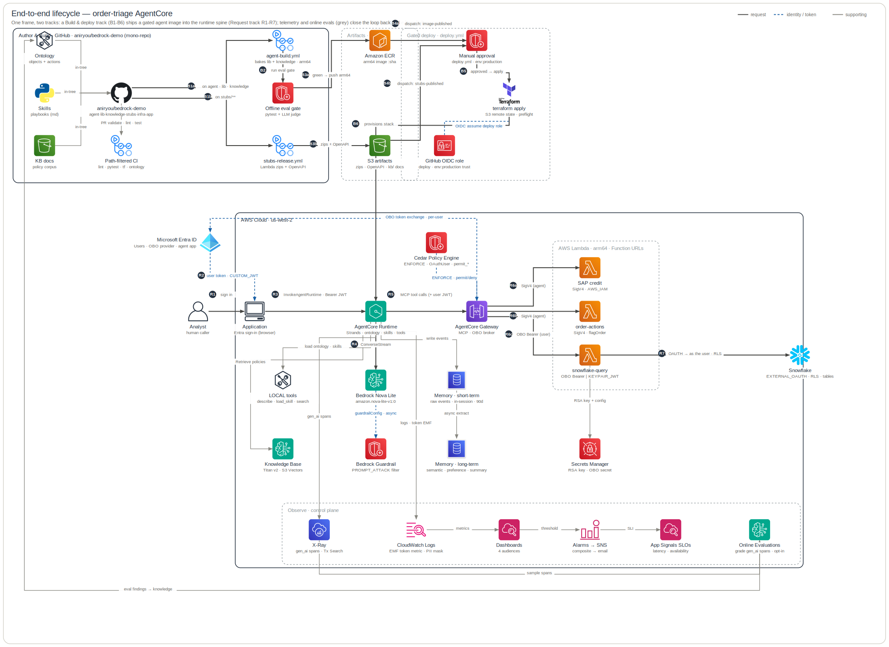
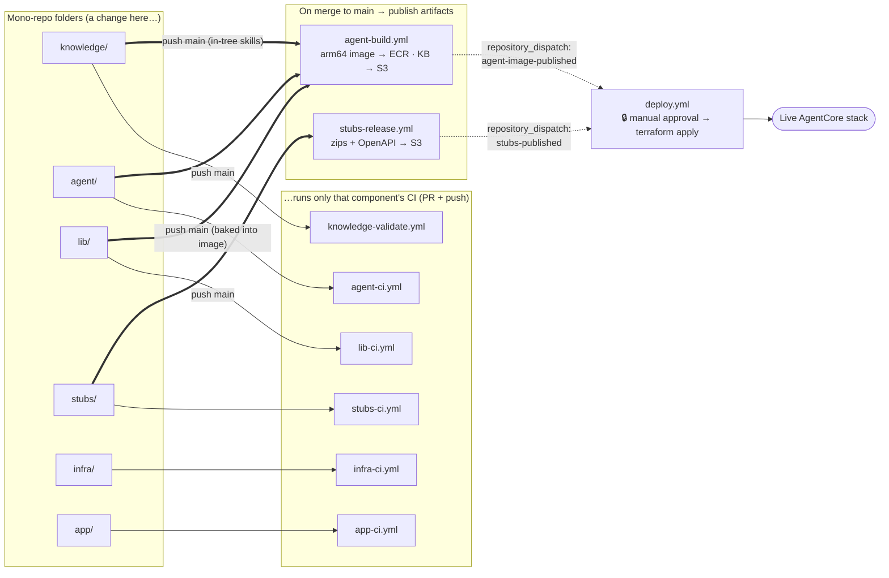

# bedrock-demo

A working **order-triage AI agent** on **Amazon Bedrock AgentCore**, delivered as a
single mono-repo. An analyst asks the agent to triage an order; the agent reads
orders/customers from Snowflake, checks SAP credit, retrieves policy from a Bedrock
Knowledge Base, and flags risky orders — every backend call **authorized by Cedar** and
brokered **on-behalf-of the signed-in user** (Entra → Snowflake OBO), so Snowflake RBAC/RLS
decides what each user can see. Deployed region: **us-west-2**; model: **Nova Lite**.

The repository is organized as six top-level folders — the five pipeline components plus the
shared lib (`agent_kit`) the agent builds on — each with its own `README.md` and `CLAUDE.md`;
this root README is the hub that ties them together.

Here's what it produces. An analyst asks in plain English — *"Triage all orders"* — and the
agent streams its reasoning back live: it picks the right skill, queries Snowflake *as the
signed-in user*, checks policy, and flags what needs attention, one visible step at a time
([see it in action](app/README.md#see-it-in-action)).

## The components

| Folder | Role | Key hand-off |
|---|---|---|
| [`knowledge/`](knowledge/README.md) | Knowledge layer: ontology + skills + KB (source of truth) | skills/ontology/KB → baked into the agent image |
| [`agent/`](agent/README.md) | Strands agent on Bedrock AgentCore Runtime | arm64 image → ECR, KB docs → S3 → `infra/`; calls the stubs through the Gateway |
| [`lib/`](lib/README.md) | `agent_kit`: agent-agnostic Strands + AgentCore runtime toolkit | consumed by `agent/` (and future agents) as a dependency; installed into the agent image |
| [`stubs/`](stubs/README.md) | Back-office tool services (SAP · order-actions · Snowflake) | Lambda zips + OpenAPI → S3 → `infra/`; serve as the agent's Gateway targets |
| [`infra/`](infra/README.md) | Terraform: provisions the live AWS stack (the **orchestrator**) | consumes all the artifacts above; deploys Runtime/Gateway/Memory/Policy/KB/Guardrail/observability |
| [`app/`](app/README.md) | OBO sign-in client (the demo driver) | Entra user JWT → the deployed OBO runtime |

The flow is a pipeline: **knowledge** is the upstream source of truth → **agent** — a thin
consumer built on the shared lib (`agent_kit`) — bakes it into an image and calls **stubs**
through the Gateway → **infra** provisions the live stack from the agent + stubs artifacts →
**app** drives the deployed runtime as a signed-in user. The shared **lib** is not a pipeline
stage; it is the agent-agnostic runtime toolkit baked into the agent image.

## Repository structure

```text
bedrock-demo/
├── knowledge/            # ontology + skills + KB (file-based; git is the audit log)
├── agent/                # Strands agent + AgentCore Runtime entrypoint (arm64 image)
├── lib/                  # agent_kit: agent-agnostic runtime toolkit consumed by agent/
├── stubs/                # 3 FastAPI back-office stubs (SAP · orders · Snowflake) as Lambdas
├── infra/                # Terraform orchestrator: provisions the whole AWS stack
├── app/                  # FastAPI OBO chat client (the demo driver)
├── .github/workflows/    # path-filtered CI/CD (see CI/CD below)
├── .env                  # the SINGLE config file for the whole stack (gitignored)
└── README.md             # you are here
```

Each folder keeps its own `README.md` (full component docs + diagrams) and `CLAUDE.md`
(machine/agent operating notes). The one config file — `.env` at the root — is read by
`infra/` and `app/` as `../.env`; it holds the AWS, Entra, and Snowflake credentials and is
gitignored.

## Setup & usage

**Prerequisites**

- An **AWS account** + a deploy role/credentials (least-privilege; see [`infra/docs/playbooks/cd-setup.md`](infra/docs/playbooks/cd-setup.md)).
- An **Entra (Azure AD) tenant** + admin, for the OBO sign-in flow ([`infra/docs/playbooks/entra-obo-setup.md`](infra/docs/playbooks/entra-obo-setup.md)).
- A **Snowflake account**, for the order/customer data path ([`infra/docs/playbooks/snowflake-bootstrap.md`](infra/docs/playbooks/snowflake-bootstrap.md)).
- The single root **`.env`** (gitignored) — `make` resolves every `TF_VAR_*` and bootstrap output from it.
- Tooling: `make -C infra prereqs` installs `terraform>=1.10` + `uv` + `aws` (skip if already present).

**Deploy (happy path)** — driven from `infra/`:

```bash
cd infra
make prereqs           # one-time: install terraform>=1.10 + uv + aws (skip if present)
make preflight         # read-only access check (must pass before deploy)
make bootstrap         # ECR + artifacts bucket + secret container — note the outputs
make snowflake-setup   # seed Snowflake + populate the Secrets Manager secret
make seed-entra-secret # put the Entra OBO client secret in Secrets Manager (kept out of TF state)
# publish the agent image + stub zips/KB to the bucket (run agent-build.yml / stubs-release.yml, or build locally)
make deploy            # terraform apply, consuming the published artifacts
make ingest            # trigger KB ingestion (required after every fresh apply)
make status            # end-to-end smoke test: mints an Entra user token + one live triage invoke
```

Then drive the live runtime from the webapp:

```bash
cd app
cp .env.example .env   # set OBO_RUNTIME_ARN (from: terraform -chdir=../infra/terraform output -raw agent_runtime_arn)
./run.sh               # http://localhost:8000 — sign in as User A vs User B
```

Each component also runs standalone for local development — see its folder README
([knowledge](knowledge/README.md) · [agent](agent/README.md) · [stubs](stubs/README.md) ·
[infra](infra/README.md) · [app](app/README.md)). The agent's shared toolkit has its own
README too ([lib](lib/README.md)).

## Architecture & visualizations

### System architecture



> The whole-lifecycle map (start here) — all nine planes fused in one frame (build `B1–B6` ·
> request `R1–R7` · observe + a loop-back). One of nine **AWS-style plane diagrams** generated by the
> `architecture-skill` skill from [`infra/docs/architecture/specs.json`](infra/docs/architecture/specs.json) —
> **regenerate, don't hand-edit** the SVG.
> For the **full runtime data plane** (CUSTOM_JWT identity, Cedar authorization, the
> PROMPT_ATTACK guardrail, the SigV4-vs-OBO egress split, per-user Snowflake RLS, and the
> per-turn token/trace telemetry) see the [data-plane diagram](infra/docs/architecture/data-plane.md),
> and the per-concern subsystem diagrams in [`infra/docs/architecture/`](infra/docs/architecture/README.md).

### CI/CD pipeline

Each component has its own **path-filtered workflow**: a change under a folder runs only that
component's checks, and a merge to `main` cascades to a **human-gated** `terraform apply`. The
publishers self-dispatch the deploy in-repo via `repository_dispatch`.



| Workflow | Trigger (path-filtered) |
|---|---|
| [`knowledge-validate.yml`](.github/workflows/knowledge-validate.yml) | PR/push · `knowledge/**` |
| [`agent-ci.yml`](.github/workflows/agent-ci.yml) | PR/push · `agent/**` or `lib/**` |
| [`lib-ci.yml`](.github/workflows/lib-ci.yml) | PR/push · `lib/**` |
| [`stubs-ci.yml`](.github/workflows/stubs-ci.yml) | PR/push · `stubs/**` |
| [`infra-ci.yml`](.github/workflows/infra-ci.yml) | PR/push · `infra/**` |
| [`app-ci.yml`](.github/workflows/app-ci.yml) | PR/push · `app/**` |
| [`agent-build.yml`](.github/workflows/agent-build.yml) | push main · `agent/**`, `knowledge/**`, or `lib/**` |
| [`stubs-release.yml`](.github/workflows/stubs-release.yml) | push main · `stubs/**` |
| [`deploy.yml`](.github/workflows/deploy.yml) | `repository_dispatch` / manual |

The `*-ci` workflows lint and run hermetic tests for their folder; the two publishers
(`agent-build` / `stubs-release`) build and upload the image, zips, and KB docs on merge to
`main`, then cascade a `repository_dispatch` into the **human-gated** `deploy.yml` (it uses a
PAT, since a `GITHUB_TOKEN`-triggered dispatch deliberately starts no new runs). Full pipeline +
secrets/vars setup: [`infra/docs/playbooks/cd-setup.md`](infra/docs/playbooks/cd-setup.md).

### One triage request (the runtime data plane)

An analyst's prompt enters the CUSTOM_JWT runtime; the agent loads memory, queries Snowflake
as the user (OBO) for orders and on its own identity (SigV4) for customers/credit, screens
model turns through the guardrail, retrieves KB policy, and may flag an order — every Gateway
call Cedar-authorized. The full step-by-step sequence — the SigV4-vs-OBO egress split, the
guardrail screen, and the per-turn telemetry — is in
[`infra/docs/architecture/data-plane.md`](infra/docs/architecture/data-plane.md).

### Per-component diagrams

- **Agent internals + ontology routing** — [`agent/docs/architecture.md`](agent/docs/architecture.md)
- **Stubs runtime + build/deploy** — [`stubs/README.md`](stubs/README.md#architecture) + [`stubs/docs/build-and-deploy.md`](stubs/docs/build-and-deploy.md)
- **Know-how stack (KB → Skills → Ontology) + feedback loop** — [`knowledge/README.md`](knowledge/README.md#architecture)
- **OBO sign-in flow (User A vs User B)** — [`app/README.md`](app/README.md#architecture)

## Key journeys

**1 · Provisioning order.** `make -C infra bootstrap` creates the ECR repo + bucket *before*
the agent image / stub zips / KB docs are published; the main `terraform apply` then reads the
published OpenAPI specs and the ECR image **at plan/apply time**, so those publishes are hard
prerequisites. The one-time Snowflake prerequisite is handled outside Terraform by
`make -C infra snowflake-setup`.

**2 · One triage request.** See the sequence above — prompt → memory → Cedar-authorized
Gateway tools (orders as the user via OBO; customers/credit as the agent via SigV4) →
guardrail-screened model loop → KB policy → optional flag → streamed result.

**3 · A change ships to the live stack.** Merge a change under `agent/`, `knowledge/`, or
`stubs/` to `main` → the matching publish workflow rebuilds and uploads the artifact → it
cascades a `repository_dispatch` into the **human-gated** `deploy.yml`. Nothing deploys
without manual approval.

**4 · The two-user OBO demo.** User A and User B sign in through the webapp and both ask
*"Triage order O-1003."* Because the order read runs **as the user** (OBO), a Snowflake row
access policy admits A and denies B — while *"What tier is customer C-001?"* succeeds for both
(customers are read on the agent's own identity). The split is driven by the ontology
classification (`SalesOrder` confidential, `Customer` not), not by app code.

## Further reading

- **Component docs** — each folder's `README.md` (full architecture + diagrams) and `CLAUDE.md`
  (machine/agent operating notes): [knowledge](knowledge/README.md) · [agent](agent/README.md) ·
  [stubs](stubs/README.md) · [infra](infra/README.md) · [app](app/README.md); plus the agent's
  shared toolkit [lib](lib/README.md) (`agent_kit`).
- **Decisions (ADRs)** — [`infra/docs/adr/`](infra/docs/adr/) (0001 OBO · 0002 memory · 0003
  guardrail · 0004 observability/FinOps · 0005 evaluations · 0006 gateway-role least-privilege ·
  0007 actor-resolution · 0008 semantic-view + Cortex Analyst · 0009 Function-URL hardening) and
  [`knowledge/docs/adr/`](knowledge/docs/adr/) (ontology privilege/classification).
- **Reference designs** — [`infra/docs/architecture/data-plane.md`](infra/docs/architecture/data-plane.md) (data plane) +
  [`infra/docs/architecture/`](infra/docs/architecture/README.md) (subsystem diagrams) +
  [`knowledge/docs/architecture/`](knowledge/docs/architecture/architecture-primer.md) (the three-layer model).
- **Runbooks** — [`infra/docs/playbooks/`](infra/docs/playbooks/): snowflake-bootstrap ·
  deploy & teardown · cd-setup · entra-obo-setup · observability-impl-plan.
- **Spikes & audits** — [`infra/docs/research/`](infra/docs/research/) (the exploration behind the ADRs).
