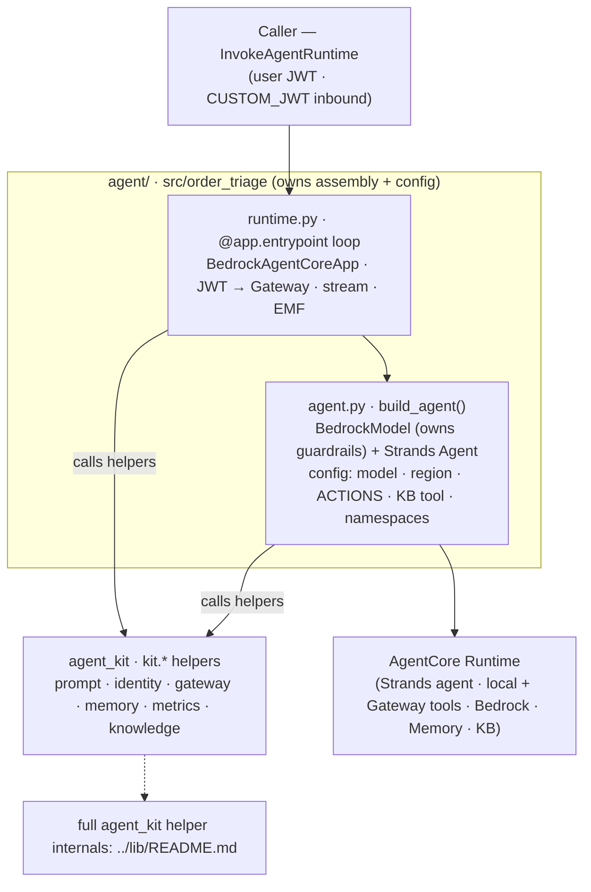
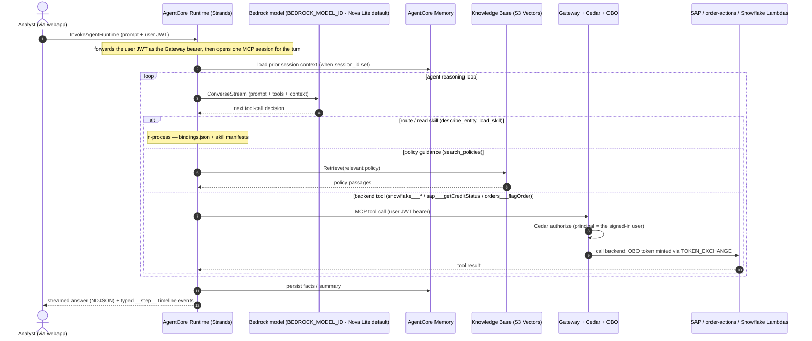
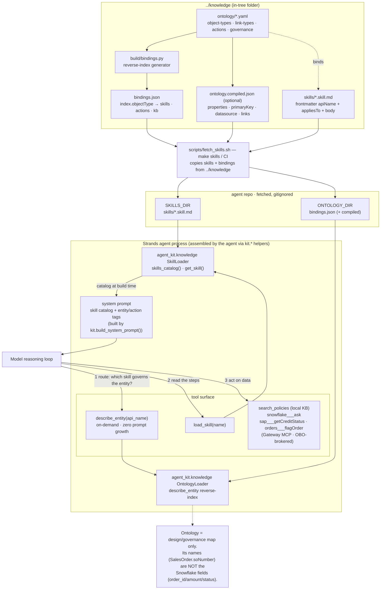
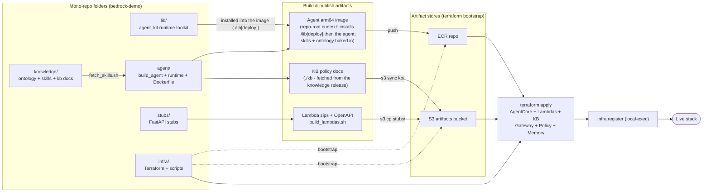

# agent

A Snowflake-backed [Strands](https://strandsagents.com) order-triage agent that runs on
**Amazon Bedrock AgentCore Runtime** (arm64 container, served on `:8080` by
`BedrockAgentCoreApp`). It reads orders/customers, checks SAP credit, and flags risky
orders **exclusively through the AgentCore Gateway's MCP tools** — Cedar-authorized and
brokered on-behalf-of the signed-in user (`grant_type=TOKEN_EXCHANGE`) — and grounds every
decision in policy playbooks plus a Bedrock Knowledge Base. This is the **agent
component**: it **owns its assembly** and composes the shared lib
([`agent_kit`](../lib/README.md)) — it constructs its own `BedrockModel` (with its
guardrail/model config), wires the AgentCore Runtime entrypoint, and calls `kit.*` helpers for
the agent-agnostic plumbing. It ships as an arm64 image to ECR and publishes KB policy docs to
S3, both consumed by `infra`; the backend reads/writes it performs never live here — they reach
it as Gateway MCP tools at runtime.

## How it fits

The [bedrock-demo](../README.md) mono-repo has **six top-level folders** — the five pipeline
components (knowledge, agent, stubs, infra, app) plus the shared lib
([`agent_kit`](../lib/README.md)) the agent builds on — see
[The components](../README.md#the-components) for the full map and hand-offs. This is the
**agent component** — the Strands agent on Bedrock AgentCore Runtime — which **owns its
assembly** and composes the shared lib: it writes its own `build_agent()` and the entrypoint
loop, calling the `agent_kit` helpers for the agent-agnostic plumbing
([`../lib`](../lib/README.md)). It bakes in the [knowledge](../knowledge/README.md) layer
(ontology + skills + KB) and produces the arm64 image + KB docs that
[infra](../infra/README.md) deploys.

## Repository structure

```text
agent/
├── src/order_triage/         # the per-agent package (owns config + assembly + entrypoint)
│   ├── agent.py              # config (model/region/guardrail/ACTIONS/KB tool/namespaces) + build_agent(): builds the BedrockModel (owns guardrails) + Strands Agent from kit.* helpers
│   ├── runtime.py            # the @app.entrypoint loop on BedrockAgentCoreApp — forwards the JWT, opens the Gateway, streams, emits the EMF metric
│   └── __init__.py           # package __version__
├── tests/                    # per-agent hermetic tests (test_spec.py: skill→action coverage of ACTIONS)
├── scripts/fetch_skills.sh   # copies skills + bindings + kb from the in-tree ../knowledge folder
├── Dockerfile                # arm64 image; REPO-ROOT build context — installs ../lib[deploy] then the agent
├── Makefile                  # setup · skills · test · lint · clean
├── pyproject.toml            # depends on agent-kit via uv path source ({ path = "../lib", editable })
├── .python-version           # pins the dev interpreter to 3.12
├── .env.example              # runtime env-var template (copy to .env)
├── ../.github/workflows/     # agent-ci.yml (lint + tests) · agent-build.yml (image + KB publish; lib-ci.yml covers ../lib)
├── skills/                   # fetched, gitignored — *.skill.md manifests
├── ontology/                 # fetched, gitignored — bindings.json (+ compiled ontology)
├── kb/                       # fetched, gitignored — policy docs (published to S3 by CI)
├── CLAUDE.md                 # machine/agent operating instructions
└── README.md
```

The agent owns assembly (`agent.py` builds the `BedrockModel` + Strands `Agent`; `runtime.py`
drives the AgentCore entrypoint loop). The agent-agnostic plumbing it calls — prompt assembly,
identity, the Gateway MCP client, memory, the EMF metric, skill/ontology/KB loaders, the
action-coverage gate, and the stream-step classifier — are helpers in the shared lib; see
[`../lib/README.md`](../lib/README.md) for their internals.

`skills/`, `ontology/`, and `kb/` are **fetched content, not committed** — `make skills`
copies them from the in-tree [`../knowledge`](../knowledge/README.md) folder (see below).

## Setup & usage

**Prerequisites**

- [`uv`](https://docs.astral.sh/uv/) — manages the venv and dependencies.
- Python **3.12** (pinned via `.python-version`); everything runs through `uv run`.
- **Docker + buildx** — only for building/pushing the arm64 image (normally done by CI).
- The in-tree [`../knowledge`](../knowledge/README.md) folder (always present in the mono-repo)
  so `make skills` can copy skills + bindings + KB.

**Happy path**

```bash
make setup                                 # uv venv + dev deps
make skills                                # copy skills + bindings + kb from ../knowledge
make test                                  # hermetic unit tests (no network, no model)
make lint                                  # ruff
```

> The deployed agent is **Gateway-only** — there is no local single-shot run target: the
> runtime requires a user JWT + `GATEWAY_URL` and hard-errors without them (enforced in
> `agent_kit`).
> Exercise the full path through the deployed runtime — e.g. the
> [order-triage-webapp](../app/README.md) OBO client — not
> locally. The runtime's env-var contract and the skills-fetch knobs are documented in
> [`CLAUDE.md`](./CLAUDE.md); copy `.env.example` to `.env` as a starting point.

Skills are **fetched content** (not a dependency): `make skills` copies `skills/*.skill.md`,
the ontology `bindings.json`, and the `kb/*.md` policy docs from the in-tree
[knowledge](../knowledge/README.md) folder (into
`./skills`, `./ontology`, `./kb` — all gitignored). Each skill
file is YAML frontmatter (the ontology binding — `apiName`, `appliesTo`, …) plus a markdown
procedure body; the loader renders an enriched catalog (description + governed
entities/actions) into the system prompt and returns the body on demand via `load_skill`. The
agent runs without them (empty catalog) but loses the `load_skill` playbooks.

## Architecture & visualizations

The agent owns assembly: `agent.py` holds the config and `build_agent()` (which constructs the
`BedrockModel`, owning the guardrail/model config, and the Strands `Agent`), and `runtime.py`
drives the `@app.entrypoint` AgentCore loop — it builds one Strands agent per turn, forwards
the inbound user JWT as the Gateway's bearer, and streams the answer back. The agent calls the
shared lib ([`agent_kit`](../lib/README.md)) for the agent-agnostic helpers. The agent has two
tool surfaces: **local tools** that run in-process (`search_policies` against the Knowledge
Base, `describe_entity` over the ontology bindings, `load_skill` for playbooks) and **backend
tools** that are injected at runtime and reached only through the Cedar-authorized,
OBO-brokered AgentCore Gateway. Skills, ontology bindings, and KB docs are copied from the
in-tree `../knowledge` folder and baked into the image (KB docs are published to S3 instead).
The runtime is entirely env-wired; the full variable contract lives in
[`CLAUDE.md`](./CLAUDE.md), and the helper internals in [`../lib/README.md`](../lib/README.md).

### System architecture (the agent owns assembly)

`agent.py` owns the config + `build_agent()` (the `BedrockModel` and Strands `Agent`),
`runtime.py` owns the `@app.entrypoint` loop, and the shared lib
([`agent_kit`](../lib/README.md)) provides the helpers both call. The helper internals — prompt
assembly, identity, the Gateway MCP client, memory, the EMF metric, the local tools, and the
connections to Bedrock / Memory / KB / Gateway / Snowflake — are documented in
[`../lib/README.md`](../lib/README.md).



A native Bedrock Guardrail (a `PROMPT_ATTACK` input filter, on by default in the deployed
stack) screens the model path; **`agent.py` builds the guardrail kwargs onto its `BedrockModel`
only when both guardrail vars are set**. The container image + skills/ontology are built/baked
by CI (`make skills` → `fetch_skills.sh` → `docker buildx`); see the
[build & deploy pipeline](#build--deploy-pipeline) below.

### Data flow (one triage request)



### How the agent uses the ontology

The ontology is a **read-only routing & governance layer**, never a data source. It reaches
the agent as two artifacts copied from the in-tree `../knowledge` folder
(`fetch_skills.sh` copies skills and bindings together, so the agent can never route into a skill the
bindings don't know): the skill manifests (`skills/*.skill.md`) and the bindings
reverse-index (`bindings.json`, plus the optional `ontology.compiled.json`). Two consumers
read them:

- **`agent_kit.knowledge.SkillLoader` → system prompt (build-agent time).** `skills_catalog()`
  renders each skill's description plus the ontology entities/actions it `appliesTo` into the
  system prompt that `kit.build_system_prompt()` returns; `load_skill(name)` returns the
  procedure body on demand.
- **`agent_kit.knowledge.OntologyLoader` → `describe_entity` tool (runtime, on-demand).** It reads
  `bindings.json`'s `index.objectType[x]` to answer "which skills / actions / KB govern this
  entity?", enriched with properties / primary key / source-of-truth datasource / related
  governed entities from the compiled file — with **zero** system-prompt growth.

At request time the model routes with `describe_entity(...)`, reads the chosen skill via
`load_skill(name)`, then acts with the Gateway MCP backend tools. The ontology's design names
(e.g. `SalesOrder.soNumber`) are deliberately distinct from the Snowflake runtime fields
(`order_id` / `amount` / `status`) the backend tools actually return — so ontology names are
for routing, never tool arguments.



### Build & deploy pipeline



The agent's CI (`../.github/workflows/agent-build.yml`) owns the **Agent arm64 image** and **KB docs**
boxes: it copies skills/ontology/kb from `../knowledge`, builds + pushes the arm64 image to ECR
(`-f agent/Dockerfile` from the **repo root**, so it can `COPY lib` then `pip install ./lib[deploy]`
before the agent), and syncs the fetched `kb/` to `s3://<artifacts>/kb/`, then cascades an
`agent-image-published` dispatch to [infra](../infra/README.md), which references the
image URI + KB prefix as Terraform inputs. Because the image bakes the shared lib, this build's
path filter includes `lib/**` — a `lib/` change rebuilds the agent image and also runs
`agent-ci.yml`. The hermetic `lib-ci.yml` (ruff + pytest, no AWS) covers `agent_kit` itself.
The build's trigger surface and the observability wiring (the `opentelemetry-instrument` launch
wrapper and the `OrderTriage/Agent` EMF metric namespace) are documented in [`CLAUDE.md`](./CLAUDE.md).

## Key journeys

- **One triage request through the runtime.** A caller invokes the runtime with a prompt and
  the user's JWT; the agent's `@app.entrypoint` loop (`runtime.py`) forwards that JWT as the
  Gateway bearer and opens one MCP session for the turn, then calls `build_agent()` and loads
  prior session context from AgentCore Memory. The Strands
  reasoning loop streams against the Bedrock model, calls local tools in-process, and routes
  every backend read/write through the Gateway (Cedar-authorized, OBO-brokered), then persists
  facts/summary and streams the answer back as NDJSON plus typed `__step__` timeline events.
- **Routing with the ontology.** The model first calls `describe_entity(...)` to learn which
  skill / actions / KB govern an entity, reads the chosen procedure via `load_skill(name)`,
  then acts with the backend Gateway tools — using the Snowflake runtime fields
  (`order_id` / `amount` / `status`), never the ontology design names.
- **Build & deploy.** CI copies skills/ontology/kb from the in-tree `../knowledge` folder, builds and
  pushes the arm64 image to ECR via `docker buildx`, syncs KB docs to S3, and dispatches
  `agent-image-published` to the `deploy.yml` workflow, which applies Terraform to deploy the new
  image (gated apply).

## Further reading

- [`CLAUDE.md`](./CLAUDE.md) — the machine/agent operating instructions: the runtime env-var
  contract, the skills-fetch knobs, hard-error invariants, code conventions, and the CI/observability
  details an agent needs to work in this code.
- This component owns **no ADRs**; cross-cutting design decisions are recorded in the owning
  components' `docs/adr/` — [`infra`](../infra/README.md)
  and [`knowledge`](../knowledge/README.md). The
  `cd-setup` playbook for the agent's publish role/secrets lives at
  `../infra/docs/playbooks/cd-setup.md`.
