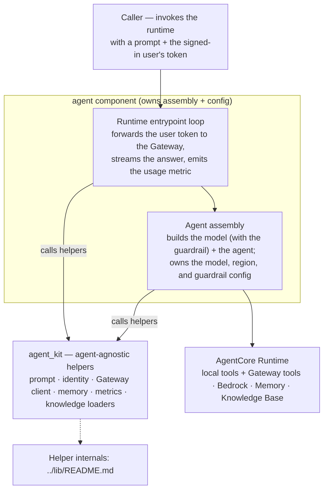

# agent

A Snowflake-backed [Strands](https://strandsagents.com) order-triage agent that runs on Amazon
Bedrock AgentCore Runtime. It reads orders and customers, checks SAP credit, and flags risky
orders, grounding every decision in policy playbooks plus a Bedrock Knowledge Base. Every
backend read and write happens exclusively through the AgentCore Gateway's MCP tools —
Cedar-authorized and brokered on behalf of the signed-in user — so the agent never touches a
credential itself. This is the agent component: it owns its own assembly and configuration
(model, guardrail, the AgentCore Runtime entrypoint) and composes the shared toolkit
([`agent_kit`](../lib/README.md)) for the agent-agnostic plumbing. It ships as an arm64 image
to ECR and publishes Knowledge Base policy docs to S3, both consumed by infra.

## How it fits

The [bedrock-demo](../README.md) mono-repo runs a **knowledge → agent → infra → live**
pipeline. This is the agent component — the Strands agent on Bedrock AgentCore Runtime. It
bakes in the [knowledge](../knowledge/README.md) layer (ontology + skills + KB) at build time
and produces the arm64 image plus KB docs that [infra](../infra/README.md) deploys; the
backends it reads and writes reach it as Gateway MCP tools at runtime, never living in this
folder. See [The components](../README.md#the-components) for the full map and hand-offs.

## Getting started

The agent is exercised through tests and lint locally; the live runtime is Gateway-only.

```bash
make setup     # uv venv + dev deps
make skills    # copy skills + ontology bindings + kb from ../knowledge
make test      # hermetic unit tests (no network, no model)
make lint      # ruff
```

> There is **no local run target**. The deployed runtime is Gateway-only — it requires a user
> JWT and Gateway URL and hard-errors without them. Exercise the full path through the deployed
> runtime, e.g. the [order-triage-webapp](../app/README.md) on-behalf-of chat client.

The runtime env-var contract, the skills-fetch knobs, and the command gotchas live in the
sibling [`CLAUDE.md`](./CLAUDE.md). Skills, ontology bindings, and KB docs are fetched content,
not committed code: `make skills` copies them from the in-tree
[knowledge](../knowledge/README.md) folder into gitignored local directories, and the agent
degrades gracefully to an empty catalog when they are absent.

## Architecture

The agent owns assembly and composes the shared toolkit: the agent constructs its own model
client (owning the guardrail and model config) and drives the AgentCore Runtime entrypoint
loop, while [`agent_kit`](../lib/README.md) supplies the agent-agnostic helpers both call —
prompt assembly, identity, the Gateway MCP client, memory, the per-turn usage metric, and the
skill/ontology/KB loaders. At runtime the agent has two tool surfaces: **local tools** that run
in-process (policy search against the Knowledge Base, entity lookup over the ontology bindings,
and skill loading) and **backend tools** injected at runtime and reached only through the
Cedar-authorized, on-behalf-of-brokered Gateway. A native Bedrock Guardrail (a prompt-attack
input filter, on by default in the deployed stack) screens the model path when both guardrail
vars are set.



The detailed diagrams — the per-turn data flow, how the agent uses the ontology, and the build
& deploy pipeline — are in [docs/architecture.md](docs/architecture.md).

## Key journeys

- **One triage request through the runtime.** A caller invokes the runtime with a prompt and
  the user's JWT; the agent's entrypoint loop forwards that JWT as the Gateway bearer and opens
  one MCP session for the turn, then builds the agent and loads prior session context from
  AgentCore Memory. The Strands reasoning loop streams against the Bedrock model, calls local
  tools in-process, and routes every backend read and write through the Gateway
  (Cedar-authorized, on-behalf-of-brokered), then persists facts and summary and streams the
  answer back as NDJSON plus typed timeline events.
- **Routing with the ontology.** The model first looks up which skill, actions, and KB govern
  an entity, reads the chosen procedure, then acts with the backend Gateway tools — using the
  Snowflake runtime fields the tools actually return, never the ontology design names (which
  are a routing and governance map only).
- **Build & deploy.** CI copies skills, ontology, and KB from the in-tree knowledge folder,
  builds and pushes the arm64 image to ECR, syncs KB docs to S3, and dispatches an
  image-published event to the deploy workflow, which applies Terraform to deploy the new image
  behind a gated apply.

## Further reading

- [`CLAUDE.md`](./CLAUDE.md) — the operating brief: the runtime env-var contract, the
  skills-fetch knobs, hard-error invariants, code conventions, and CI/observability details.
- [docs/architecture.md](docs/architecture.md) — the deep diagrams: per-turn data flow,
  ontology routing, and the build & deploy pipeline.
- This component owns **no ADRs**; cross-cutting design decisions are recorded in the owning
  components' `docs/adr/` — [`infra`](../infra/README.md) and
  [`knowledge`](../knowledge/README.md). The publish-role/secrets runbook lives at
  [`../infra/docs/playbooks/cd-setup.md`](../infra/docs/playbooks/cd-setup.md).
