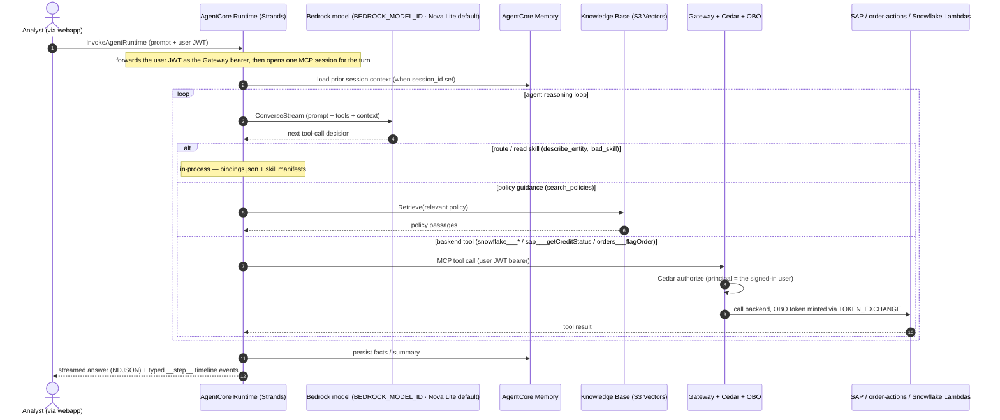
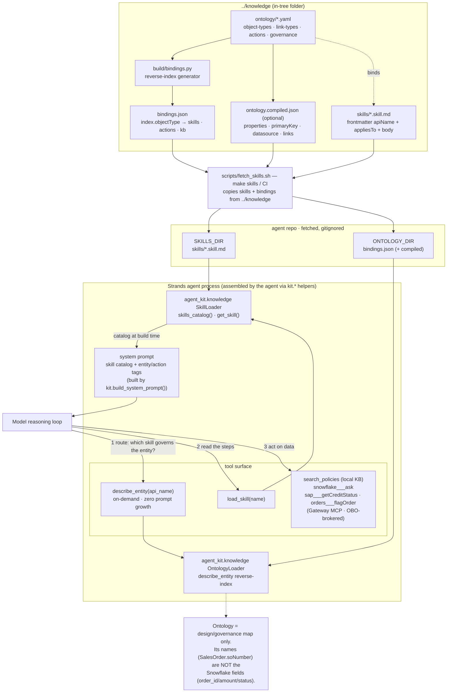
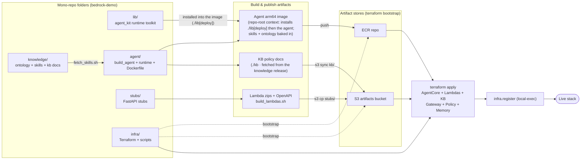

# agent — architecture & internals

Agent-developer reference: the per-turn data flow, how the agent uses the ontology, and the
build & deploy pipeline. The conceptual system diagram lives in the [README](../README.md#architecture);
the helper internals it calls live in [`../../lib/README.md`](../../lib/README.md).

## Data flow (one triage request)

## How the agent uses the ontology

The ontology is a **read-only routing & governance layer**, never a data source. It reaches
the agent as two artifacts copied from the in-tree `../knowledge` folder
(`fetch_skills.sh` copies skills and bindings together, so the agent can never route into a skill the
bindings don't know): the skill manifests (`skills/*.skill.md`) and the bindings
reverse-index (`bindings.json`, plus the optional `ontology.compiled.json`). Two consumers
read them:

- **`agent_kit.knowledge.SkillLoader` → system prompt (build-agent time).** `skills_catalog()`
  renders each skill's description plus the ontology entities/actions it `appliesTo` into the
  system prompt that `kit.build_system_prompt()` returns; `load_skill(name)` returns the
  procedure body on demand.
- **`agent_kit.knowledge.OntologyLoader` → `describe_entity` tool (runtime, on-demand).** It reads
  `bindings.json`'s `index.objectType[x]` to answer "which skills / actions / KB govern this
  entity?", enriched with properties / primary key / source-of-truth datasource / related
  governed entities from the compiled file — with **zero** system-prompt growth.

At request time the model routes with `describe_entity(...)`, reads the chosen skill via
`load_skill(name)`, then acts with the Gateway MCP backend tools. The ontology's design names
(e.g. `SalesOrder.soNumber`) are deliberately distinct from the Snowflake runtime fields
(`order_id` / `amount` / `status`) the backend tools actually return — so ontology names are
for routing, never tool arguments.

## Build & deploy pipeline

The agent's CI (`../../.github/workflows/agent-build.yml`) owns the **Agent arm64 image** and **KB docs**
boxes: it copies skills/ontology/kb from `../knowledge`, builds + pushes the arm64 image to ECR
(`-f agent/Dockerfile` from the **repo root**, so it can `COPY lib` then `pip install ./lib[deploy]`
before the agent), and syncs the fetched `kb/` to `s3://<artifacts>/kb/`, then cascades an
`agent-image-published` dispatch to [infra](../../infra/README.md), which references the
image URI + KB prefix as Terraform inputs. Because the image bakes the shared lib, this build's
path filter includes `lib/**` — a `lib/` change rebuilds the agent image and also runs
`agent-ci.yml`. The hermetic `lib-ci.yml` (ruff + pytest, no AWS) covers `agent_kit` itself.
The build's trigger surface and the observability wiring (the `opentelemetry-instrument` launch
wrapper and the `OrderTriage/Agent` EMF metric namespace) are documented in [`../CLAUDE.md`](../CLAUDE.md).
