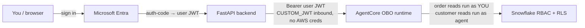

# app — OBO demo chat client

A minimal chat UI for the AgentCore **OBO runtime**. It signs a human into
Microsoft Entra, then proxies chat to the runtime carrying that user's JWT, so the
agent **impersonates the signed-in user**, so Snowflake RBAC/RLS decides what each
user can see. This is the demo *driver* — the thing a person actually clicks — and
it sits at the bottom of the stack, calling the live runtime that the rest
of the system produces.

Why a backend (not a pure SPA): the agent app is a **confidential** client (it has
a client secret) so the auth-code→token exchange must be server-side; and the
browser can't call `bedrock-agentcore.<region>.amazonaws.com` directly (no CORS),
so the backend proxies it. **No AWS credentials** are required — the runtime call
carries only the user bearer.

## How it fits

One of **five components** in the [bedrock-demo](../README.md) mono-repo — see
[The five components](../README.md#the-five-components) for the full map and hand-offs.
The OBO sign-in client and demo driver: it takes an Entra user JWT and calls the deployed OBO runtime that the [infra](../infra/README.md) stack produces, so the agent impersonates the signed-in user and Snowflake RBAC/RLS decides what they see.

## Repository structure

```text
app/
├── app/
│   ├── main.py          # FastAPI app: routes, config loading, in-memory session store
│   ├── entra.py         # Entra auth-code helpers (plain OAuth2 over httpx, no MSAL)
│   └── agentcore.py     # stream_agent(): invokes the OBO runtime, yields delta/step events
├── web/
│   └── index.html       # single-page UI (renders tokens as they stream)
├── run.sh               # creates .venv, runs uvicorn on http://localhost:8000
├── requirements.txt     # four deps: fastapi, uvicorn, httpx, python-dotenv
├── .env                 # webapp-local per-deploy config (OBO_RUNTIME_ARN, WEBAPP_REDIRECT_URI)
└── (../.env)            # shared bedrock-demo/.env: Entra app config + client secret
```

## Setup & usage

**Prerequisites**

1. **The runtime must be up.** The stack is often torn down (zero idle cost):
   ```bash
   cd ../infra && make deploy && make ingest   # terraform apply (reuses published artifacts) + KB ingest
   terraform -chdir=terraform output -raw agent_runtime_arn
   ```
2. **Snowflake RLS + the second user applied** (one-time; Snowflake persists):
   `../infra/snowflake/rls.sql` + `test_user.sql` (set User B's email).
3. **A second Entra member user** created in the tenant (User B), and a matching
   Snowflake user (`JINCE_ENTRA`, login_name = that email).
4. **Register the redirect URI** `http://localhost:8000/callback` on the Entra
   **agent** app (appId = `ENTRA_AGENT_APP_ID`), platform **Web**.

**Run locally**

```bash
cp .env.example .env          # then set OBO_RUNTIME_ARN (from terraform output)
./run.sh                      # http://localhost:8000
```

Config comes from two `.env` files: the webapp-local `.env` (per-deploy bits) and
the shared `../.env` (`bedrock-demo/.env`, Entra app config + client secret). Sign
in as User A in one browser/profile and User B in another (or a private window) to
see the two outcomes side by side.

## Architecture & visualizations

The browser signs in through Entra, the FastAPI backend completes the confidential
auth-code exchange, and every chat turn is proxied to the OBO runtime with the user's
bearer JWT — no AWS credentials. Order reads run *as the user* (OBO), so a Snowflake
row access policy can deny User B; customer reads run *as the agent*. The split is
driven by the ontology classification, not by this app.



## Key journeys

- **User A — entitled order triage.** User A signs in via Entra and asks *"Triage
  order O-1003."* The order read runs **as the user** (OBO), the row access policy
  admits them, and the order is returned. Asking *"What tier is customer C-001?"*
  reads customers **as the agent** and also succeeds.
- **User B — RLS-denied order, shared customer.** User B signs in and asks the same
  *"Triage order O-1003."* Because the order read runs **as the user**, the Snowflake
  row access policy (`../infra/snowflake/rls.sql`) denies it — 0 rows /
  "no such order". But *"What tier is customer C-001?"* still succeeds, because
  customers are read on the agent's own identity (`SalesOrder` is `confidential` in
  the ontology, `Customer` is not).
- **Streaming chat.** A chat turn POSTs the message to the backend, which invokes the
  OBO runtime and relays answer tokens to the UI as they arrive; the single-page UI
  renders them incrementally rather than waiting for the full reply.

## What it demonstrates (two test users)

| Ask | Path | User A (entitled) | User B (RLS-denied) |
|---|---|---|---|
| "Triage order O-1003" | order read → **as the user** (OBO) | sees it | 0 rows / "no such order" |
| "What tier is customer C-001?" | customer read → **as the agent** | sees it | **also** sees it |

The difference for orders comes from a Snowflake row access policy
(`../infra/snowflake/rls.sql`); customer access is preserved because the
agent reads customers on its own identity (`SalesOrder` is `confidential` in the
ontology, `Customer` is not).

## Deploy to AWS (phase 2)

Recommended: **App Runner** from a container (public HTTPS, secret from Secrets
Manager) — fits the existing CodeBuild→ECR pattern. Then add the deployed
`https://…/callback` URL as a second redirect URI on the Entra agent app, and set
`WEBAPP_REDIRECT_URI` accordingly. (A `Dockerfile` + App Runner service are the
next increment.)

## Further reading

- **OBO decision + runbook:** `../infra/docs/adr/0001-user-impersonation-obo.md`
  and `../infra/docs/playbooks/entra-obo-setup.md`.
- **Why order vs customer split:** `../knowledge/docs/adr/0001` +
  `../infra/snowflake/rls.sql`.
- **Machine/agent operating instructions** — including the full route catalog and the
  `/chat` NDJSON event-schema reference — live in [CLAUDE.md](CLAUDE.md).
