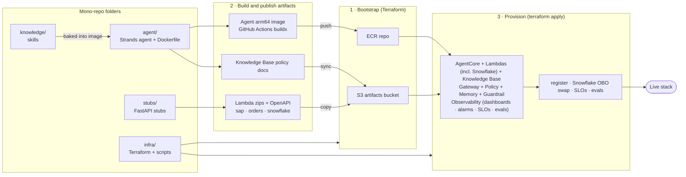

# infra

Terraform (plus a small preflight/registry helper) that **provisions the live
order-triage AgentCore stack on AWS** — the AgentCore Runtime, Gateway, Memory and policy
engine, three back-office stub Lambdas (including the Snowflake data path), a Bedrock
Knowledge Base, a native guardrail, and the observability layer. It is the **orchestrator**:
it consumes the other components' *published artifacts* as inputs and never reaches into
their source. Deployed region: **us-west-2**; model: **Nova Lite**.

## How it fits

One of the **six top-level folders** in the [bedrock-demo](../README.md) mono-repo (the five
pipeline components plus the shared lib) — see [The components](../README.md#the-components)
for the full map and hand-offs. This component is the orchestrator: it provisions the live
order-triage AgentCore stack on AWS, consuming the published artifacts from `agent` and
`stubs` and serving the deployed on-behalf-of runtime that `app` drives.

## Getting started

The happy path is a sequence of `make` targets. The bootstrap stack (ECR repo + artifacts
bucket) must exist before the agent image and Lambda zips are published, and the main apply
reads those published artifacts at plan time — so order matters.

```bash
make prereqs           # one-time: install terraform>=1.10 + uv + aws (skip if present)
make preflight         # read-only access check (must pass before deploy)
make bootstrap         # ECR repo + artifacts bucket + secret container — note the outputs
make snowflake-setup   # seed Snowflake + populate the Secrets Manager secret
make seed-entra-secret # put the Entra on-behalf-of client secret in Secrets Manager
# run the agent + stubs "publish" workflows so the image/zips/KB docs land in the bucket
make deploy            # terraform apply, consuming the published artifacts
make ingest            # trigger Knowledge Base ingestion (required after every fresh apply)
make status            # end-to-end smoke test: mints an Entra user token + one live invoke
```

Tunables ship with sensible defaults (guardrail on, observability on, evaluations opt-in).
For the full command list, the prerequisites (an AWS account, an Entra tenant, a Snowflake
account, the single root `.env`), teardown, rotation and the per-command gotchas, see the
operating brief in [CLAUDE.md](CLAUDE.md) and the [runbooks](#further-reading).

## Architecture

`infra` orchestrates; the other components supply artifacts, and `app` drives the live
on-behalf-of flow against the deployed runtime. The system diagram below is a generated
AWS-icon picture of the whole stack — the live runtime data plane, the back-office stubs,
the Knowledge Base, the guardrail and the observability layer.


For the **full runtime data plane** (the on-behalf-of identity chain, Cedar authorization,
the prompt-attack guardrail, the SigV4-versus-OBO egress split, per-user Snowflake
row-level security, and the per-turn token/trace telemetry) see
[`docs/architecture/data-plane.md`](docs/architecture/data-plane.md). For **per-concern
subsystem deep-dives** see the [plane index](docs/architecture/README.md):
[Agent](docs/architecture/agent-architecture.md) ·
[Knowledge](docs/architecture/knowledge-architecture.md) ·
[Security](docs/architecture/security-architecture.md) ·
[Memory](docs/architecture/memory-architecture.md) ·
[Observability](docs/architecture/observability-architecture.md) ·
[Evaluation](docs/architecture/evaluation-architecture.md).

The build-and-deploy pipeline — bootstrap, then publish artifacts, then provision — is:



## Key journeys

**1 · Provisioning order.** The bootstrap apply must create the ECR repo and artifacts
bucket *before* the image, Lambda zips and Knowledge Base docs are published; the main apply
then reads the published OpenAPI specs and the ECR image at plan/apply time, so those
publishes are hard prerequisites. The one-time Snowflake setup (warehouse, database, tables,
the read-only service user and the Secrets Manager secret the Snowflake Lambda reads) is
handled outside Terraform by the Snowflake setup target.

**2 · One triage request.** An analyst's prompt enters the runtime over a validated Entra
token. The agent loads prior session memory, then queries Snowflake **as the calling human**
(on-behalf-of) for that user's region-entitled orders, and on its own identity (SigV4) for
customer and credit data. It screens each model turn through the prompt-attack guardrail,
retrieves policy passages from the Knowledge Base, may flag a high-value order, and streams
the triage result back — every Gateway tool call authorized by the Cedar policy engine. The
wire-level walkthrough and sequence diagram are in
[`docs/architecture/data-plane.md`](docs/architecture/data-plane.md).

**3 · The CD cascade.** A merge under `knowledge/` or `agent/` to `main` triggers the agent
image build, which cascades to the **human-gated** deploy workflow. Nothing reaches AWS
without manual approval. Full runbook:
[`docs/playbooks/cd-setup.md`](docs/playbooks/cd-setup.md).

## Further reading

- **Decisions** — [`docs/adr/`](docs/adr/): 0001 on-behalf-of · 0002 memory · 0003 guardrail ·
  0004 observability/FinOps · 0005 evaluations · 0006 gateway-role least-privilege ·
  0007 actor-resolution · 0008 semantic-view + Cortex Analyst · 0009 Function-URL hardening.
- **Reference designs** — [`docs/architecture/data-plane.md`](docs/architecture/data-plane.md)
  (detailed data plane) + the [plane index](docs/architecture/README.md) (subsystem diagrams).
- **Runbooks** — [`docs/playbooks/`](docs/playbooks/):
  [snowflake-bootstrap](docs/playbooks/snowflake-bootstrap.md) ·
  [deploy & teardown](docs/playbooks/deploy.md) · [cd-setup](docs/playbooks/cd-setup.md) ·
  [entra-obo-setup](docs/playbooks/entra-obo-setup.md) ·
  [observability-impl-plan](docs/playbooks/observability-impl-plan.md).
- **Spikes & audits** — [`docs/research/`](docs/research/) (the exploration behind the ADRs).
- **[CLAUDE.md](CLAUDE.md)** — the operating brief for this repo (deployed-reality invariants,
  conventions, gotchas, diagram regeneration).