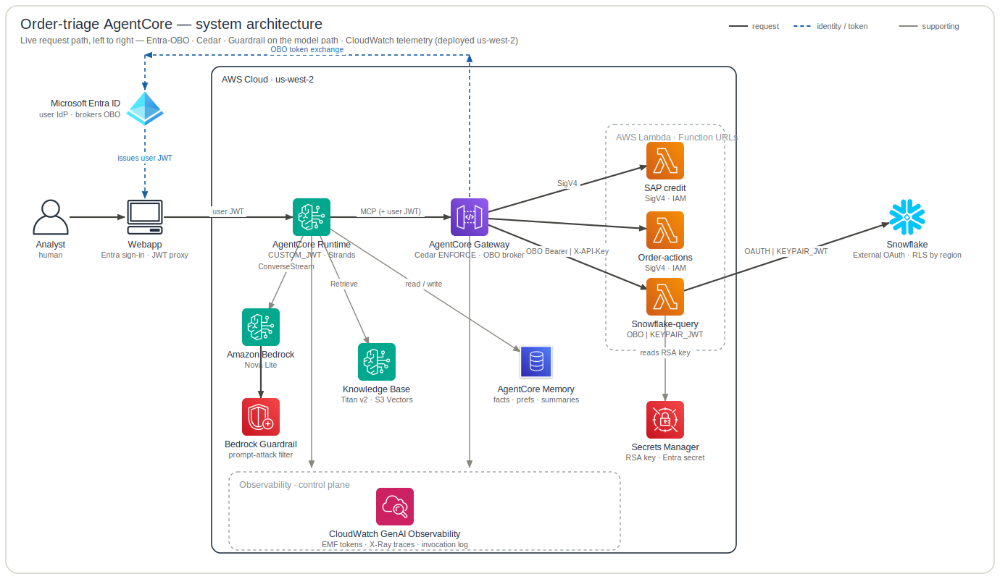
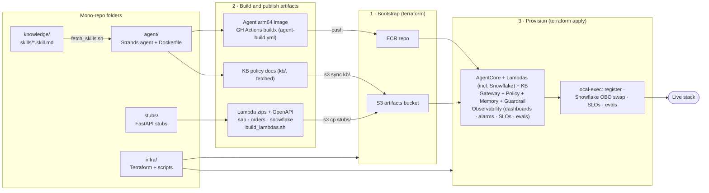
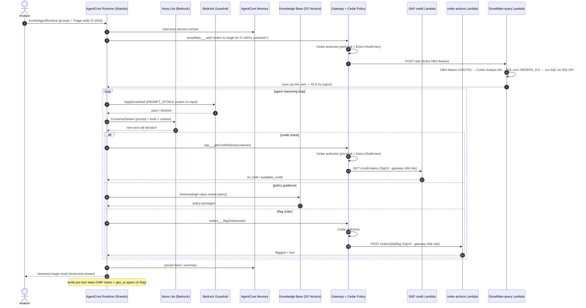

# infra

Terraform (plus a small preflight/registry helper) that **provisions the live
order-triage AgentCore stack on AWS** — AgentCore Runtime / Gateway / Memory / Policy,
three back-office stub Lambdas (incl. the Snowflake data path), a Bedrock Knowledge
Base, a native Guardrail, and the observability layer. It is the **orchestrator**: it consumes the other components' *published artifacts*
as inputs and does not reach into their source. Deployed region: **us-west-2**; model: **Nova Lite**.

## How it fits

One of **five components** in the [bedrock-demo](../README.md) mono-repo — see
[The five components](../README.md#the-five-components) for the full map and hand-offs.
This component is the orchestrator: it provisions the live order-triage AgentCore stack on
AWS, consuming the published artifacts from `agent` and `stubs` and serving the deployed
OBO runtime that `app` drives.

## Repository structure

```text
bootstrap/      ECR repo + artifacts S3 bucket + GitHub OIDC roles — the publish targets. Apply FIRST (separate state).
terraform/      The main stack (one apply):
                  runtime.tf · gateway.tf · policy.tf (Cedar) · identity.tf (credential providers) ·
                  memory.tf · {sap,order_actions,snowflake}_lambda.tf · guardrail.tf · knowledge_base.tf ·
                  observability.tf → modules/observability/ · registry.tf · iam.tf · variables.tf
                  terraform.tfvars.example  — the canonical, documented list of tunables
entra/          The Entra (azuread) apps as Terraform — SEPARATE local state, never torn down with the AWS stack
snowflake/      setup.sql · rls.sql · semantic_view.sql (ORDERS_SV Cortex-Analyst model) · test_user.sql
infra/          preflight.py (read-only access check) + register.py (Registry has no TF resource)
scripts/        seed_entra_secret.sh, snowflake_bootstrap.py, and the other make helpers
registry/       AgentCore Registry helper (idempotent register / destroy-time deregister)
docs/           adr/ (decisions 0001–0009) · architecture/ (subsystem diagrams) ·
                playbooks/ (runbooks) · research/ (spikes & audits) · architecture.md (detailed data plane)
Makefile        every operation is a make target (see Setup & usage)
```

## Setup & usage

**Prerequisites**

- An **AWS account** + a deploy role/credentials (the CD role is least-privilege; see [`docs/playbooks/cd-setup.md`](docs/playbooks/cd-setup.md)).
- An **Entra (Azure AD) tenant** + admin, for the OBO sign-in flow ([`docs/playbooks/entra-obo-setup.md`](docs/playbooks/entra-obo-setup.md)).
- A **Snowflake account**, for the order/customer data path ([`docs/playbooks/snowflake-bootstrap.md`](docs/playbooks/snowflake-bootstrap.md)).
- The single root **`bedrock-demo/.env`** (gitignored) — the one config file for all deploy/ops; `make` resolves every `TF_VAR_*` and bootstrap output from it.
- Tooling: `make prereqs` installs `terraform>=1.10` + `uv` + `aws` (skip if already present).

**Deploy (happy path)**

```bash
make prereqs           # one-time: install terraform>=1.10 + uv + aws (skip if present)
make preflight         # read-only access check (must pass before deploy)
make bootstrap         # ECR + artifacts bucket + secret container — note the outputs
make snowflake-setup   # seed Snowflake + populate the Secrets Manager secret  → docs/playbooks/snowflake-bootstrap.md
make seed-entra-secret # put the Entra OBO client secret in Secrets Manager (kept out of TF state)
# run the agent + stubs "publish" workflows so the image/zips/KB docs land in the bucket
make deploy            # terraform apply, consuming the published artifacts
make ingest            # trigger KB ingestion (required after every fresh apply)
make status            # end-to-end smoke test: mints an Entra ROPC user token + one live triage invoke
```

Tunables ship with sensible defaults (guardrail on, observability on, evaluations
opt-in) — override via `TF_VAR_*` or `terraform.tfvars`; the full annotated list is
[`terraform/terraform.tfvars.example`](terraform/terraform.tfvars.example), with the
rationale in the relevant ADRs. **Seeding, teardown, and rotation each have a runbook** —
see [Further reading](#further-reading).

## Architecture & visualizations

`infra` orchestrates; the other components supply artifacts, and
`app` drives the live OBO flow against the deployed CUSTOM_JWT runtime.
The system-architecture image below is a generated AWS-icon diagram; the
deployment-pipeline and data-flow diagrams are Mermaid (GitHub renders them inline).

### System architecture



> Generated from [`docs/architecture_diagram.py`](docs/architecture_diagram.py) — **regenerate,
> don't hand-edit** the SVG (the how-to is in [CLAUDE.md](CLAUDE.md)). Raster fallback:
> [`docs/system-architecture.png`](docs/system-architecture.png).

For the **full runtime data plane** (CUSTOM_JWT identity, Cedar authorization, the
PROMPT_ATTACK guardrail, the SigV4-vs-OBO egress split, per-user Snowflake RLS, and the
per-turn token/trace telemetry) see [`docs/architecture.md`](docs/architecture.md). For
**per-concern subsystem deep-dives** see [`docs/architecture/`](docs/architecture/README.md):
[Agent](docs/architecture/agent-architecture.md) ·
[Security](docs/architecture/security-architecture.md) ·
[Memory](docs/architecture/memory-architecture.md) ·
[Observability](docs/architecture/observability-architecture.md) ·
[Evaluation](docs/architecture/evaluation-architecture.md).

### Deployment pipeline



## Key journeys

**1 · Provisioning order.** `make bootstrap` must create the ECR repo + bucket *before*
the image/zip/KB artifacts are published; the main `terraform apply` then reads the
published OpenAPI specs (`aws_s3_object` data sources) and the ECR image **at plan/apply
time**, so those publishes are hard prerequisites. The one-time Snowflake prerequisite
(warehouse / DB / tables + read-only service user + the Secrets Manager secret the
Snowflake Lambda reads) is handled outside Terraform by `make snowflake-setup`.

**2 · One triage request (the runtime data plane).** An analyst's prompt enters the
CUSTOM_JWT runtime; the agent loads memory, queries Snowflake as the user (OBO) for
orders and on its own identity (SigV4) for customers/credit, screens model turns through
the guardrail, retrieves KB policy, and may flag an order — every Gateway call Cedar-authorized:



**3 · The CD cascade.** A merge under `knowledge/` or `agent/` to `main` triggers the agent
image build (`agent-build.yml`), which cascades a `repository_dispatch` to the **human-gated**
`deploy.yml`. Nothing deploys without manual approval.
Full runbook: [`docs/playbooks/cd-setup.md`](docs/playbooks/cd-setup.md).

## Further reading

- **Decisions** — [`docs/adr/`](docs/adr/): 0001 OBO · 0002 memory · 0003 guardrail ·
  0004 observability/FinOps · 0005 evaluations · 0006 gateway-role least-privilege ·
  0007 actor-resolution · 0008 semantic-view + Cortex Analyst · 0009 Function-URL hardening.
- **Reference designs** — [`docs/architecture.md`](docs/architecture.md) (data plane) +
  [`docs/architecture/`](docs/architecture/README.md) (subsystem diagrams).
- **Runbooks** — [`docs/playbooks/`](docs/playbooks/): [snowflake-bootstrap](docs/playbooks/snowflake-bootstrap.md) ·
  [deploy & teardown](docs/playbooks/deploy.md) · [cd-setup](docs/playbooks/cd-setup.md) ·
  [entra-obo-setup](docs/playbooks/entra-obo-setup.md) · [observability-impl-plan](docs/playbooks/observability-impl-plan.md).
- **Spikes & audits** — [`docs/research/`](docs/research/) (the exploration behind the ADRs).
- **[CLAUDE.md](CLAUDE.md)** — the machine/agent operating instructions for this repo
  (deployed-reality invariants, conventions, gotchas, diagram-regeneration).
