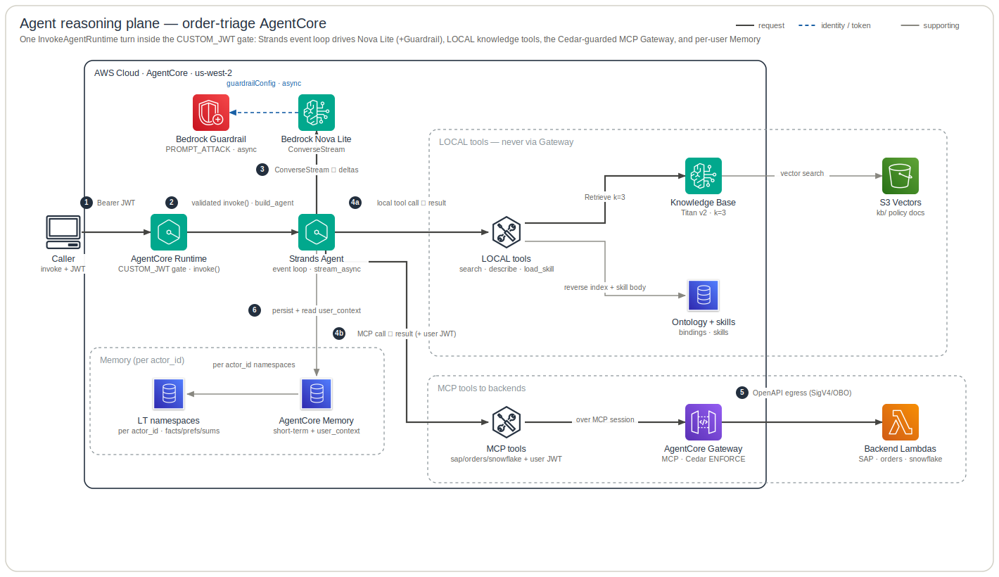

# Agent Architecture

This is the **agent reasoning plane** — what happens *inside* one `InvokeAgentRuntime` call once the CUSTOM_JWT authorizer has let it through: how the agent's `build_agent()` assembles the system prompt from preloaded doctrine plus an on-demand skills catalog, how the Strands `Agent` loops between **Bedrock Nova Lite** (`ConverseStream`) and its tools, how the three knowledge surfaces are wired (ontology bindings via `describe_entity`, on-demand skill bodies via `load_skill`, and the **Knowledge Base** via `search_policies`), and which tools are **LOCAL** (never traverse the Gateway) versus served by the **AgentCore Gateway (MCP)** under Cedar authorization. The grey **Observability** band is the control plane (telemetry, not request flow). The identity/OBO/Snowflake-RLS **data plane** and the build/publish/deploy pipeline are intentionally omitted — see `infra/docs/architecture/data-plane.md` for that request/data plane.

**Legend** — official AWS icons, left → right. Edges: **solid dark** = request / data path · **blue dashed** = identity / token / secret · **grey** = supporting (incl. telemetry); primary steps are numbered. Rounded boxes are trust / responsibility zones. The diagram is generated from [`specs.json`](specs.json) by the `architecture-skill` skill — edit the spec, not the SVG.

## How to read it

The walkthrough below is the full turn in depth — **steps 1–6** assemble the agent (the agent's `build_agent()`); **steps 7–13** are the per-turn reasoning loop the diagram above shows.

**1–2 · Entrypoint — the CUSTOM_JWT gate, then code runs.** The caller issues `InvokeAgentRuntime` with `{prompt, session_id}` and a Bearer Entra user JWT. The Runtime Endpoint's CUSTOM_JWT authorizer validates `aud`/`iss` *before any code runs* — `allowed_audience = ["api://${entra_agent_app_id}"]` on `aws_bedrockagentcore_agent_runtime_endpoint.default` in `infra/terraform/runtime.tf`. Only then does `BedrockAgentCoreApp`'s `@app.entrypoint async invoke(payload, context)` execute — **the agent owns this loop** in `agent/src/order_triage/runtime.py` (it constructs the `BedrockAgentCoreApp` and the entrypoint directly; the agent-agnostic plumbing is `agent_kit` helpers it calls). It reads `prompt` from `payload["prompt"]`/`inputText` and `session_id` from the payload, falling back to `context.session_id`. The runtime streams back **NDJSON** — each `yield` is one line: answer/thinking text bare, everything else routed through `step_events`.

**3 · Identity → the memory partition key (NOT authorization).** `extract_user_jwt(context)` (`agent_kit.infra.identity`) reads the allow-listed `Authorization` header (`request_header_allowlist = ["Authorization"]`, `runtime.tf`), strips the `Bearer ` prefix, and `identity.set_user_jwt` stores it in a ContextVar for the turn. `_claims_from_jwt` base64-decodes the JWT payload **without verifying the signature** (the authorizer already verified it) to read `sub`, falling back to `oid`; `actor_id(default="order-triage")` returns that subject or the shared anonymous fallback (the agent passes its `AGENT_ID="order-triage"` as the default). This subject is used **only** as the Memory `actor_id` partition — never to authorize a call.

**4 · Gateway MCP client opens for the whole turn.** `build_gateway_client(gateway_url, jwt)` (`agent_kit.infra.gateway`) builds a Strands `MCPClient` over `streamablehttp_client(GATEWAY_URL)` with `headers={"Authorization": f"Bearer {ident.raw_jwt}"}` — it forwards the **same inbound user JWT**; the agent mints no credentials. The agent's `runtime.py` hard-`RuntimeError`s (this runtime is Gateway-only) when `GATEWAY_URL` or the user identity is missing, then enters `with gw:` and calls `gw.list_tools_sync()` to fetch the backend tool surface as `extra_tools`. The MCP session must stay open for the whole stream because the tools are only callable while the session is live.

**5 · System-prompt assembly — the three knowledge surfaces wired in.** `kit.build_system_prompt()` (`agent_kit.prompt`) assembles the system prompt from three parts: **(a)** hard-coded order-triage guardrail text (flag only on evidence — a high risk score, a policy requirement, or a confirmed SAP hold — and only on an OPEN order; only `orders___flagOrder` truly flags; ground every policy claim in `search_policies`); **(b)** the doctrine = the joined `.body` of all `preload:true` skills via `skill_loader.preloaded_skills()` — today just `using_the_knowledge_layer.skill.md`, which teaches the Ontology→Skills→KB hierarchy; **(c)** `skill_loader.skills_catalog()`, the on-demand catalog (name, description, applies-to entities/actions) of the **NON-preload** skills the model can `load_skill(name)` to read in full. `skills_catalog` explicitly excludes preloaded skills (`agent_kit.knowledge.skill_loader`). When `SKILLS_DIR` is absent (sandbox), the doctrine is empty and the catalog renders `(no skills available)` — a real branch, not an error.

**6 · Model, tools, and the startup coverage gate.** The agent's `build_agent` (`agent/src/order_triage/agent.py`) constructs `BedrockModel(model_id=os.getenv("BEDROCK_MODEL_ID", …), …)` itself — **the agent owns the model and its config**. The code default is `anthropic.claude-opus-4-8`, but `runtime.tf` injects `BEDROCK_MODEL_ID = var.bedrock_model_id` = `amazon.nova-lite-v1:0` at deploy — **Nova Lite is what actually runs** (`infra/CLAUDE.md` "Deployed reality"). `additional_args.requestMetadata` (from `kit.request_metadata(...)`) tags every Converse with opaque `agent`/`actor`/`session`/`turn` ids, each passed through `_rm_value` to strip `_RM_DISALLOWED` chars (incl. `@`) and truncate to 256 (`agent_kit.prompt`). Tools come from `kit.tools_with_coverage(local_tools, ACTIONS, extra_tools)` (`agent_kit.knowledge.coverage`): the local tools `[search_policies, describe_entity, load_skill]` **plus** the Gateway `extra_tools`. `assert_action_coverage` is a **hard fail-fast startup gate**: every action any fetched skill can `invoke` must map through the agent's `ACTIONS` map (`{"raiseException": "orders___flagOrder"}`) to a Gateway tool that is actually registered — otherwise `tools_with_coverage` aborts with `SkillActionCoverageError`. This is the load-bearing invariant that ties the skills corpus to the live Gateway tool surface.

**7–8 · The Strands event loop (model ⇄ tools).** `agent.stream_async(prompt)` runs the reasoning loop. Each cycle calls Nova Lite via `ConverseStream`; when **both** `BEDROCK_GUARDRAIL_ID` and `BEDROCK_GUARDRAIL_VERSION` are set (default-on via `var.enable_guardrail` injecting them in `runtime.tf`), the agent's `build_agent` attaches `guardrailConfig` onto its `BedrockModel` with `guardrail_stream_processing_mode="async"` and `guardrail_redact_input=False` (`agent/src/order_triage/agent.py`). Note: the agent wires the id/version generically — the **PROMPT_ATTACK-only, no-PII** content policy itself lives in `infra/terraform/guardrail.tf` (rationale in ADR-0003: the OBO agent reads customer PII end-to-end by design). The model streams text deltas and `toolUse` blocks back into the loop.

**9–10 · LOCAL tools vs. MCP Gateway tools.** When the model emits a `toolUse`, Strands dispatches to one of two surfaces. **LOCAL tools never traverse the Gateway:**
- `search_policies(query)` → `boto3 "bedrock-agent-runtime".retrieve(knowledgeBaseId, numberOfResults=3)` into the Titan-v2 / S3-Vectors Knowledge Base. The tool is built by the `make_kb_tool(name, description, knowledge_base_id, region)` factory from the agent's `KB_TOOL_NAME`/`KB_TOOL_DESCRIPTION` constants (`agent_kit.knowledge.kb:make_kb_tool` / `_kb_retrieve`).
- `describe_entity(api_name)` → the ontology reverse index in `bindings.json` + `ontology.compiled.json` (`agent_kit.knowledge.ontology:OntologyLoader`). Its `EntityView` returns **skills + actions + KB tags + related entities (via `linkTypes`) + properties + datasource** — so this tool is itself the ontology→KB bridge, not just a skills pointer. Its docstring warns that ontology names are **not** Snowflake runtime field names and must never be passed as tool args.
- `load_skill(name)` → the full markdown body of a fetched skill on demand (`agent_kit.knowledge.skills`).

**MCP Gateway tools** — `sap___getCreditStatus`, `orders___flagOrder`, and `snowflake___ask` (the exact set enumerated in `agent_kit.infra.gateway`'s module docstring) — go over the MCP session to the **AgentCore Gateway (MCP)**, which **Cedar-authorizes every call** (`infra/terraform/policy.tf`: principal `AgentCore::OAuthUser`, guard `principal.hasTag("scp")`, permits `permit_sap_read` / `permit_flag` / `permit_snowflake_ask`) then egresses to the backend Lambdas (SigV4 for sap/orders, OBO `TOKEN_EXCHANGE` for snowflake — the data plane, out of scope here). `snowflake___ask` is the single Snowflake analytics tool: a natural-language question that the snowflake Lambda answers via Cortex Analyst over the `ORDERS_SV` semantic view and runs as the signed-in user (ADR-0008). Tool results feed back into the loop, which continues until the model produces the final answer.

**11 · Memory — short-term + per-user long-term.** When `session_id` is non-null, `build_session_manager` (`agent_kit.infra.memory`) returns an `AgentCoreMemorySessionManager` (`AGENTCORE_MEMORY_ID` from `memory.tf`); when it is null the agent is stateless single-shot (manager is `None`). It persists each turn as short-term events and retrieves extracted long-term memories, injecting them as a `<user_context>` block on the latest user message. `_RETRIEVAL` selects three namespaces — `/facts/{actorId}` (SEMANTIC), `/preferences/{actorId}` (USER_PREFERENCE), and `/summaries/{actorId}/{sessionId}` (SUMMARIZATION) — all keyed by the request `actor_id`, so long-term memory is partitioned per user (`relevance_score = 0.3`). The strategies are `aws_bedrockagentcore_memory_strategy.{semantic,summary,preferences}` in `memory.tf`. The system prompt explicitly tells the model to treat `<user_context>` as background, **never** as evidence for flagging.

**12–13 · Streaming timeline + token telemetry.** The agent's `runtime.py` loop forwards answer/thinking text bare and runs every other event through `step_events` (`agent_kit.stream_steps`), which classifies Strands `message` events into typed `__step__` timeline entries — `tool_call` `{name, input}`, `tool_result` `{status, text}`, `reason` — for a Claude-Code-style client timeline. After the stream completes, `kit.emit_usage_metric(...)` (`agent_kit.infra.metrics`) reads `agent.event_loop_metrics.latest_agent_invocation.usage` (the **per-turn** total, not accumulated) and prints one EMF line — Namespace `OrderTriage/Agent` (the agent's `METRIC_NAMESPACE`), dimensions `[agent_id, model_id]` only, with `session_id` / `actor_id` / `cache_*` as high-cardinality **root** fields (never dimensions). That EMF metric, the Bedrock model-invocation log (PII-masked), and the OTEL `gen_ai` spans (`OTEL_SEMCONV_STABILITY_OPT_IN = gen_ai_latest_experimental,gen_ai_tool_definitions` in `runtime.tf`) feed CloudWatch GenAI Observability. Telemetry never raises — a failure must not break the turn.

## Provenance

- **Runtime entrypoint / NDJSON / gw lifecycle** — the agent's `agent/src/order_triage/runtime.py` (the `@app.entrypoint invoke` loop on `BedrockAgentCoreApp`, `with gw` / `list_tools_sync`), calling helpers `agent_kit.infra.identity.extract_user_jwt`, `agent_kit.infra.metrics.emit_usage_metric`, `agent_kit.stream_steps.step_events`.
- **System-prompt assembly / requestMetadata** — `agent_kit.prompt` (`build_system_prompt`, `request_metadata`, `_rm_value`/`_RM_DISALLOWED`). **Model / guardrail gating / Agent construction** — the agent's `agent/src/order_triage/agent.py` (`build_agent`: `BedrockModel` + guardrail kwargs + `Agent(...)`, the model/config constants).
- **Tool surface + coverage gate** — `agent_kit.knowledge.coverage` (`tools_with_coverage`, `assert_action_coverage`, `SkillActionCoverageError`); the action map is the agent's `ACTIONS` constant in `agent.py`.
- **Three knowledge surfaces** — `agent_kit.knowledge.kb` (`search_policies` via `make_kb_tool`/`_kb_retrieve`), `agent_kit.knowledge.ontology` (`describe_entity`/`OntologyLoader`/`EntityView`), `agent_kit.knowledge.skills` (`load_skill`), `agent_kit.knowledge.skill_loader` (`SkillLoader`, `preloaded_skills`, `skills_catalog`).
- **Skills & ontology corpus (fetched, gitignored)** — `agent/skills/*.skill.md` (4 skills), `agent/ontology/bindings.json` + `ontology.compiled.json` (built by `knowledge/build/bindings.py`).
- **Identity** — `agent_kit.infra.identity` (`extract_user_jwt`, `_claims_from_jwt`, `actor_id`, `ANONYMOUS_ACTOR`).
- **Gateway client** — `agent_kit.infra.gateway` (`build_gateway_client`); the backend tool list is the agent's concern (the `ACTIONS` map + the Gateway-discovered `extra_tools`).
- **Memory** — `agent_kit.infra.memory` (`build_session_manager`) + the agent's `RETRIEVAL_NAMESPACES` constant + `infra/terraform/memory.tf` (`aws_bedrockagentcore_memory_strategy.{semantic,summary,preferences}`).
- **Runtime endpoint / model env / OTEL / guardrail env** — `infra/terraform/runtime.tf` (`aws_bedrockagentcore_agent_runtime_endpoint.default`, `custom_jwt_authorizer`, `request_header_allowlist`, `BEDROCK_MODEL_ID`, `BEDROCK_GUARDRAIL_ID/VERSION`, `OTEL_SEMCONV_STABILITY_OPT_IN`).
- **Model default override** — the agent's `agent.py` (`BEDROCK_MODEL_ID` env, default `anthropic.claude-opus-4-8`).
- **Knowledge Base / S3 Vectors** — `infra/terraform/knowledge_base.tf` (`aws_bedrockagent_knowledge_base.this`, `aws_s3vectors_index.kb`, `aws_bedrockagent_data_source.kb` inclusion prefix `kb/`).
- **Gateway / Cedar / targets** — `infra/terraform/gateway.tf` (`aws_bedrockagentcore_gateway.this`, sap/orders targets), `policy.tf` (`cedar_principal`, `cedar_guard`, `permit_sap_read`/`permit_flag`/`permit_snowflake_ask`), `snowflake_lambda.tf` (snowflake target + `terraform_data.snowflake_obo_egress`).
- **Guardrail content policy** — `infra/terraform/guardrail.tf` (PROMPT_ATTACK input filter; ADR-0003).
- **Stream timeline** — `agent_kit.stream_steps` (`step_events`).

## Status & caveats

- **Deployed model is Nova Lite (`amazon.nova-lite-v1:0`)** via `BEDROCK_MODEL_ID`. The Python default `anthropic.claude-opus-4-8` in the agent's `agent.py` is overridden at deploy and is misleading if read in isolation (`runtime.tf`; `agent` CLAUDE.md "Deployed reality").
- **Guardrail is default-on (`enable_guardrail`) but PROMPT_ATTACK input-filter ONLY** — no PII policy by design, because the OBO agent reads customer PII end-to-end (ADR-0003). It is also a **silent no-op unless BOTH** `BEDROCK_GUARDRAIL_ID` *and* `…_VERSION` env vars are set (the agent's `build_agent` gate in `agent.py`); empty env (sandbox) = no guardrail. The PROMPT_ATTACK literal lives in `guardrail.tf`, not in agent code.
- **Skills / ontology / KB docs are FETCHED content** (`make skills`), **gitignored** in the agent repo and pinned to an `knowledge` git tag — not source in this repo. The agent **degrades gracefully** to an empty skills catalog / empty ontology when absent: the system prompt renders `(no skills available)`, the doctrine is empty, `describe_entity` returns empty (`agent_kit.knowledge.skill_loader`, `agent_kit.knowledge.ontology`).
- **The coverage gate is fail-fast**, not best-effort: a fetched skill whose `invokes` action lacks an `ACTIONS` mapping — or whose mapped Gateway tool is not registered — aborts `tools_with_coverage` (called from the agent's `build_agent`) with `SkillActionCoverageError` (`agent_kit.knowledge.coverage`).
- **Memory is active only when `session_id` is non-null**; `session_id=None` yields a stateless single-shot agent with no persistence (`agent_kit.infra.memory`). `retrieval_config relevance_score = 0.3` is a conservative starting floor to tune from traces, not a validated value (ADR-0002).
- **Skill bodies reference abstract verbs** (`ask_orders`, `sap_credit_check`, `score_order`, `flag_order_for_review`) that are skill-authored pseudonyms, **NOT** the live Gateway tool names; only `raiseException → orders___flagOrder` is mapped in the agent's `ACTIONS` constant. `score_order` is an agent-specific heuristic intentionally **not** promoted into the enterprise knowledge layer (knowledge-repo enterprise-scope).
- **One Snowflake action now: `snowflake___ask`** — the four fixed reads (getOrders/getOrder/getCustomer/listCustomers) collapsed into a single Cortex-Analyst-backed analytics tool (`permit_snowflake_ask` in `policy.tf`; `agent_kit.infra.gateway` docstring lists `snowflake___ask` + sap + orders). Fine-grained row/column governance moved into the `ORDERS_SV` semantic view + Snowflake RLS, enforced under the user's OBO token (ADR-0008).
- **The snowflake target's OBO `TOKEN_EXCHANGE` credential and the App Signals / online-eval wiring** are applied out-of-band via `terraform_data` + AWS CLI local-exec and have **NO drift detection** (`snowflake_lambda.tf`; ADR-0004/0005). The `api_key` (`X-API-Key`) credential is the creation-time placeholder / SigV4-path fallback.
- **EMF token-metric auto-extraction over the vended-log delivery pipeline is not guaranteed**; a CloudWatch Logs metric filter may be needed (`agent_kit.infra.metrics:emit_usage_metric` NOTE). The structured log line is queryable via Logs Insights regardless.
- **Backend Lambdas, Cedar enforcement detail, OBO brokering, and Snowflake RLS** are collapsed here as one out-of-scope node — the full request/identity data plane is `infra/docs/architecture/data-plane.md`.
- **`ontologyVersion` in the fetched `bindings.json` is `0.5.0`** ("Agro-Commodity Supply Chain Ontology", 6 skills incl. `examples/`) while only **4** `*.skill.md` are baked into the agent image; the agent consumes top-level `skills/*.skill.md` only, not `skills/examples/*.skill.yaml` (knowledge CLAUDE.md "Consuming side").
