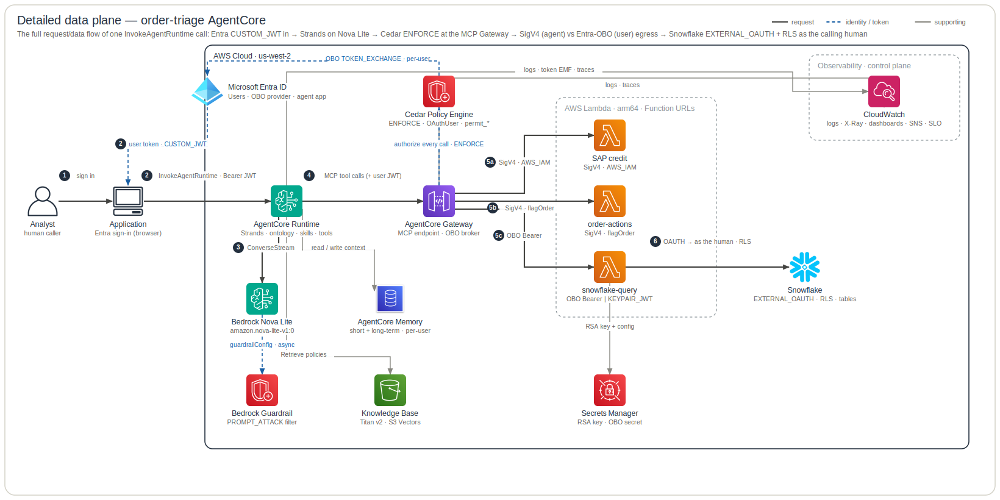
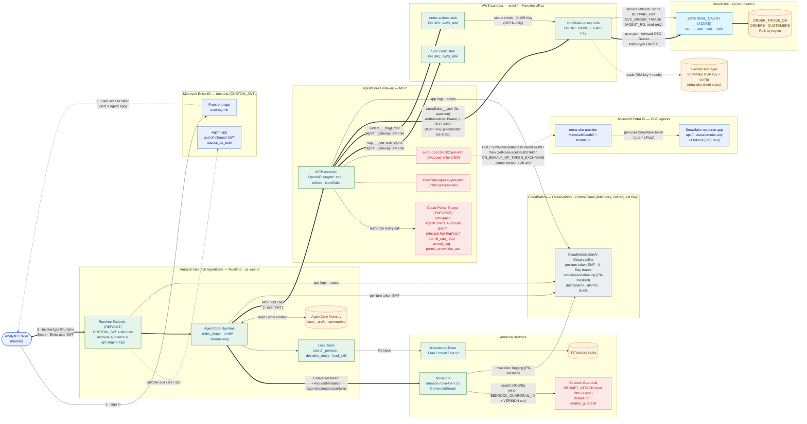
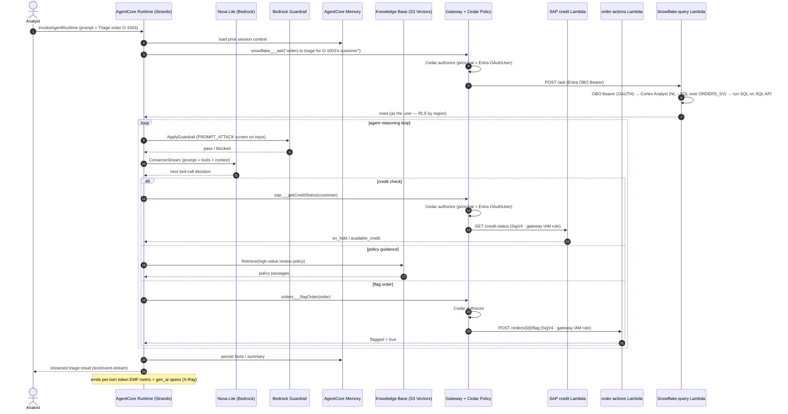

# Detailed Runtime Data Plane

The **live request / data plane**: how one `InvokeAgentRuntime` call flows from an
Entra-authenticated caller, through the AgentCore Runtime and the Cedar-guarded
Gateway, out to the stub Lambdas, and into Snowflake **as the calling human** (OBO).
The grey **Observability** band is the *control plane* (telemetry, not request flow);
build/publish/deploy is documented in the [repo README](../../../README.md) and
[`playbooks/cd-setup.md`](../playbooks/cd-setup.md), and drawn as the [DevOps / CI-CD plane](devops-architecture.md). This is the
detailed sibling of the [end-to-end lifecycle](end-to-end.md) — the hero's request spine (`R1–R7`)
at wire level, expanding the identity / Cedar / OBO / RLS chain the hero folds.

**Legend** — official AWS (+ SaaS) icons, left → right. Edges: **solid dark** =
request / data path (numbered `1…6`) · **blue dashed** = identity / token / OBO ·
**grey** = supporting (reads, telemetry). Rounded boxes group by trust / responsibility.
The diagram is generated from [`specs.json`](specs.json) by the
[`architecture-skill` skill](README.md) — edit the spec, not the SVG.

> **See also — subsystem deep-dives.** This page is the end-to-end *data plane*. For
> per-concern detail (each a different cross-section of the same call, in the same visual
> grammar), see the [plane index](README.md): [Agent](agent-architecture.md) ·
> [Knowledge](knowledge-architecture.md) · [Security](security-architecture.md) ·
> [Memory](memory-architecture.md) · [Observability](observability-architecture.md) ·
> [Evaluation](evaluation-architecture.md).

## Wire-level view (Mermaid)

The same flow as a detailed Mermaid diagram — finer-grained than the AWS-icon SVG above
(every Entra app, credential provider and auth path spelled out), and useful where an
AWS-icon render is overkill (PR diffs, ADRs). **Colour** — blue = identity, green =
compute, red = authorization (incl. the Guardrail), amber = data store, cyan = external
Snowflake, grey = observability (control plane).

## How to read it

**1 — Inbound identity (CUSTOM_JWT).** The human signs in to the Entra **front-end app**
and receives a user access token whose `aud` is the **agent app**. `InvokeAgentRuntime`
carries it as a Bearer; the Runtime Endpoint's **CUSTOM_JWT** authorizer validates
`aud`/`iss` and that `scp` is present before any agent code runs.

**2 — Agent reasoning.** The `order_triage` Strands agent streams to **Nova Lite**
(`ConverseStream`, tagging each call with `requestMetadata` for the audit log), retrieves
policy passages from the **Knowledge Base** (Titan v2 → S3 Vectors), reads/writes session
**Memory** (short-term events **and** active long-term retrieval — facts/prefs/summaries,
per-user `actor_id`), and reaches all backend data only through **MCP tool calls** to the
Gateway — propagating the user JWT. When `BEDROCK_GUARDRAIL_ID`/`VERSION` are set (default-on
via `enable_guardrail`), Strands attaches a **Bedrock Guardrail** `guardrailConfig` to the
model path — an async `PROMPT_ATTACK` input filter.

> **Model id:** the diagram shows the *deployed* model, **Nova Lite**
> (`amazon.nova-lite-v1:0` via `var.bedrock_model_id`). The agent's code default in
> `agent/src/order_triage/agent.py` (`BEDROCK_MODEL_ID` env) is `anthropic.claude-opus-4-8`;
> the Terraform-injected env var overrides it at deploy time.

**3 — Authorization (Cedar).** Every Gateway tool call is checked by the **Cedar Policy
Engine** in `ENFORCE` mode. The principal is `AgentCore::OAuthUser`; the guard
`principal.hasTag("scp")` admits any authenticated Entra user (a trivially-true
`when{true}` is rejected by the engine's semantic validation). Three permits map to the
tool actions: `permit_sap_read`, `permit_flag`, `permit_snowflake_ask` (one `snowflake___ask`
analytics action — fine-grained row/column governance is in the semantic view + Snowflake RLS,
see ADR-0008).

**4 — Egress credentials (the split).**
- **SAP & orders** targets use **SigV4** signed by the Gateway's IAM role against the
  `AWS_IAM`-locked Lambda Function URLs — no credential provider, no shared key.
- **snowflake** target uses **Entra OBO**: the Gateway exchanges the inbound user JWT for
  a per-user, Snowflake-scoped token (`GetWorkloadAccessTokenForJWT` →
  `GetResourceOauth2Token`, `ON_BEHALF_OF_TOKEN_EXCHANGE`, scope `session:role-any`) via
  the `entra-obo` provider and injects it as `Authorization: Bearer`.

**5 — Snowflake, as the human.** The snowflake-query Lambda has **two auth paths**:
- **User path (OBO):** when the Gateway forwards a Bearer token, the Lambda presents *that*
  to the Snowflake SQL REST API (`token-type OAUTH`). Snowflake's `EXTERNAL_OAUTH (AZURE)`
  integration maps `upn → user` and `scp → role`, so queries run **as the calling human**
  and **row-level security** returns only that user's entitled region.
- **Service fallback:** with no Bearer (e.g. the order-actions status check via `X-API-Key`),
  the Lambda signs a **KEYPAIR_JWT** as `SVC_ORDER_TRIAGE` (the read-only `AGENT_RO` role).

`order-actions` (`flagOrder`) is a thin write-side stub: it reads the order's status from
the snowflake-query Lambda (X-API-Key → service path), refuses anything not `OPEN`, and
records the flag.

**6 — Observability (control plane).** Off the request path, the Runtime and Gateway
deliver **application logs and X-Ray traces** to **CloudWatch GenAI Observability**; the
Runtime also emits a per-turn **token-usage EMF metric** (`OrderTriage/Agent`), and Bedrock
**model-invocation logging** captures each call's tokens/identity/IO behind a CloudWatch
data-protection PII mask. These feed the dashboards, alarms, SLOs and Contributor-Insights
rules. Per-trace **AgentCore Online Evaluations** (LLM-judge) is wired in IaC but
opt-in (`enable_online_evaluations`, default off) and is omitted here for clarity.

## One triage request (sequence)

The same flow as a step-by-step sequence — an analyst's prompt enters the
CUSTOM_JWT runtime; the agent loads memory, queries Snowflake as the user (OBO) for
orders and on its own identity (SigV4) for customers/credit, screens model turns through
the guardrail, retrieves KB policy, and may flag an order — every Gateway call Cedar-authorized:

