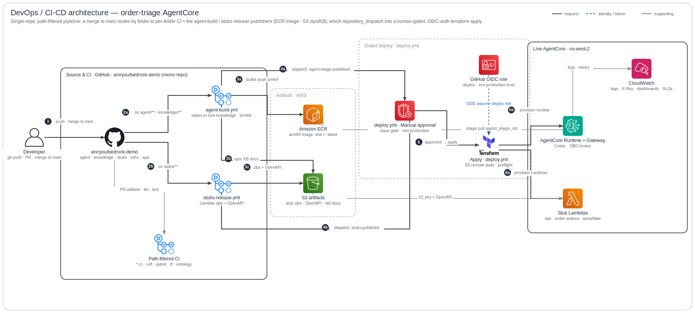
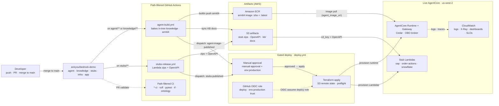

# DevOps / CI-CD Architecture

The **delivery plane** — how a change reaches the live `order_triage` AgentCore stack. Unlike the
runtime planes (which trace one `InvokeAgentRuntime` call), this traces one **merge to `main`**
through the mono-repo's **path-filtered** GitHub Actions pipeline. It replaces the retired 5-repo
`repository_dispatch` cascade: now there is **one repo** (`aniryou/bedrock-demo`) with component
folders, and **path filters** route each change to the right workflow.

**Legend** — official AWS (+ GitHub / Terraform) icons, left → right. Edges: **solid dark** =
build / publish / deploy path (numbered; `a/b` for a parallel fan-out) · **blue dashed** =
identity / OIDC · **grey** = supporting (PR validation, artifact reads, telemetry). Rounded boxes
are pipeline-stage zones. The diagram is generated from [`specs.json`](specs.json) by the
`architecture-skill` skill — edit the spec, not the SVG.

## How to read it

### 1 · A change enters one repo
**(1)** A developer pushes / merges to `main`. There is a single repo; the **folder** that changed
(`agent/`, `knowledge/`, `stubs/`, `infra/`, `app/`) decides which workflows run — every workflow
declares `paths:` filters, so unrelated folders stay idle.

### 2 · Path-filtered fan-out
**(2a)** `agent-build.yml` triggers on **`agent/**` _or_ `knowledge/**`** — because the agent
**bakes knowledge in-tree**: its build runs `make skills`, which copies `skills/` + ontology
`bindings.json` + `kb/` straight from the sibling `../knowledge` folder (no cross-repo fetch, no
`SKILLS_TOKEN`), so the image always matches the knowledge committed in the same revision. **(2b)**
`stubs-release.yml` triggers on `stubs/**`. The grey **Path-filtered CI** lane is the per-folder
`*-ci` / validate workflows (`agent-ci`, `app-ci`, `infra-ci`, `stubs-ci`, `knowledge-validate`) —
ruff · pytest · `terraform fmt+validate` · the ontology/bindings drift gate — run on every PR and
push; it produces **no artifact**.

### 3 · Publish artifacts
**(3a)** `agent-build` cross-builds a `linux/arm64` image and pushes it to **Amazon ECR** as
`:<sha>` + `:latest`; **(3b)** the same job `aws s3 sync`s the KB policy docs to the artifacts
bucket. **(3c)** `stubs-release` builds the three Lambda zips and uploads them **plus their OpenAPI
specs** to `s3://<artifacts>/stubs/` — `infra/` references the zips by `s3_key` and reads the
OpenAPI via `aws_s3_object` data sources (the Gateway targets).

### 4 · Cascade into the gated deploy
**(4a / 4b)** After publishing, each producer fires an intra-repo `repository_dispatch` —
`agent-image-published` and `stubs-published` — at **`deploy.yml`**. (`stubs-release` uses a PAT
because a `GITHUB_TOKEN`-triggered dispatch deliberately does **not** start new runs.) Both land on
the same `deploy-infra` concurrency group, which coalesces overlapping triggers into one apply.

### 5–6 · The gate, then apply
**(5)** `deploy.yml` runs **`trstringer/manual-approval` first** — it opens an issue and blocks
until an approver comments `approved`; this step holds only the default `GITHUB_TOKEN`, so **no AWS
role is assumed until after approval**. The single node folds all three enforcement layers: the
approval comment, the GitHub `environment: production` required-reviewers gate, and the OIDC trust
pinned to `repo:aniryou/bedrock-demo:environment:production`. On approval it assumes the
least-privilege **deploy** role via GitHub OIDC (no long-lived keys), runs `infra.preflight`
(read-only access check), and **(6a / 6b)** `terraform apply`s against S3 remote state — provisioning
the **AgentCore Runtime + Gateway** and the **stub Lambdas**, which pull the ECR image
(`agent_image_uri`) and the S3 `s3_key` / OpenAPI respectively. Runtime + Gateway telemetry flows to
CloudWatch (the grey control plane).

## Wire-level view (Mermaid)

The same pipeline as a Mermaid flowchart — useful where an AWS-icon SVG is overkill (PR diffs, ADRs).

## Provenance
- **Workflows** — `.github/workflows/`: `agent-build.yml` (image + KB publish, the `knowledge/**`
  trigger + `make skills` in-tree bake), `stubs-release.yml` (zips + OpenAPI, the PAT dispatch),
  `{agent,app,infra,stubs}-ci.yml` + `knowledge-validate.yml` (the validate lane), `deploy.yml`
  (manual-approval gate → OIDC → `terraform apply`).
- **OIDC trust** — `infra/bootstrap/github_oidc.tf` (`repo:aniryou/bedrock-demo:environment:production`).
- **In-tree knowledge** — `agent/scripts/fetch_skills.sh` (prefers the local `../knowledge` sibling).
- **Runbook** — [`playbooks/cd-setup.md`](../playbooks/cd-setup.md).

## Caveats / scope
- Delivery plane only; the per-turn runtime is the other planes (start at the
  [system overview](system-overview.md)).
- The producers still use `repository_dispatch`, now **intra-repo** — every dispatch step is guarded
  `if: env.DISPATCH_TOKEN != ''`, so the cascade no-ops safely until the PAT is provisioned;
  `deploy.yml` is also `workflow_dispatch` (manual) for an apply with no producer change.
