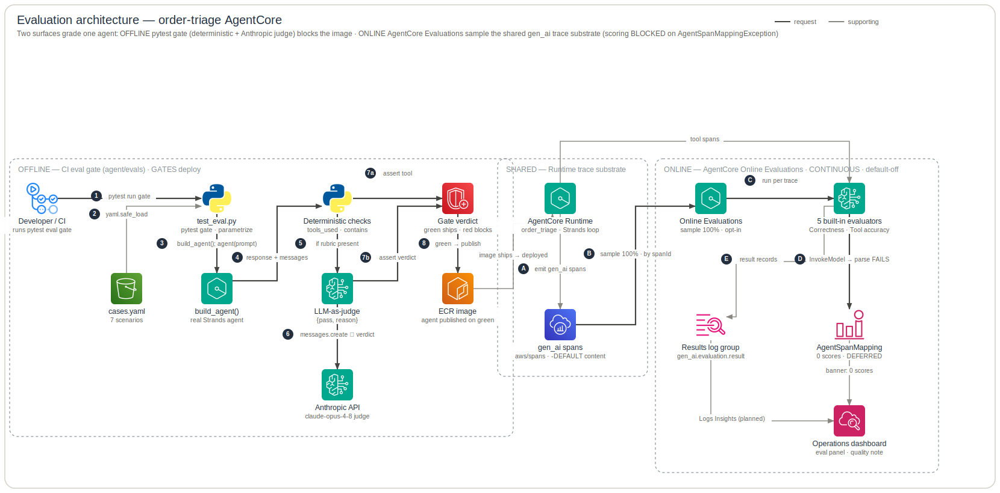

# Evaluation Architecture

This shows the **evaluation plane** of the order-triage agent — the two surfaces that decide whether the agent is correct, helpful, and faithful, and how each one grades the *same* `order_triage` Strands agent. **Left:** the offline/pre-deploy CI gate that lives in the agent repo (`agent/evals/`) — deterministic tool-trajectory and substring assertions plus an Anthropic LLM-as-judge rubric, run as a `pytest` gate that blocks the image before it ships. **Right:** the in-production AgentCore Online Evaluations service that samples live agent traces and runs five built-in LLM-judge evaluators, intended to feed the **Operations dashboard** eval panel (formerly the "Feedback" board). The shared AgentCore Runtime sits between them as the single source of the `gen_ai` spans both surfaces depend on. This deliberately omits the request/data plane (OBO token exchange, Cedar authorization, Snowflake RLS) — that is `infra/docs/architecture/data-plane.md` — and the build/publish pipeline (GitHub Actions, OIDC, ECR/S3). It marks what is **gating** vs **continuous**, what is **opt-in / default-off**, the **`AgentSpanMappingException`** blocker, and the `terraform_data`/`local-exec` provisioning that has **no drift detection**.

**Legend** — official AWS icons, left → right. Edges: **solid dark** = request / data path · **blue dashed** = identity / token / secret · **grey** = supporting (incl. telemetry); primary steps are numbered. Rounded boxes are trust / responsibility zones. The diagram is generated from [`specs.json`](specs.json) by the `architecture-skill` skill — edit the spec, not the SVG.

## How to read it

### Two surfaces, one agent
The same `order_triage` Strands agent is judged twice. **OFFLINE** (left) is a `pytest` gate in `agent/evals/` that runs the *real* agent against fixed scenarios and blocks the deploy if quality regresses — developer-time, deterministic + judge, **gating**. **ONLINE** (right) is AgentCore Online Evaluations sampling the agent's *production* traces and running an LLM judge — production-time, 100% sampled, judge-only, **continuous**. The shared **RUNTIME** band in the middle is both the artifact the offline gate must pass *and* the single source the online surface reads.

### 1–4 · Offline: run the real agent over `cases.yaml`
`test_eval.py` (`agent/evals/test_eval.py:test_eval_case`) is `@pytest.mark.parametrize("case", CASES)` over the **7** scenarios loaded by `yaml.safe_load(...)["cases"]` from `agent/evals/cases.yaml`. The whole module is `@pytest.mark.skipif(not HAS_KEY)` where `HAS_KEY = bool(os.getenv("ANTHROPIC_API_KEY"))`, so `make test` (which runs `pytest tests -q` with `testpaths=["tests"]` per `agent/Makefile` / `pyproject.toml`) stays hermetic and model-free — the eval gate is the *separate* model-backed CI job. Each case calls `build_agent()` (`agent/src/order_triage/agent.py:build_agent`) and invokes `agent(case["prompt"])` for real. Cases marked `needs_sap` (`sap_credit_hold`) first probe the SAP stub via `_sap_up()` → `{sap_api_url}/health` and skip if it is down.

### 4–5 · Offline grading: deterministic checks, then judge
The harness captures `response = str(result)` and `trace = json.dumps(agent.messages)`. Deterministic assertions fire first: `tools_used` / `tools_not_used` assert a named tool appears (or is absent) in the message trace — e.g. `score_and_flag_high_risk` requires `[score_order, flag_order_for_review]`, and `no_ontology_overcall_on_scoring` requires `score_order` but **forbids** `describe_entity` (the negative-trajectory check). `contains` / `not_contains` assert substrings in the response (e.g. `"high"`, `"O-1003"`). These are the offline analogue of the online `ToolSelectionAccuracy` / `ToolParameterAccuracy` evaluators — same intent, deterministic implementation.

### 5–8 · Offline LLM-as-judge and the gate
If a case has a `rubric`, `judge(prompt, response, rubric)` (`agent/evals/judge.py:judge`) calls the Anthropic API directly — `anthropic.Anthropic().messages.create(model=get_config().judge_model)` — with a strict system prompt forcing `{"pass": bool, "reason": str}`. The harness asserts `verdict.get("pass")`. `JUDGE_MODEL` defaulted to `claude-opus-4-8` (independent of the agent's deployed model) **in the git-recovered harness** (`config.py @4028e13`). Any failed assertion fails `pytest`, which fails CI and **blocks the deploy of the agent image** — that is the gate (dashed `8`: a green gate is the precondition for the same agent reaching the runtime).

### A–B · The shared trace substrate
Once deployed, the **AgentCore Runtime (order_triage)** on its **Runtime Endpoint (CUSTOM_JWT)** (`infra/terraform/runtime.tf:4`) runs the Strands loop and ADOT auto-instrumentation emits `gen_ai` spans. `OTEL_SEMCONV_STABILITY_OPT_IN=gen_ai_latest_experimental,gen_ai_tool_definitions` (`runtime.tf:51`) ensures per-span content events (input/output messages) exist and that `gen_ai_tool_definitions` feeds the tool-accuracy evaluators. Spans land in `aws/spans` (X-Ray Transaction Search); message content lands in the runtime `-DEFAULT` log group `/aws/bedrock-agentcore/runtimes/<id>-DEFAULT` (`infra/terraform/modules/observability/monitoring.tf:42` `runtime_default_log_group`). These are exactly the two log groups the online config reads.

### C · Online provisioning (opt-in, out-of-band, no drift detection)
There is no native Terraform resource for an evaluation config, so `terraform_data.online_evaluations` (`infra/terraform/modules/observability/evaluations.tf:68`) runs a `local-exec` calling `aws bedrock-agentcore-control create-online-evaluation-config --cli-input-json '<online_eval_payload>'`. It is entirely gated by `var.enable_online_evaluations` (`infra/terraform/variables.tf:173`, type `bool`, default `false`) via `count` — when off, **no** eval role/policy/config is created and only the dashboard banner flips. The create provisioner first **short-circuits**: it `list-online-evaluation-configs` by name and `exit 0` if one already exists (idempotent re-apply, no duplicate). Otherwise it retries 6× sleeping 15s, but **only** on `does not have permissions` / `access denied` (same-apply IAM eventual consistency on the exec role); any other error fails fast. A `when=destroy` provisioner looks the config up by name and deletes it. Because it is imperative, drift (e.g. a console deletion) is **invisible to `plan`** — only the payload hash (`triggers_replace = [local.online_eval_payload]`) re-creates it.

### D–E · Online sampling and the 5 built-in evaluators
`local.online_eval_payload` (`evaluations.tf:9`) sets `onlineEvaluationConfigName=order_triage_online_evals`, `samplingPercentage=100`, `enableOnCreate=true`, `serviceNames=["order_triage.DEFAULT"]`, and `logGroupNames=["aws/spans", local.runtime_default_log_group]` — correlating content to spans by `spanId`. Every sampled trace is scored by **5** `Builtin` evaluators: `Correctness`, `Helpfulness`, `Faithfulness` (KB groundedness — ties back to the agent's `search_policies` / Knowledge Base retrieval), `ToolSelectionAccuracy` and `ToolParameterAccuracy` (which grade the **deployed runtime's** actual tool calls via its spans — the production mirror of the offline `tools_used`/`contains` checks; note this is the runtime instance, *not* the offline `build_agent()` one). The `evaluations-exec` role (`order-triage-evaluations-exec`, `evaluations.tf:35`) is assumable only by `bedrock-agentcore.amazonaws.com` (`aws:SourceAccount`-conditioned) and `evaluationExecutionRoleArn = one(aws_iam_role.evaluations[*].arn)`, granting four Sids: `ReadTraces` (incl. `logs:StartQuery` + `*IndexPolic*`/field-index perms on `aws/spans`), `InvokeJudge` (`bedrock:InvokeModel`), `PublishScores` (`cloudwatch:PutMetricData`), `WriteResults`.

### F–G · The judge runs, but the mapper fails (current blocker)
Each evaluator invokes a built-in judge model per sampled trace (`bedrock:InvokeModel`). Today every run errors with **`AgentSpanMappingException: Failed to parse user_query from agent-span`**, producing **0 numeric scores** (`infra/docs/adr/0005-online-evaluations.md` R1/D7). Root cause is an upstream **Strands-1.44 (OTel v1.37 `parts` content shape)** vs AgentCore eval-mapper incompatibility: AgentCore re-wraps the delivered user message as a serialized `[{role, parts}]` aggregate the mapper cannot round-trip. Two agent-side telemetry shims were deployed, live-validated at zero, and reverted — so scoring is **DEFERRED** pending an AWS-side fix while evals stay enabled (harmlessly erroring). This is the single biggest caveat on the online surface.

### H–I · Results, namespace, and the Operations dashboard
By design, scores publish to the `Bedrock-AgentCore-Evaluations` CloudWatch namespace, read by the **Operations dashboard** eval tile `SELECT AVG(Score) FROM "Bedrock-AgentCore-Evaluations" GROUP BY EvaluatorName` (`infra/terraform/modules/observability/dashboards.tf:187`, inside `aws_cloudwatch_dashboard.operations` — the eval/quality panel **folded in from the former Feedback board**, see comment at `dashboards.tf:176`). Live observation (ADR-0005 D6) contradicts this: output actually lands as `gen_ai.evaluation.result` log records in `/aws/bedrock-agentcore/evaluations/results/<cfg-id>`, so the metric-namespace path is **unverified** (the `PutMetricData` permission is *granted* but the namespace has never been observed to populate — drawn dashed). A rebuild over the results log group (Logs Insights, "**Fix B**") is a tracked follow-up. The `_quality_note` banner (`dashboards.tf:30–31`) self-documents the state: when enabled it reads *"online evaluations configured; scores pending (`AgentSpanMappingException`, ADR-0005). Human thumbs/rating feedback not instrumented."*

## Provenance

- **Offline gate / cases** — `agent/evals/test_eval.py` (`test_eval_case`, `@pytest.mark.parametrize("case", CASES)`, `HAS_KEY` skipif, `_sap_up()`); `agent/evals/cases.yaml` (7 cases). *(Recovered from git `4028e13`; see caveats — removed from the working tree in `1dbc8f0`.)*
- **Offline judge** — `agent/evals/judge.py` (`judge()` → `anthropic.Anthropic().messages.create(model=get_config().judge_model)`); `agent/src/order_triage/config.py` (`judge_model=os.getenv("JUDGE_MODEL","claude-opus-4-8")` @`4028e13`; working tree `config.py:41` now sets `bedrock_model_id="anthropic.claude-opus-4-8"` and no longer defines `judge_model`/`sap_api_url`).
- **Agent under test / hermetic split** — `agent/src/order_triage/agent.py:build_agent`; `agent/Makefile` (`test: pytest tests -q`); `pyproject.toml` (`testpaths=["tests"]`).
- **Shared runtime + telemetry** — `infra/terraform/runtime.tf:4` (CUSTOM_JWT), `:51` (`OTEL_SEMCONV_STABILITY_OPT_IN`); `infra/terraform/modules/observability/monitoring.tf:42` (`runtime_default_log_group`).
- **Online config / payload** — `infra/terraform/modules/observability/evaluations.tf:9` (`local.online_eval_payload`: `samplingPercentage=100`, `enableOnCreate=true`, `logGroupNames`, `serviceNames`); `:21–27` (5 `Builtin` evaluators); `:28` (`evaluationExecutionRoleArn = one(...)`).
- **Online exec role / policy** — `infra/terraform/modules/observability/evaluations.tf:35–47` (`aws_iam_role.evaluations`, trust `bedrock-agentcore.amazonaws.com` + `aws:SourceAccount`); `:59–63` (Sids `ReadTraces` / `WriteResults` / `InvokeJudge` / `PublishScores`).
- **Out-of-band provisioning** — `infra/terraform/modules/observability/evaluations.tf:68–96` (`terraform_data.online_evaluations`: existing-config short-circuit `:81–82`, 6×15s IAM retry, `when=destroy` delete, `triggers_replace=[payload]`).
- **Opt-in flag** — `infra/terraform/variables.tf:173` (`variable enable_online_evaluations`, `bool`, default `false`; description references the Operations dashboard eval note).
- **Dashboard sink** — `infra/terraform/modules/observability/dashboards.tf:35` (`aws_cloudwatch_dashboard.operations`), `:30–31` (`_quality_note`), `:176` (comment: folded in from former Feedback board), `:187` (`SELECT AVG(Score) ... GROUP BY EvaluatorName`). **There is no `aws_cloudwatch_dashboard.feedback` resource.**
- **Blocker / results / namespace status** — `infra/docs/adr/0005-online-evaluations.md` R1/D7 (`AgentSpanMappingException`, two reverted shims), D6 (results log group vs unverified metric namespace), D1/D5 (consumes existing `aws/spans`, no new agent instrumentation).

## Status & caveats

- **ONLINE scoring is BLOCKED.** Every run errors with `AgentSpanMappingException` ("Failed to parse user_query") and produces **0 numeric scores**; deferred as an upstream Strands-1.44 (OTel v1.37 `parts` shape) vs AgentCore eval-mapper incompatibility (ADR-0005 R1/D7). Two agent-side shims were tried, live-validated at zero, and reverted.
- **ONLINE is OPT-IN / default OFF.** `var.enable_online_evaluations` defaults `false`; when off, no eval role/policy/config is created and only the Operations dashboard `_quality_note` banner flips (ADR-0005 D2).
- **NO drift detection.** The config is provisioned out-of-band via `terraform_data` + `local-exec` (no native TF resource); a console deletion is invisible to `plan` — only the payload hash (`triggers_replace`) re-creates it. The create is idempotent (existing-config short-circuit) and a `when=destroy` provisioner deletes by name (ADR-0005 D3).
- **Metric namespace UNVERIFIED.** The Operations dashboard tile reads the `Bedrock-AgentCore-Evaluations` namespace, but it has **never been observed to populate**; real output lands as `gen_ai.evaluation.result` log records in `/aws/bedrock-agentcore/evaluations/results/<cfg-id>`. The `cloudwatch:PutMetricData` permission is granted but the path is unconfirmed. A rebuild over the results log group (Logs Insights, "Fix B") is tracked (ADR-0005 D6).
- **Cost scales with traffic.** 100% sampling × one judge `InvokeModel` per trace = recurring cost; `samplingPercentage` is the lever and should be lowered before non-idle use (ADR-0005 R2).
- **Unmasked sensitive content.** Verbatim order/credit/dispute content is logged unmasked into the runtime `-DEFAULT` group (`runtime.tf:51` comment notes "Captures full request/response content … unmasked") and read by the eval role; a data-classification review is deferred pending sign-off (ADR-0005 R3).
- **OFFLINE harness is git-recovered, may be un-wired.** `test_eval.py`, `judge.py`, `cases.yaml` were **removed from the working tree** in commit `1dbc8f0` (only a stale `.pyc` remains); the harness described is recovered from `4028e13` and may no longer be in current CI. Working-tree `config.py:41` no longer defines `judge_model`/`sap_api_url` and sets `bedrock_model_id` default to `anthropic.claude-opus-4-8`.
- **Three different models in play.** The offline judge default (`claude-opus-4-8`, git-recovered) and the agent's code-default model both differ from the **deployed** model `amazon.nova-lite-v1:0` (overridden at deploy); the online judge is a separate AgentCore-managed built-in model.
- **No human feedback.** Human thumbs/rating feedback is NOT instrumented on the dashboard — an explicit gap stated in the `_quality_note` banner (`dashboards.tf:31`).
