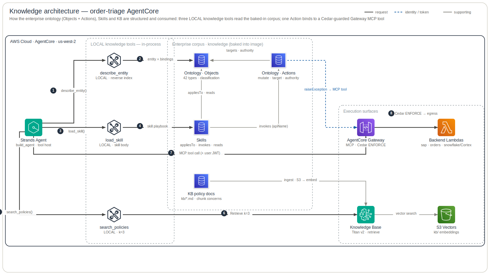
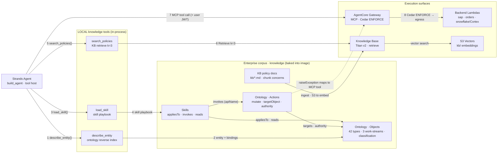

# Knowledge Architecture

This shows the **knowledge plane** — how the enterprise corpus (Ontology **Objects** + **Actions**,
**Skills**, **Knowledge Base**) is structured, how its assets reference one another, and how the
agent **consumes** it through three LOCAL tools while one ontology **Action** binds to a
Gateway-fronted backend tool. It is the structural cut that the [agent reasoning plane](agent-architecture.md)
(the per-turn event loop) deliberately leaves out.

The corpus lives in its own enterprise repo, `knowledge` — domain-wide, multi-consumer
(42 object types across 3 work-streams), **not** agent-specific. `build/validate.py` merges and
validates the YAML layers and `build/bindings.py` compiles a **reverse index** (`bindings.json`:
`apiName → {skills, kb, actions}`); both committed artifacts plus the skill bodies are fetched at a
pinned release tag and **baked into the agent image**. The agent wires the corpus to runtime with
**three LOCAL knowledge tools** — `describe_entity` (ontology reverse index), `load_skill` (skill
playbook), `search_policies` (KB retrieve) — none of which traverse the Gateway. The one place
knowledge crosses into the action plane is the spec's `action_implementations`: a skill that `invokes` the
ontology Action `raiseException` is mapped to the Gateway MCP tool `orders___flagOrder`, asserted at
startup by a coverage gate (ADR-0001 — the ontology declares the *what*, the agent binds the *how*).

**Legend** — official AWS (+ SaaS) icons, left → right. Edges: **solid dark** = request / consume
path (numbered `1…8`) · **blue dashed** = the Action→tool binding · **grey** = supporting
(asset cross-references, KB ingest, vector search). Rounded boxes are responsibility zones. The
diagram is generated from [`specs.json`](specs.json) by the `architecture-skill` skill — edit the spec,
not the SVG.

## How to read it

### The three knowledge surfaces, three LOCAL tools
The agent reasons over **three** knowledge surfaces, each read by exactly one LOCAL tool (in-process,
never via the Gateway, no Cedar check):

- **Ontology** (Objects + Actions) ← `describe_entity(apiName)` — returns the skills, actions, KB
  docs, properties and datasource that govern an entity, by reading the compiled reverse index.
- **Skills** ← `load_skill(name)` — returns one skill's markdown playbook on demand; the catalog
  (name · description · applies-to) is rendered into the system prompt at build time.
- **Knowledge Base** ← `search_policies(query)` — `bedrock-agent-runtime.retrieve` over the Bedrock
  Knowledge Base (Titan v2 embeddings, `k=3`) backed by S3 Vectors.

### 1–6 · Consuming the corpus (read paths)
**(1–2)** The model calls `describe_entity` to resolve an ontology entity (e.g. `CreditProfile`) to
its governing skills/actions/KB. **(3–4)** It then `load_skill`s the named playbook (e.g.
`credit_hold`). **(5–6)** `search_policies` retrieves the relevant policy passages from the Knowledge
Base, which runs the vector search against S3 Vectors. These three reads are independent and the
model interleaves them as its reasoning needs.

### 7–8 · Acting (the Gateway path)
**(7)** Backend-touching tools are **not** defined in the agent — they are MCP tools served by the
**AgentCore Gateway**, fetched at runtime and called with the inbound user JWT. **(8)** The Gateway
**Cedar-authorizes** every call (`ENFORCE`) then egresses to the backend Lambdas — `sap` /
`orders` over SigV4 (agent identity), `snowflake` over OBO `TOKEN_EXCHANGE` (the signed-in user; one
`/ask` over the `ORDERS_SV` semantic view via Cortex Analyst, ADR-0008).

### How the assets reference each other (grey edges)
Inside the corpus everything anchors on the **Objects**: an **Action** declares a `targetObjectType`
and derives its `authority` (`agent` vs `user`) from that object's classification + whether it
mutates; **Skills** declare `appliesTo` / `reads` object types and `invokes` actions — all by stable
`apiName`. **KB** policy docs are tagged with the object types each chunk `concerns` and are
**ingested** into the Bedrock Knowledge Base (S3 sync → embed). A dangling `apiName` fails the
corpus build, so the cross-references are guaranteed resolvable.

### The one binding edge (blue dashed)
`actions → AgentCore Gateway` is the **only** coupling between the enterprise corpus and the agent's
concrete tools: `spec.action_implementations = {"raiseException": "orders___flagOrder"}`, checked at
startup by `_assert_action_coverage()` (`agent_kit.knowledge.coverage`). The ontology never names a Gateway target; the agent owns
that map. This is what keeps the corpus reusable across agents (and why agent-specific heuristics
like `score_order` stay in the agent, never promoted up to the ontology).

## Wire-level view (Mermaid)

The same structure as a Mermaid flowchart — useful where an AWS-icon SVG is overkill (PR diffs,
ADRs) and the source of truth for what the SVG above renders.

## Provenance
- **Corpus** — `knowledge`: `ontology/{object-types,action-types,link-types}.yaml`,
  `skills/*.skill.md`, `kb/*.md` + `kb/index.yaml`; compiled by `build/{validate,bindings}.py` to
  `build/{ontology.compiled.json,bindings.json}`.
- **Agent toolkit** — the shared lib (`agent_kit`, consumed by `agent`):
  `knowledge/{ontology.py,skills.py,kb.py}` (the 3 LOCAL tools — `kb.py` via the `make_kb_tool`
  factory), `knowledge/skill_loader.py` (catalog + bodies), `knowledge/coverage.py`
  (`get_tools`, `_assert_action_coverage`); the action map is `spec.action_implementations` on the
  agent's `AgentSpec` (`agent/src/order_triage/spec.py`).
- **Infra** — `bedrock-demo-infra`: `terraform/gateway.tf` (3 MCP targets), `policy.tf` (Cedar
  `permit_*`), `knowledge_base.tf` (Titan v2 + S3 Vectors), `*_lambda.tf` (sap / orders / snowflake).

## Caveats / scope
- This plane is **structural** (how the corpus is shaped and consumed), not temporal — the per-turn
  event loop, Memory, Guardrail and the model are the [agent plane](agent-architecture.md); identity
  / OBO / Cedar internals are the [security plane](security-architecture.md).
- The KB `concerns` tags enable **scoped** retrieval (boost chunks about the entity in context); the
  shipped `search_policies` uses a plain `k=3` retrieve — the tagging is corpus-side, not yet wired
  into the query.
- The corpus ships **3 MVP actions**; the broader A/B/C action catalog comes from the work-stream
  specs. Only `raiseException` currently has a Gateway implementation (the other two MCP tools are
  reads, not ontology actions).
