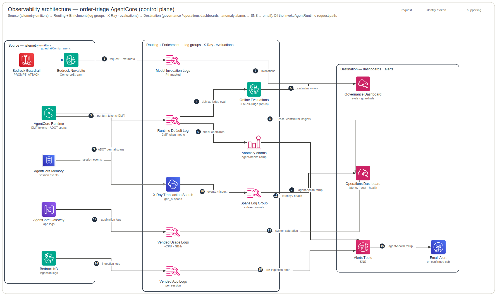

# Observability Architecture

This is the **grey control plane** of the order-triage AgentCore system: how telemetry is *emitted* and *consumed*, entirely off the live `InvokeAgentRuntime` request path (that data plane is `infra/docs/architecture/data-plane.md`). It distinguishes the **two independent emission mechanisms** — ADOT/OpenTelemetry auto-instrumentation that turns Strands `gen_ai.*` spans into X-Ray Transaction Search (`aws/spans`), versus the hand-rolled per-turn EMF token metric `print()`ed to stdout into namespace `OrderTriage/Agent` — then traces per-resource `APPLICATION_LOGS`/`USAGE_LOGS`/`TRACES` delivery, Bedrock model-invocation logging behind a CloudWatch Logs data-protection PII mask, and the downstream consumers: the **4** audience dashboards, the alarm→composite→SNS chain, 2 App-Signals SLOs, 2 Contributor Insights rules, opt-in online Evaluations, and the *proposed* identity-resolution Graph Lambda. It deliberately omits the request/data plane and the build/publish/deploy pipeline.

**Legend** — official AWS icons, left → right. Edges: **solid dark** = request / data path · **blue dashed** = identity / token / secret · **grey** = supporting (incl. telemetry); primary steps are numbered. Rounded boxes are trust / responsibility zones. The diagram is generated from [`specs.json`](specs.json) by the `architecture-skill` skill — edit the spec, not the SVG.

## How to read it

**0 — Scope: this is the control plane.** Everything above is telemetry, not the live `InvokeAgentRuntime` flow. The founding fact is in the module header: observability is *automatic* on AgentCore Runtime because the container launches under `opentelemetry-instrument` with the `aws-opentelemetry-distro` ADOT distro, so logs+metrics flow with no extra config — but **traces/spans require account-level CloudWatch Transaction Search to be turned on** (`infra/terraform/modules/observability/observability.tf` header, lines 1-8; `agent/Dockerfile` CMD `opentelemetry-instrument python -m order_triage.runtime`). ADR-0004 frames the work as exploiting a deeply under-used native surface with no third-party tooling.

**1 — Two emission mechanisms (and why both exist).** *Mechanism A — ADOT spans:* the hosted runtime auto-instruments; the Strands tracer emits `gen_ai.*` spans (including `gen_ai.usage.*` token attributes) which become X-Ray segments. *Mechanism B — the hand-rolled EMF metric:* `agent/src/order_triage/runtime.py:_emit_usage_metric` reads `agent.event_loop_metrics.latest_agent_invocation.usage` (the **per-turn** total — `accumulated_usage` is never zeroed, so it would over-count) and `print()`s **one** Embedded Metric Format document to stdout. The code comment is explicit about why both exist: the Strands tracer already sets `gen_ai.usage.*` on spans, so **no span attribute is added** — the EMF metric is the genuine gap because "CloudWatch has no token metric otherwise" (`runtime.py` lines 137-145). The EMF `_aws` block declares `Namespace OrderTriage/Agent`, `Dimensions [[agent_id, model_id]]`, `Metrics InputTokens/OutputTokens/TotalTokens`; `session_id`, `actor_id`, `cache_read_input_tokens` and `cache_write_input_tokens` are root **log** fields only — high-cardinality keys as dimensions would explode the custom-metric bill (`runtime.py` comment line 70; ADR-0004 D3 / Risk 2).

**2 — Where the EMF line lands and becomes a metric.** The EMF document is *both* a valid metric document *and* a queryable structured JSON log line. It is printed to stdout, which AgentCore routes to the runtime **-DEFAULT** log group `/aws/bedrock-agentcore/runtimes/{runtime_id}-DEFAULT` — a **local string** `local.runtime_default_log_group` (`monitoring.tf:42`), **not** a Terraform-created resource (the platform auto-creates it for stdout), distinct from the vended `APPLICATION_LOGS` group this module *does* create (`observability.tf:102-105`). This group is **UNMASKED** (no data-protection policy). CloudWatch EMF auto-extraction lifts `InputTokens/OutputTokens/TotalTokens` into the `OrderTriage/Agent` namespace; ADR-0004 records this auto-extraction validated working live, with the fallback being a Logs metric filter over the same JSON if a routing change breaks it (`runtime.py` docstring lines 40-44).

**3 — Transaction Search: two coupled account toggles, ordered.** Spans reach `aws/spans` only if both toggles exist **in order**: (1) `aws_cloudwatch_log_resource_policy.xray_spans` grants `xray.amazonaws.com` `logs:PutLogEvents` to `aws/spans` (+ `/aws/application-signals/data`), `SourceArn`/`SourceAccount`-scoped (`observability.tf:9-28`); (2) `terraform_data.transaction_search` runs `aws xray update-trace-segment-destination --destination CloudWatchLogs || true` — best-effort, `depends_on` the policy, because X-Ray's pre-flight `PutLogEvents` check can lag minutes on a fresh account (`observability.tf:34-40`). `aws_xray_indexing_rule.default` sets `trace_indexing_percentage` — explicitly a **cost + search-index lever only**; it does **not** reduce span storage in `aws/spans` (`observability.tf:261-269`).

**4 — Per-resource log/trace delivery trios.** Unlike the runtime's auto-metrics, AgentCore does **not** auto-configure log/trace destinations per resource, so `observability.tf` clones the trio (`aws_cloudwatch_log_delivery_source` → `_destination` → `_delivery`) for each: **Runtime** gets `APPLICATION_LOGS` + `USAGE_LOGS` (the only native per-session 1-sec vCPU-h / GB-h cost signal, wired to its own `/aws/vendedlogs/.../USAGE_LOGS/{id}` group, `observability.tf:125-148`) → CWL, plus `TRACES` → XRAY; **Gateway** gets `APPLICATION_LOGS` + `TRACES` (the two-span Call-Tool `SERVER`+`CLIENT` structure with `TargetExecutionTime`, plus the OBO `GetWorkloadAccessTokenForJWT(issuer, user_sub)` spans, comment lines 194-196); **Memory** gets `APPLICATION_LOGS` + `TRACES`; **Knowledge Base** gets `APPLICATION_LOGS` **only** (the sole `log_type` a KB supports; source is the KB ARN). All `TRACES` deliveries carry `delivery_destination_type='XRAY'` and `depends_on terraform_data.transaction_search`. **Identity/WorkloadIdentity has no standalone delivery resource** — it traces transitively (ADR-0004 D1, deliberate non-action). Separately, `log_groups.tf:6-19` adopts the three **backend Lambda log groups** `/aws/lambda/{prefix}-{sap,order-actions,snowflake}` purely to manage retention as IaC. The KB group also feeds `aws_cloudwatch_log_metric_filter.kb_ingestion_failed` → `{prefix}/KnowledgeBase` `KBIngestionJobFailed` because no native ingestion metric exists; ADR-0004 flags the JSON path as **provisional** (`observability.tf:241-255`).

**5 — Model-invocation logging behind the PII mask (the canonical token/audit source).** `invocation_logging.tf` enables the account+region-**singleton** `aws_bedrock_model_invocation_logging_configuration.this` → the dedicated group `/aws/bedrock/{prefix}/modelinvocations`, written by a Bedrock-trusted role scoped by `SourceAccount`+`SourceArn`. This captures every `InvokeModel`/`Converse` call's token counts, `modelId`, `identity.arn`, `requestMetadata`, and **verbatim** text+embedding bodies — the masked, PII-safe shareable source. The mask `aws_cloudwatch_log_data_protection_policy.bedrock_invocations` is exactly two statements (**Audit** then **Deidentify**) over an **identical** array of 5 verified managed identifiers: `EmailAddress`, `PhoneNumber-US`, `Ssn-US`, `DriversLicense-US`, `CreditCardNumber`. **Critical non-reversible ordering:** the mask MUST exist before the config writes its first record (`depends_on` enforces it) — any record landing first is stored unmasked permanently. `large_data_delivery_s3_config` is deliberately **unset** so >100 KB bodies truncate rather than spill to an S3 path the CWL mask cannot cover. Generic `Name`/`Address` are not valid managed identifiers and free-text customer names have no identifier → **accepted unmasked** (ADR-0004 D2). Text+embedding delivery enabled (Nova Lite = text+embedding only); image/video off. The opaque `requestMetadata.actor`/`turn`/`session` written here are the per-turn audit join key the Governance audit table and `tokens_per_turn_cost` query read (`queries.tf:53-71`, `dashboards.tf:288-291`).

**6 — Consumers: dashboards, alarms, SLOs, Contributor Insights, queries.** `dashboards.tf` builds **4** audience-scoped boards — **Operations, FinOps, Governance, Exec** — reading four namespaces (`AWS/Bedrock-AgentCore` vended, `bedrock-agentcore` OTEL, `ApplicationSignals`, `OrderTriage/Agent`). There are **no** separate Incident, Security, or Feedback dashboards: Incident + Feedback are folded into **Operations** (the eval-score widget `SELECT AVG(Score) FROM Bedrock-AgentCore-Evaluations GROUP BY EvaluatorName`, id `evalscore`, lives in the Operations "Quality" row, `dashboards.tf:181-189`); Security is folded into **Governance** (header comment line 1: "Four audience-scoped CloudWatch dashboards"). The "7" is ADR-0004 D4 *intent* + the audit's *pre-consolidation* state — and the audit's own 7→4 recommendation is already implemented. Cost tiles multiply the EMF token metric by `model_input/output_usd_per_million` math expressions — an **estimate**, not invoiced (Exec/FinOps banners say so; D6). `alarms.tf` wires static fault alarms (`runtime_system_errors`, `runtime_throttles`, `appsig_service_faults` rolling up ANY downstream — model/KB/Memory/SAP/Snowflake, `obo_failures` on undimensioned `ResourceAccessTokenFetchFailures`) plus `token_usage_anomaly` via `ANOMALY_DETECTION_BAND(m1,2)` on `OrderTriage/Agent` `TotalTokens`; all four roll into the composite `agent_unhealthy` (OR). **`kb_ingestion_failed` is a separate alarm deliberately OUTSIDE the composite** (data-freshness, not a live-path fault; `alarms.tf:126-139`). `treat_missing_data='notBreaching'` throughout (the demo idles). `slo.tf` creates 2 App-Signals SLOs (latency p99≤5s; availability system-error-free; 99% / rolling-7d) via `terraform_data` local-exec because `hashicorp/aws` lacks the resource (#39555) and `awscc` self-collides — imperative, **no drift detection**. `queries.tf` adds 2 Contributor Insights rules ranking top actors/sessions by `$.TotalTokens` straight from the **UNMASKED** -DEFAULT group, plus saved Logs Insights queries (`tokens_by_session` on -DEFAULT; `model_invocations_by_turn` + `tokens_per_turn_cost` on the masked group).

**7 — The opaque actor and the render-time Graph Lambda (PII-safe by design).** `identity.actor_id()` returns the verified Entra `sub` claim (a pairwise pseudonymous GUID, fallback `oid`, else `ANONYMOUS_ACTOR`), used **only** as the Memory partition key — never to authorize. That `sub` flows into the EMF `actor_id` field and into `requestMetadata.actor` (`agent.py:_rm_value` strips chars outside `[a-zA-Z0-9 _:/+,.=-]` — including `@` — so a UPN-shaped subject can never reach the model-invocation log). So the FinOps top-actors Contributor Insights leaderboard and the Governance/Security audit tables show **opaque subs** beside readable session ids — looks broken, is correct security. The audit's **IDR-1 fix (PROPOSED, not built)** is a CloudWatch custom-widget Lambda invoked at panel render that reads the top-N subs from `GetInsightRuleReport`, batch-resolves them via Microsoft Graph (`GET /users/{id}`, `User.Read.All` client-credentials), and returns HTML — the GUID→name mapping exists only transiently in the render path, **never** in a log/metric/Contributor-Insights key. The doc explicitly **rejects** injecting email/UPN at write time (IDR-5: unmasked -DEFAULT group + UPN is not a managed identifier + the `@`-strip defeats masking + masks are non-retroactive).

**8 — Opt-in online Evaluations (Operations Quality row).** `evaluations.tf` wires AgentCore online Evaluations: a `terraform_data` local-exec creates an online-evaluation config (`samplingPercentage` 100, `dataSource` log groups `[aws/spans, runtime -DEFAULT]`) running 5 Builtin evaluators (`Correctness`, `Helpfulness`, `Faithfulness`, `ToolSelectionAccuracy`, `ToolParameterAccuracy`) and publishing `Score`-by-`EvaluatorName` to the `Bedrock-AgentCore-Evaluations` namespace that the **Operations** Quality-row `evalscore` widget reads (there is no Feedback dashboard). Gated by `var.enable_online_evaluations` (default **off** — ongoing judge-model cost). Per ADR-0004/0005 the config is active but scoring currently errors `AgentSpanMappingException`, so the eval-score panel populates only after that is fixed; human thumbs/rating feedback is an explicit un-instrumented gap.

## Provenance

- **ADOT auto-instrumentation** — `agent/Dockerfile` (CMD `opentelemetry-instrument`, `.[deploy]` installs `aws-opentelemetry-distro`); `…/modules/observability/observability.tf` header (lines 1-8); ADR-0004 Context / D1.
- **EMF token metric** (`emf`, `tokmetric`) — `agent/src/order_triage/runtime.py:_emit_usage_metric` (`_aws.CloudWatchMetrics`, lines 40-44 docstring, 55-74, 137-145).
- **runtime -DEFAULT group** (`rtdefault`) — `…/modules/observability/monitoring.tf:42` (`local.runtime_default_log_group`, **referenced not provisioned**); vended app group created at `observability.tf:102-105`.
- **AgentCore Runtime / Gateway / Memory / KB sources** — `…/modules/observability/observability.tf` delivery trios (lines 56-239); Memory strategies `infra/terraform/memory.tf:10-29`.
- **Model + invocation logging + PII mask** (`model`, `invlog`, `invgrp`, `piimask`, `blogrole`) — `…/modules/observability/invocation_logging.tf:16-22, 25-94`; `agent.py:_rm_value` + `build_agent` (`requestMetadata`, lines 26-30, 96-107); `guardrail` gate `agent.py:73-84` + `config.py:26-27,44-45`.
- **Transaction Search routing** (`xray`, `xraypol`, `idxrule`, `spans`) — `…/observability.tf:9-28, 34-40, 261-269`.
- **USAGE_LOGS leg** (`usage`) — `…/observability.tf:125-148`.
- **Backend Lambda log groups** (`lamgrp`) — `…/modules/observability/log_groups.tf:6-19`.
- **KB filter + alarm** (`kbfilter`, `kbalarm`) — `…/observability.tf:241-255`; `…/alarms.tf:126-139`.
- **Alarms + composite + SNS + email** (`alarms`, `composite`, `sns`, `email`) — `…/alarms.tf:7-106, 110-121, 123-139`; `…/monitoring.tf:48-57`.
- **Dashboards** (`dash`, `evalns` widget) — `…/dashboards.tf` (4 resources at lines 35/200/274/367; `evalscore` widget 181-189; governance audit table 288-291).
- **SLOs** (`slo`) — `…/slo.tf:1-73`.
- **Contributor Insights + saved queries** (`ci`, `qdef`) — `…/queries.tf:8-71`.
- **Online Evaluations** (`evals`, `evalns`) — `…/evaluations.tf:9-95`.
- **Opaque actor + Graph Lambda** (`actorid`, `graphlam`, `entra`) — `agent/src/order_triage/identity.py:actor_id()` (lines 42-91); `OBSERVABILITY-DASHBOARD-AUDIT.md` §2 IDR-1 / IDR-5 / FIX-08 (lines 21-46, 80-81).
- **Decisions** — `infra/docs/adr/0004-observability-finops.md` (D1/D2/D3/D4/D6/D7); ADR-0005 (evaluations).

## Status & caveats

- **Online Evaluations are opt-in and default-OFF** (`var.enable_online_evaluations`); the eval-exec IAM role and the config only exist when enabled. Even enabled, scoring currently errors `AgentSpanMappingException` (ADR-0004 action 11 / ADR-0005), so the Operations Quality eval-score panel does **not** populate yet. Human thumbs/rating feedback is an un-instrumented gap.
- **The 2 App-Signals SLOs are imperative** (`terraform_data` local-exec `create||update`) with **NO drift detection**; they need extra deploy-role perms (`application-signals:*` + `cloudwatch:GetMetricData`) and must be verified with `get --id` (`list` omits metric-query SLOs). `hashicorp/aws` lacks the resource (#39555); `awscc` self-collides.
- **Transaction Search routing is best-effort** (`|| true`) because X-Ray's pre-flight `PutLogEvents` check can lag minutes on a fresh account; a first apply may no-op and need a re-run.
- **EMF auto-extraction is validated-live, not doc-guaranteed** — the `runtime.py` docstring flags a metric-filter fallback may be needed if a future routing change breaks the path.
- **The KB ingestion-FAILED metric-filter JSON pattern is PROVISIONAL** — not yet confirmed against a real emitted record (ADR-0004 action 12); the resource-level form may differ.
- **The `alert_email`→SNS subscription is conditional** (`count = 0` when `var.alert_email` empty): with no `alert_email`, the composite `agent_unhealthy` (and the `kb_ingestion_failed` alarm) fire into an SNS topic with **no subscriber** — alerts are silently dropped.
- **The identity-resolution Graph Lambda (IDR-1) is PROPOSED, not built** — no `actor_resolver.tf` / Lambda / Entra app registration exists. The opaque Entra `sub` on FinOps/Governance/Security panels is intentional (PII-safe) but unresolved; the shipped interim fix is a relabel only.
- **The -DEFAULT group is UNMASKED** (no data-protection policy) yet is the source of the EMF token line, both Contributor Insights rules, and the `tokens_by_session` query. The audit's data-sensitivity invariant requires FinOps (which reads it) to never co-tenant a widget with a broader audience; only the masked `modelinvocations` group is the PII-safe shareable source.
- **The PII mask covers only 5 managed identifiers** — free-text customer names and generic Name/Address are accepted **unmasked**. `large_data_delivery_s3_config` is deliberately unset so >100 KB bodies truncate rather than spill to an unmaskable S3 path.
- **The deployed dashboard state is 4 boards** (Operations·FinOps·Governance·Exec). The 7→4 consolidation the audit recommended is already implemented; "7" survives only in ADR-0004 D4 intent and the audit's pre-consolidation analysis.
- **Cost-allocation tags beyond Project+ManagedBy (FinOps P2.7) are DEFERRED** — they need org-supplied values + management-account Billing activation, so per-actor invoice-grade $ via CUR is not wired; dashboard $ remains a token×rate estimate.
- **Identity/WorkloadIdentity has NO standalone delivery resource by design** — it traces transitively via Runtime/Gateway; wiring a delivery for it would be a guaranteed-fail apply (ADR-0004 D1 deliberate non-action).
