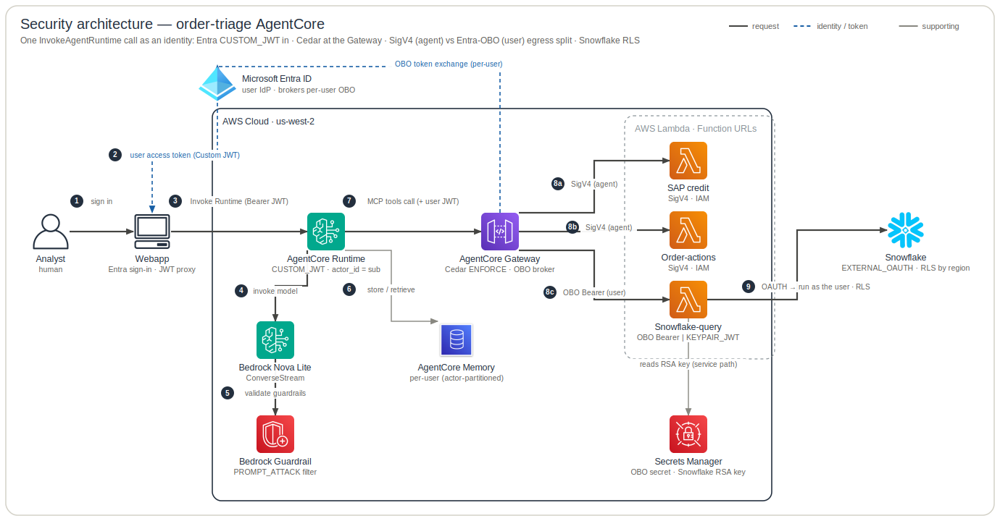

# Security Architecture

This is the **security view of one `InvokeAgentRuntime` call** — the identity, authorization, and secrets posture of the order-triage AgentCore system end to end: who is allowed to do what, *as whom*. It follows an Entra-authenticated human's identity through `CUSTOM_JWT` inbound auth, Cedar authorization at the Gateway, the Bedrock Guardrail on the model path, and the egress split that is the heart of the design — **agent-authority `SigV4`** for SAP/orders versus a **Gateway-brokered Entra OBO `TOKEN_EXCHANGE`** for Snowflake, so confidential order reads run as the calling human (`ANIL_ENTRA` → Europe only) under Snowflake `EXTERNAL_OAUTH (AZURE)` + row-level security. It marks every trust boundary crossed and shows where each secret lives (Secrets Manager, deliberately out of Terraform state). It covers the **live request / data plane only**: build/publish/deploy (GitHub Actions, OIDC, ECR/S3) and the grey telemetry control plane are intentionally out of scope.

**Legend** — official AWS icons, left → right. Edges: **solid dark** = request / data path · **blue dashed** = identity / token / secret · **grey** = supporting (incl. telemetry); primary steps are numbered. Rounded boxes are trust / responsibility zones. The diagram is generated from [`specs.json`](specs.json) by the `architecture-skill` skill — edit the spec, not the SVG.

## How to read it

**1 — Inbound identity (CUSTOM_JWT, Entra v1).** The human signs into the Entra front-end app via auth-code (`app/app/entra.py:authorize_url` / `exchange_code`). Because the agent app is a **confidential client**, the code→token exchange is server-side and the client secret is sent in the form body. The `access_as_user` scope yields a **v1** user access token whose `aud = api://agent-app`, carrying `scp` and `upn` claims. That token is the inbound JWT: `InvokeAgentRuntime` carries it as a Bearer, and the Runtime Endpoint's `CUSTOM_JWT` authorizer validates `aud` / `iss` / `scp` against the **v1 discovery** endpoint (`infra/terraform/runtime.tf` — `custom_jwt_authorizer.allowed_audience = ["api://${var.entra_agent_app_id}"]`, `discovery_url` = `login.microsoftonline.com/<tenant>/.well-known/openid-configuration`) before any agent code runs.

**2 — Identity propagation inside the runtime.** The runtime is configured with `request_header_configuration.request_header_allowlist = ["Authorization"]` and `environment_variables.USER_JWT_HEADER = "Authorization"` (`infra/terraform/runtime.tf`), so the verified bearer reaches the container. `agent_kit.infra.identity:extract_user_jwt` strips `Bearer ` and the agent's `runtime.py` stores it in a `ContextVar` via `identity.set_user_jwt` (reset in `finally`). Crucially, `agent_kit.infra.identity:_claims_from_jwt` decodes the payload segment **without re-verifying the signature** (the authorizer already verified it) and reads `claims.get("sub") or claims.get("oid")`; this becomes the AgentCore Memory `actor_id`, so each user gets a private `/facts/{actorId}`, `/preferences/{actorId}`, and `/summaries/{actorId}/{sessionId}` namespace (`infra/terraform/memory.tf`). A malformed / sub-less token falls back to the anonymous-actor namespace (`actor_id(AGENT_ID)` = `"order-triage"`). **The runtime makes NO authorization decision — the subject is a partition key only.**

**3 — Model path and the Guardrail.** The agent streams to Bedrock Nova Lite (`amazon.nova-lite-v1:0` via `environment_variables.BEDROCK_MODEL_ID = var.bedrock_model_id`; the Python default `anthropic.claude-opus-4-8` in the agent's `agent.py` is **overridden at deploy**). The agent's `build_agent` tags each Converse call with `requestMetadata` (agent / actor / session / turn) via `kit.request_metadata(...)`, sanitized by `_RM_DISALLOWED` (and `_rm_value` truncation to 256) in `agent_kit.prompt` so no `@` / PII reaches the model-invocation log. When **both** `BEDROCK_GUARDRAIL_ID` and `BEDROCK_GUARDRAIL_VERSION` are set (default-on via `enable_guardrail`), `build_agent` attaches a `guardrailConfig` onto its own `BedrockModel` (`guardrail_stream_processing_mode = "async"`, `guardrail_redact_input = False`). The guardrail (`infra/terraform/guardrail.tf`) has exactly **one** policy: a `PROMPT_ATTACK` input filter (MEDIUM, output strength NONE) — the prompt-injection defense against untrusted Snowflake customer names / KB chunks. There is **deliberately no PII / sensitive-information policy** because this agent reads customer PII end-to-end. Invocation requires `bedrock:ApplyGuardrail` scoped to the guardrail ARN (`infra/terraform/iam.tf`, only when `enable_guardrail`).

**4 — Authorization at the Gateway (Cedar, ENFORCE).** Every MCP tool call carries the user JWT as the Gateway bearer — `agent_kit.infra.gateway:build_gateway_client` sets `headers = {"Authorization": f"Bearer {ident.raw_jwt}"}` (returns `None` if there is no gateway URL or identity). The Gateway is itself `CUSTOM_JWT` with `allowed_audience = ["api://agent-app"]` (`infra/terraform/gateway.tf`), pinning the agent/source. Its Cedar Policy Engine runs in `ENFORCE` mode (`policy_engine_configuration.mode = "ENFORCE"`) with `principal is AgentCore::OAuthUser` (`infra/terraform/policy.tf:locals.cedar_principal`). The shared guard `principal.hasTag("scp")` (`cedar_guard`) admits any authenticated Entra user — it must **not** be trivially-true (`when{true}` fails the engine's semantic validation as Overly Permissive), and inbound claims are exposed as Cedar **TAGS**, not `claims[...]`. Three permits map to the tool actions: `permit_sap_read` (`sap___getCreditStatus`), `permit_flag` (`orders___flagOrder`), and `permit_snowflake_ask` (`snowflake___ask` — one analytics action; row/column governance is in the `ORDERS_SV` semantic view + Snowflake RLS, ADR-0008). **This is the only authorization layer that checks the AGENT dimension.**

**5 — The egress split: agent-authority vs user-authority.** This is the **intersection model** (= agent permission AND user permission). SAP and orders targets use `SigV4` signed by the Gateway's IAM role against `AWS_IAM`-locked Lambda Function URLs — no shared key, agent authority only (`infra/terraform/gateway.tf` — `credential_provider_configuration.gateway_iam_role { service = "lambda" }`). The snowflake target is different: at apply time it is created with the `snowflake-api-key` X-API-Key placeholder (`infra/terraform/identity.tf:aws_bedrockagentcore_api_key_credential_provider.snowflake`), then `infra/terraform/snowflake_lambda.tf:terraform_data.snowflake_obo_egress` swaps the gateway-target egress credential out-of-band via `aws bedrock-agentcore-control update-gateway-target` to `grantType = TOKEN_EXCHANGE` with `scopes = [session:role-any]` (neither the `aws` nor `awscc` provider can express `TOKEN_EXCHANGE` on a gateway target; `lifecycle.ignore_changes = [credential_provider_configuration]` keeps it from reverting to the placeholder). This routing is driven by the ontology: `SalesOrder.classification: confidential` (`knowledge/ontology/object-types.yaml` line 112) → reads run on-behalf-of the user; `Customer` is not confidential → agent identity is fine.

**6 — The OBO token exchange.** For the snowflake target the per-user token is brokered by the **runtime AgentCore Identity flow** (not by `snowflake_lambda.tf`, which only performs the one-time egress-credential CLI swap): `GetWorkloadAccessTokenForJWT(inbound user JWT)` → `GetResourceOauth2Token(oauth2_flow = ON_BEHALF_OF_TOKEN_EXCHANGE, scopes = [session:role-any])` (RFC 8693/7523), via the `entra-obo` provider (`infra/terraform/identity.tf:awscc_bedrockagentcore_o_auth_2_credential_provider.entra_obo`, lines 14–16; vendor `MicrosoftOauth2` + `tenant_id` — `tenant_id` makes discovery tenant-specific so personal/guest accounts work, and the vendor adds `requested_token_use` itself). The provider's `client_secret` lives in Secrets Manager (`order-triage/entra-agent-client-secret`, `json_key client_secret`, `client_secret_source = EXTERNAL`) — referenced **by ARN** (`data.aws_secretsmanager_secret.entra_obo`) so the value never enters TF state. The `GetResourceOauth2Token` read of that `bedrock-agentcore-identity!*` secret is performed with the **caller's role**: the runtime role is the one explicitly granted `secretsmanager:GetSecretValue` on `arn:...secret:bedrock-agentcore-identity!*` (`infra/terraform/iam.tf` lines 42–45). The resulting token has `aud = api://order-triage-snowflake` and `scp` containing `session:role-any`.

**7 — Snowflake, as the human (EXTERNAL_OAUTH + RLS).** The snowflake-query Lambda's Function URL is `AuthType = NONE`, so `stubs/snowflake_stub/app.py` self-authorizes per route. The agent tool `POST /ask` is **OBO-only** (`_user_token`): it requires the forwarded `Authorization: Bearer <token>` and returns **401** on a missing/empty bearer — `X-API-Key` is **not** accepted on `/ask`, because an analyst query must be attributable to a human for RLS to mean anything (ADR-0008 D2). That bearer is presented to **Cortex Analyst** (NL→SQL over the `ORDERS_SV` semantic view) and to the SQL API (`stubs/snowflake_stub/snowflake_client.py:query`) with `X-Snowflake-Authorization-Token-Type: OAUTH` and the role **omitted**, so the generated SQL runs in the user's Snowflake context. The `KEYPAIR_JWT` **service path** survives only on the internal `GET /orders/{order_id}` route (`_check_key` / `X-API-Key`) — a deterministic single-order status read that `order_actions_stub` calls server-to-server for its OPEN-only flag rule, **deliberately excluded from `openapi.json`** so the Gateway never surfaces it as an agent tool (ADR-0008 D4); it signs a `KEYPAIR_JWT` as `SVC_ORDER_TRIAGE` / `ORDER_TRIAGE_RO`, reading the RSA key + config from Secrets Manager via `_load_config` → `SNOWFLAKE_SECRET_NAME` (the service role comes from `cfg["role"]`, not a hardcode). On the `/ask` user path Snowflake's `EXTERNAL_OAUTH (AZURE)` integration maps `upn → login_name` (`EXTERNAL_OAUTH_TOKEN_USER_MAPPING_CLAIM = ('upn','email')`, `EXTERNAL_OAUTH_SNOWFLAKE_USER_MAPPING_ATTRIBUTE = login_name`) and `scp session:role-any → role` (`ANY_ROLE_MODE = ENABLE`), so the query runs as `ANIL_ENTRA` (`infra/docs/playbooks/entra-obo-setup.md`). The `orders_region_rap` row access policy (`infra/snowflake/rls.sql`, keyed via `USER_REGION_ACCESS`) then returns only that user's entitled region — `ANIL_ENTRA → Europe`, `JINCE_ENTRA → Asia` — while `SVC_ORDER_TRIAGE` sees all regions and `CUSTOMERS` stays unpoliced.

**8 — Secrets and trust boundaries.** Secrets are deliberately out of Terraform state: the Snowflake RSA private key + connection config (`var.snowflake_secret_name`) and the entra-obo client secret (`order-triage/entra-agent-client-secret`) are both referenced by ARN / metadata only and seeded out-of-band (`make snowflake-setup` / `make seed-entra-secret`). Read access is least-privileged across the stack: the snowflake Lambda role gets `secretsmanager:GetSecretValue` on **exactly its one** Snowflake secret ARN (`infra/terraform/snowflake_lambda.tf:aws_iam_role_policy.snowflake_lambda_secrets`); the runtime role only on the `bedrock-agentcore-identity!*` prefix. The **gateway IAM role** — the *second* OBO caller — is now scoped to least privilege in four statements (`infra/terraform/iam.tf:aws_iam_role_policy.gateway`, **ADR-0006, verified live 2026-06-24**): `lambda:InvokeFunctionUrl` on the SAP + order-actions function ARNs; the three AgentCore token-mint actions (`GetWorkloadAccessTokenForJWT` / `GetResourceOauth2Token` / `GetResourceApiKey`); the Cedar policy-engine actions (`AuthorizeAction` / `PartiallyAuthorizeActions` / `GetPolicyEngine`, scoped to `gateway/*` + `policy-engine/*` in this account/region — the Gateway evaluates its `ENFORCE`-mode engine on every `ListTools`/tool call as this role); and `secretsmanager:GetSecretValue` on **just two** secrets — the AgentCore-managed `bedrock-agentcore-identity!*` (the `snowflake-api-key` value, read by `GetResourceApiKey`) and the **exact** `order-triage/entra-agent-client-secret` ARN, which `GetResourceOauth2Token` reads at `TOKEN_EXCHANGE` time because the `entra-obo` provider is `clientSecretSource = EXTERNAL` (the caller reads it, live, per exchange). This replaced the broad `secretsmanager:GetSecretValue` (Resource = `*`) + `bedrock-agentcore:*` it once held; the role can no longer read the Snowflake RSA key or manage any gateway/policy resource (both verified `implicitDeny` via `iam simulate-principal-policy`). (The token-mint actions retain `Resource = "*"` — several required resource types incl. the Gateway's implicit workload identity, ADR-0006 R1.) Trust boundaries crossed: human ↔ Entra (TLS; login *is* the authorization — OBO is silent, no per-resource consent), Entra ↔ AgentCore (`CUSTOM_JWT` validation on **both** Runtime and Gateway), Gateway ↔ Lambda (`SigV4` or `X-API-Key`), and AWS ↔ Snowflake (the external boundary where `EXTERNAL_OAUTH` + RLS make Snowflake the real user-authorization authority). Note the snowflake-query Lambda's public `AuthType = NONE` Function URL (`aws_lambda_permission` principal = `*`) is reached by **two** consumers of that same public surface — the OBO user path (8c) and the `order-actions` status check (X-API-Key service path, `stubs/order_actions_stub/app.py`) — both self-authorizing at the app layer.

## Provenance

- **Front-end / agent app, auth-code, confidential client** → `app/app/entra.py` (`authorize_url` / `exchange_code`, scope `access_as_user` → `aud = api://agent-app`); webapp invokes runtime with only the user Bearer (no SigV4) → `app/app/agentcore.py:stream_agent`.
- **Microsoft Entra ID (IdP), v1 token endpoint** → `app/app/entra.py:_AUTHORITY` (`login.microsoftonline.com`).
- **Runtime Endpoint (CUSTOM_JWT), allowed_audience, v1 discovery** → `infra/terraform/runtime.tf` (`custom_jwt_authorizer.allowed_audience` / `discovery_url`).
- **Authorization-header surfacing** → `infra/terraform/runtime.tf` (`request_header_configuration.request_header_allowlist = ["Authorization"]`; `environment_variables.USER_JWT_HEADER`).
- **Model id override** → `infra/terraform/runtime.tf` (`environment_variables.BEDROCK_MODEL_ID = var.bedrock_model_id`).
- **JWT extraction / decode-only subject** → `agent_kit.infra.identity:extract_user_jwt` (+ `identity.set_user_jwt`, wired from the agent's `runtime.py`); `agent_kit.infra.identity:_claims_from_jwt` (`sub` → `oid`), `ANONYMOUS_ACTOR`, `actor_id()`.
- **Memory partitioning by actorId** → `infra/terraform/memory.tf` (facts SEMANTIC `/facts/{actorId}`, summaries SUMMARIZATION `/summaries/{actorId}/{sessionId}`, preferences USER_PREFERENCE `/preferences/{actorId}`).
- **requestMetadata sanitization** → `agent_kit.prompt:request_metadata` (`_RM_DISALLOWED` / `_rm_value`). **guardrailConfig** → the agent's `build_agent` in `agent.py` (guardrail kwargs only when id+version, `async`, `redact_input=False`).
- **Guardrail = PROMPT_ATTACK only** → `infra/terraform/guardrail.tf` (`content_policy_config PROMPT_ATTACK`; version `skip_destroy = true`).
- **Runtime IAM (ApplyGuardrail scoped, GetSecretValue on bedrock-agentcore-identity!\*)** → `infra/terraform/iam.tf` (lines 42–45).
- **Gateway client forwards user JWT** → `agent_kit.infra.gateway:build_gateway_client` (`Authorization: Bearer <raw_jwt>`).
- **Gateway CUSTOM_JWT + Cedar ENFORCE + SigV4 targets** → `infra/terraform/gateway.tf` (`authorizer_type = CUSTOM_JWT`; `policy_engine_configuration.mode = ENFORCE`; sap/orders `gateway_iam_role { service = "lambda" }`).
- **Cedar principal / guard / three permits** → `infra/terraform/policy.tf` (`locals.cedar_principal = AgentCore::OAuthUser`; `cedar_guard = principal.hasTag("scp")`; `permit_sap_read` / `permit_flag` / `permit_snowflake_ask`). The Snowflake permit gates one `snowflake___ask` analytics action; row/column governance is in the semantic view + RLS (ADR-0008).
- **entra-obo OAuth2 provider (MicrosoftOauth2 + tenant_id, EXTERNAL secret by ARN)** → `infra/terraform/identity.tf` (`awscc_bedrockagentcore_o_auth_2_credential_provider.entra_obo`, lines 14–16; `data.aws_secretsmanager_secret.entra_obo`). **snowflake-api-key placeholder** → `aws_bedrockagentcore_api_key_credential_provider.snowflake`.
- **OBO TOKEN_EXCHANGE runtime flow** → described in `infra/terraform/identity.tf:14-16` + the runtime IAM comment in `infra/terraform/iam.tf:38-45` (`GetWorkloadAccessTokenForJWT` → `GetResourceOauth2Token` / `ON_BEHALF_OF_TOKEN_EXCHANGE`). The **egress-credential swap** (`grantType = TOKEN_EXCHANGE`, `scopes = [session:role-any]`, `ignore_changes`, precondition on `entra_obo_scope`) → `infra/terraform/snowflake_lambda.tf:terraform_data.snowflake_obo_egress`.
- **Gateway IAM role (least-privileged: `bedrock-agentcore-identity!*` secret · 3 AgentCore token-mint actions · `InvokeFunctionUrl` on SAP/orders)** → `infra/terraform/iam.tf` (`aws_iam_role_policy.gateway`); rationale + residual `Resource = "*"` in `infra/docs/adr/0006-gateway-role-least-privilege.md`.
- **SAP credit Lambda** → `stubs/sap_stub/app.py`. **order-actions Lambda (OPEN-only, X-API-Key status check)** → `stubs/order_actions_stub/app.py:flag_order` / `_status`. **snowflake-query Lambda (FN URL NONE, public principal=\*)** → `stubs/snowflake_stub/app.py` (`POST /ask` → `_user_token`, OBO-only; internal `GET /orders/{order_id}` → `_check_key`, service path); `infra/terraform/snowflake_lambda.tf` (`aws_lambda_function_url.snowflake.authorization_type = NONE`, `aws_lambda_permission` principal `*`).
- **User-path OAUTH vs service-path KEYPAIR_JWT** → `stubs/snowflake_stub/snowflake_client.py:query` (`token_type=OAUTH`, role omitted vs `body["role"]=cfg["role"]`; `X-Snowflake-Authorization-Token-Type`); config from `_load_config` (`SNOWFLAKE_SECRET_NAME`).
- **Snowflake-Lambda secret read least-privilege** → `infra/terraform/snowflake_lambda.tf:aws_iam_role_policy.snowflake_lambda_secrets`.
- **EXTERNAL_OAUTH (AZURE) mapping + ANY_ROLE_MODE** → `infra/docs/playbooks/entra-obo-setup.md` (`EXTERNAL_OAUTH_TYPE=AZURE`, ISSUER `sts.windows.net` (v1), `AUDIENCE_LIST=('api://order-triage-snowflake')`, `TOKEN_USER_MAPPING_CLAIM=('upn','email')`, `SNOWFLAKE_USER_MAPPING_ATTRIBUTE='login_name'`, `ANY_ROLE_MODE='ENABLE'`).
- **Region RLS + service user** → `infra/snowflake/rls.sql` (`orders_region_rap` / `USER_REGION_ACCESS`; `ANIL_ENTRA→Europe`, `JINCE_ENTRA→Asia`; `CUSTOMERS` unpoliced); `infra/snowflake/setup.sql` (`CREATE USER SVC_ORDER_TRIAGE DEFAULT_ROLE = ORDER_TRIAGE_RO`, SELECT-only).
- **SalesOrder = confidential (drives OBO)** → `knowledge/ontology/object-types.yaml` (line 112).
- **OBO model / silent consent / Cedar IamEntity→OAuthUser** → `infra/docs/adr/0001-user-impersonation-obo.md`.

## Status & caveats

- **Guardrail is default-on (`enable_guardrail = true`) but has NO PII/sensitive-information policy by design** — the OBO agent reads customer PII unmasked end-to-end; the only policy is the `PROMPT_ATTACK` input filter (`guardrail.tf`, ADR-0003). If `enable_guardrail = false`, `BEDROCK_GUARDRAIL_ID` / `VERSION` resolve to empty and the agent injects **no** `guardrailConfig` (silent both-or-nothing).
- **Editing the guardrail does NOT affect the runtime** until a new version is published **and** `BEDROCK_GUARDRAIL_VERSION` is bumped — the runtime is pinned to an immutable version number (`guardrail.tf` `skip_destroy`).
- **The snowflake target's OBO egress credential is applied OUT-OF-BAND** via `terraform_data` + AWS CLI local-exec (no native TF resource for `TOKEN_EXCHANGE` on a gateway target) — it has **no drift detection**; `lifecycle.ignore_changes` keeps the provider from reverting it to the X-API-Key placeholder.
- **The entire OBO egress path is count-guarded on `var.entra_agent_app_id != ""`** — when Entra creds are unset, the `entra-obo` provider and OBO swap vanish and the snowflake target keeps its `snowflake-api-key` X-API-Key placeholder. But `/ask` is **OBO-only** (it rejects `X-API-Key` — ADR-0008 D2), so with OBO disabled the agent's `snowflake___ask` analytics tool **stops working (401) — there is no service fallback**; the only surviving X-API-Key path is the internal `GET /orders/{order_id}` status read (`order_actions` → server-to-server, off the Gateway surface).
- **Secrets (Snowflake RSA key + config, entra-obo client secret) live in Secrets Manager OUT OF TF STATE** and are seeded out-of-band (`make snowflake-setup` / `make seed-entra-secret`). The entra-obo agent client secret **EXPIRES 2026-12-17** — OBO breaks on expiry until rotated.
- **The snowflake-query Lambda Function URL is `AuthType = NONE` with a public `lambda:InvokeFunctionUrl` permission (principal = `*`)** — it self-authorizes at the app layer via the forwarded OBO Bearer or X-API-Key. Anyone with the URL + a valid key/token can reach it; the `order-actions` service path is a **second** consumer of this same public surface. A *direct* caller of this URL bypasses Gateway/Cedar (the residual boundary is Snowflake's own token validation + the user's RBAC/RLS); hardening this is a **reasoned deferral** — see [ADR-0009](../adr/0009-snowflake-function-url-direct-call-hardening.md) (IAM-fronting rejected as it would reverse the Gateway-brokered OBO; JWT-validation deferred with revisit triggers).
- **The gateway IAM role is now least-privileged (ADR-0006), verified live 2026-06-24.** Four statements: `lambda:InvokeFunctionUrl` on the SAP+order-actions ARNs; the three AgentCore token-mint actions; the Cedar policy-engine actions (`AuthorizeAction`/`PartiallyAuthorizeActions`/`GetPolicyEngine` on `gateway/*`+`policy-engine/*`); and `GetSecretValue` on just `bedrock-agentcore-identity!*` + the exact entra client-secret ARN. Replaced the broad `secretsmanager:*` (Resource = `*`) + `bedrock-agentcore:*`. **Live proof:** `make status` triaged O-1003 and `QUERY_HISTORY` shows the order read ran as the OBO user `SVC_TRIAGE_TEST_ENTRA`/`ORDER_TRIAGE_RO` (not the service user); `iam simulate-principal-policy` confirms the Snowflake RSA key + gateway management are `implicitDeny`. **Two pieces of `bedrock-agentcore:*` proved load-bearing and were re-added scoped** (caught only by the live invoke, not static review): Cedar policy evaluation, and the EXTERNAL entra secret read at `TOKEN_EXCHANGE`. **Residual:** the token-mint actions retain `Resource = "*"` (multiple required resource types incl. the Gateway's implicit workload identity — ADR-0006 R1).
- **The Cedar guard `principal.hasTag("scp")` admits ANY authenticated Entra user** (it only proves the delegated-scope claim exists, not a specific value); tightening to a scope value (e.g. `like "*access_as_user*"`) is noted but **not implemented** (`policy.tf`).
- **OBO consent is SILENT** — the inbound login *is* the authorization; there is no per-resource or per-action consent screen (ADR-0001). Per-action approval would be an application-layer concern, not built.
- **Snowflake `EXTERNAL_OAUTH (AZURE)` integration, RLS policy, and demo users are applied OUTSIDE the main Terraform apply** (`snowflake/*.sql` via bootstrap admin) — not TF-managed, no drift detection; the integration definition lives in `docs/entra-obo-setup.md`, not in `setup.sql`.
- **Inbound tokens must be Entra v1** (`requestedAccessTokenVersion = null` → `iss = https://sts.windows.net/<tenant>/`, includes `upn`) for Snowflake's AZURE integration; a v2 token (bare-GUID `aud`, no `upn`) breaks **both** the `CUSTOM_JWT` `allowed_audience` match and the Snowflake user mapping.
- **The OTEL env opts in to `gen_ai_latest_experimental` + `gen_ai_tool_definitions`** (`OTEL_SEMCONV_STABILITY_OPT_IN`, `runtime.tf`), capturing full request/response content (incl. tool results) **unmasked** into the runtime + eval-results log groups — a PII exposure surface in logs.
