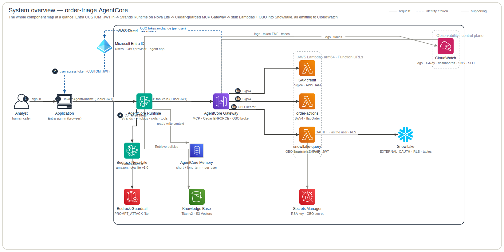

# System overview

The **order-triage AgentCore** system at a glance — one left-to-right pass from an
Entra-authenticated analyst, through the AgentCore Runtime (Strands over **Bedrock Nova
Lite**) and the Cedar-guarded **AgentCore Gateway**, out to the stub Lambdas and
**Snowflake**, with the whole system emitting telemetry to CloudWatch. This is the **map**;
the five plane docs below are its cross-sections.

**Legend** — official AWS icons, left → right. Edges: **solid dark** = request / data path · **blue dashed** = identity / token / secret · **grey** = supporting (incl. telemetry); primary steps are numbered. Rounded boxes are trust / responsibility zones. The diagram is generated from [`specs.json`](specs.json) by the `architecture-skill` skill — edit the spec, not the SVG.

Every box is a real subsystem; its detail — and the file behind it — lives in the matching plane:

- [**Agent**](agent-architecture.md) — the reasoning loop (model ⇄ tools, the three knowledge surfaces).
- [**Security**](security-architecture.md) — Entra `CUSTOM_JWT`, Cedar at the Gateway, the SigV4 (agent) vs Entra-OBO (user) egress split, Snowflake RLS.
- [**Memory**](memory-architecture.md) — per-user short-term events + the three long-term strategies, keyed by the Entra subject.
- [**Observability**](observability-architecture.md) — logs, ADOT `gen_ai` traces, the EMF token metric, dashboards, alarms → SNS.
- [**Evaluation**](evaluation-architecture.md) — the offline pytest gate on the agent image + online grading of sampled live spans.

The detailed live request / data plane is [`data-plane.md`](data-plane.md); the build / publish / deploy pipeline is in the [repo README](../../README.md) and [CD-SETUP.md](../playbooks/cd-setup.md).
