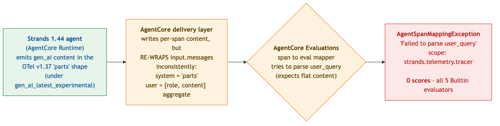

# AgentCore Online Evaluations cannot score Strands ≥ 1.44 traces — `AgentSpanMappingException`

**Prepared for:** AWS Bedrock AgentCore team / AWS Support
**From:** order-triage demo team (Anil Choudhary)
**Account / Region:** `953472632913` / `us-west-2`
**Date:** 2026-06-24
**Severity:** Feature-blocking (the service runs, provisions, and bills, but produces **zero** usable output)
**Status:** Reproduced live today; root cause isolated to an AWS-owned format mismatch; no agent-side workaround exists (two were tried and reverted).

---

## 1. The issue in plain terms

We enabled **Amazon Bedrock AgentCore Online Evaluations** — the native, LLM-as-judge service that samples a deployed agent's live traces and scores them for Correctness, Helpfulness, Faithfulness, and tool-call accuracy. Everything provisions and runs: the config is `ACTIVE`, the judge fires on every sampled trace, IAM is correct, and the result records are written.

**But every single evaluation fails to parse the trace, and we get zero numeric scores.** Each result is an error, not a score.

The cause is a **format mismatch between two AWS-owned components**:

- **Strands** (the AWS agent SDK), at **version 1.44**, emits the prompt/response content using the **newer OpenTelemetry GenAI semantic convention** — the OTel v1.37 *"parts"* content shape. It only emits the content event we need when we opt into that convention via `OTEL_SEMCONV_STABILITY_OPT_IN=gen_ai_latest_experimental`.
- **AgentCore Online Evaluations**' span-to-evaluation **mapper expects the older, flat content shape** and tries to read `user_query` directly out of it. It cannot parse the "parts" shape, so it throws:

  > `AgentSpanMappingException: Failed to parse user_query from agent-span with spanId: <id> and scope: strands.telemetry.tracer`

The error string itself names both AWS components: it failed to read `user_query`, from a span whose instrumentation `scope` is `strands.telemetry.tracer`.

**Why we can't work around it from our side:** we cannot simply turn off the new convention, because the aggregate content event the evaluator reads *only exists* under `gen_ai_latest_experimental`. Turning it off trades `AgentSpanMappingException` for a *different* error (`LogEventMissingException`). And when we tried to reshape the content in our own agent code, **AgentCore's delivery layer re-wraps the content before the mapper sees it**, so no client-side shape satisfies it. This is an upstream incompatibility that has to be fixed in the AgentCore eval mapper (or in what Strands emits) — not in our agent.



---

## 2. Environment (verified today)

| Component | Value |
|---|---|
| Online evaluation config | `order_triage_online_evals-7nK2307vE8` (**`ACTIVE`**) |
| Service name | `order_triage.DEFAULT` |
| Evaluators (all 5 fail) | `Builtin.Correctness`, `Builtin.Helpfulness`, `Builtin.Faithfulness`, `Builtin.ToolSelectionAccuracy`, `Builtin.ToolParameterAccuracy` |
| Sampling | `samplingPercentage = 100` |
| Data-source log groups | `aws/spans` (X-Ray Transaction Search) **+** `/aws/bedrock-agentcore/runtimes/order_triage-cwG2Pw7Bnv-DEFAULT` |
| Results log group | `/aws/bedrock-agentcore/evaluations/results/order_triage_online_evals-7nK2307vE8` |
| Agent SDK | **`strands-agents` 1.44.0** |
| OTel runtime | `opentelemetry-api` / `opentelemetry-sdk` **1.40.0**, `opentelemetry-semantic-conventions` **0.61b0** |
| AWS OTel distro | `aws-opentelemetry-distro` **0.17.1** (launched via `opentelemetry-instrument`) |
| Runtime env (load-bearing) | `OTEL_SEMCONV_STABILITY_OPT_IN = gen_ai_latest_experimental,gen_ai_tool_definitions` |

> For contrast: AWS's own working Online-Evaluations example documents `telemetry.auto.version 0.12.2-aws`. The shape that mapper was validated against is the *older* (pre-v1.37) content shape — which is the crux of this report.

---

## 3. Expected vs. actual

**Expected:** each sampled trace yields a `gen_ai.evaluation.result` record carrying a numeric `gen_ai.evaluation.score` per evaluator, which then surfaces in CloudWatch / GenAI Observability.

**Actual:** each sampled trace yields a `gen_ai.evaluation.result` record with `error.type = "AgentSpanMappingException"`, `error = 1`, and **no `gen_ai.evaluation.score` field at all**. Over the most recent 12-hour window, **48 of 48** result records are errors; 0 scores.

---

## 4. The precise technical issue

### 4.1 The error (live, from the results log group)

A representative result record, fetched today from `/aws/bedrock-agentcore/evaluations/results/order_triage_online_evals-7nK2307vE8`:

```json
{
  "name": "gen_ai.evaluation.result",
  "attributes": {
    "gen_ai.evaluation.name": "Builtin.Correctness",
    "session.id": "status-check-1782264057-padpadpadpadpadpadpadpadpad",
    "gen_ai.response.id": "6a3b30fa728131a2506b931e3c6cc499",
    "error.type": "AgentSpanMappingException",
    "error.message": "Failed to parse user_query from agent-span with spanId: c8a70359e4ff5fbb and scope: strands.telemetry.tracer",
    "error": 1,
    "throttle": 0,
    "aws.bedrock_agentcore.online_evaluation_config.name": "order_triage_online_evals",
    "aws.bedrock_agentcore.evaluator.arn": "arn:aws:bedrock-agentcore:::evaluator/Builtin.Correctness",
    "aws.bedrock_agentcore.evaluator.rating_scale": "Numerical",
    "aws.bedrock_agentcore.evaluation_level": "Trace"
  },
  "onlineEvaluationConfigId": "order_triage_online_evals-7nK2307vE8"
}
```

The same error appears for the span-level tool evaluators, e.g. `Builtin.ToolParameterAccuracy` with `"aws.bedrock_agentcore.evaluation_level": "Span"` and `"error.message": "Failed to parse user_query from agent-span with spanId: e162c28d7d6f1ffb and scope: strands.telemetry.tracer"`. **Note there is no `gen_ai.evaluation.score` key on any of these records.**

### 4.2 The content the mapper is choking on

The judge correlates content to the span via `spanId`, reading the per-span `gen_ai` content events that Strands writes to the runtime `-DEFAULT` log group. Here is the **actual delivered content** for one such span (scope `strands.telemetry.tracer`), captured live today. Content is truncated; **the shapes are verbatim**:

```jsonc
// body.input.messages[] — as delivered to /aws/bedrock-agentcore/runtimes/order_triage-cwG2Pw7Bnv-DEFAULT
[
  {
    "role": "system",
    // OTel v1.37 "parts" shape (stringified): [{"type":"text","content": ...}]
    "content": "[{\"type\": \"text\", \"content\": \"You are an order-triage assistant for orders, customers, credit, and disputes. ...\"}]"
  },
  {
    "role": "user",
    // RE-WRAPPED aggregate (stringified, doubly nested): [{"role":..,"content":"[{\"text\":..}]"}]
    "content": "[{\"role\": \"user\", \"content\": \"[{\\\"text\\\": \\\"<user_context>The user requested triage of order O-1003 ...\\\"}]\"}]"
  }
]
```

This is the smoking gun, and it shows **two distinct problems at once**:

1. **Wrong convention.** The `system` message content is in the OTel v1.37 **`parts`** shape — `[{"type":"text","content":"…"}]` — not the flat text / native Bedrock `ContentBlocks` that AWS's mapper was built to read.
2. **Inconsistent re-wrapping.** The `user` message — the one the mapper needs for `user_query` — is **not** even in the `parts` shape; it arrives as a whole serialized `[{"role":"user","content":"[{\"text\":…}]"}]` **aggregate**, where `content` is itself a stringified array. So within a single span, the **system** message and the **user** message are delivered in **two different shapes**. The mapper has no single rule that can extract `user_query` from this.

### 4.3 Why this is upstream, not ours

The instrumentation `scope` in the error is `strands.telemetry.tracer` — i.e. AgentCore is reporting that it received a span emitted by Strands' own tracer and could not map it. Both producer (Strands SDK) and consumer (AgentCore Evaluations mapper) are AWS-owned. The agent contributes **no custom telemetry**; it runs the stock `opentelemetry-instrument` entrypoint and the documented `OTEL_SEMCONV_STABILITY_OPT_IN` env var.

---

## 5. The catch-22 (why "just disable the new convention" does not work)

The obvious workaround — drop `gen_ai_latest_experimental` so Strands emits the older shape — is **not viable**:

- **With** `gen_ai_latest_experimental`: the aggregate `body.input.messages` content event *exists* (good — the evaluator has something to read), but its content is in the v1.37 `parts` shape the mapper can't parse → **`AgentSpanMappingException`** (this report).
- **Without** `gen_ai_latest_experimental`: Strands does not emit the aggregate `body.input.messages` content event at all, so the evaluator finds no content for the span → **`LogEventMissingException: "Session span data is incomplete … missing a corresponding log event"`** (we confirmed this earlier on the prior config `…-dJ3KO96WVM`).

So one AgentCore feature (Online Evaluations) requires content that, in this SDK/runtime version, only materializes under a convention that a second AgentCore feature (the eval mapper) cannot read. There is no env-var combination on our side that satisfies both.

---

## 6. Workarounds we attempted (and why they failed)

We tried to reshape the emitted content in our own agent code by monkeypatching Strands' tracer. **Both attempts were deployed, live-validated, and scored zero — then reverted.**

1. **Patched `Tracer._add_event`** to rewrite the `{role, parts}` envelope toward native `{role, content}`. Result: **AgentCore re-wrapped** the delivered content, so the mapper still failed to parse `user_query`. 0 scores.
2. **Patched `Tracer._map_content_blocks_to_otel_parts`** to emit native Bedrock `ContentBlocks` as the OTel parts. Result: the **system** message then arrived native, but the **user** message still arrived as the whole serialized `[{role, content}]` aggregate (the re-wrap in §4.2). 0 scores.

The conclusion from these experiments: **AgentCore's delivery layer re-wraps `input.messages` content after our code runs and before the mapper reads it**, and it does so *inconsistently* between the system and user messages. No single client-side content shape can satisfy both the `user_query` parse (which wants flat content) and the tool-trajectory evaluators (which want structured tool detail). We reverted both shims because they were no-ops for evaluation and made our OTel spans non-standard (native blocks where OTel parts are expected), which risks confusing the GenAI-Observability content display.

We have **kept Online Evaluations enabled** (harmlessly erroring) and **kept** `gen_ai_latest_experimental` on the runtime, because the gen_ai content capture has standalone GenAI-Observability value independent of scoring.

---

## 7. What we are asking AWS

In rough priority order:

1. **Make the AgentCore Evaluations mapper parse the OTel v1.37 `parts` content convention** emitted by Strands ≥ 1.44 under `gen_ai_latest_experimental`. This is the standard, forward-looking direction and would unblock us with no agent change.
2. **Fix the inconsistent re-wrapping of `input.messages`** in the delivery path — the system message and user message of the same span arrive in different shapes (§4.2). Even a mapper that understood `parts` would still need the user message to be in a parseable shape.
3. **Publish a known-good compatibility matrix** for Online Evaluations: which `strands-agents` / `aws-opentelemetry-distro` / `OTEL_SEMCONV_STABILITY_OPT_IN` combinations the mapper currently supports. AWS's working example references `telemetry.auto.version 0.12.2-aws`; current Strands resolves a much newer OTel stack (1.40.0 / semconv 0.61b0). A documented matrix would let customers pin a working set instead of discovering this by trial.
4. **Confirm the `gen_ai_latest_experimental` dependency.** Online Evaluations appears to require an aggregate content event that only exists under that opt-in, while the mapper only understands the pre-opt-in shape (§5). If that is a known transitional state, please document the supported path.

If a specific older `aws-opentelemetry-distro` pin is the supported workaround today, we will take that as an interim answer — but note it would affect **all** of our observability instrumentation, not just evaluations, so we would weigh it carefully.

---

## 8. Appendix — reproduce the evidence

**A. Confirm the config is active**
```bash
aws bedrock-agentcore-control list-online-evaluation-configs --region us-west-2 \
  --query "onlineEvaluationConfigs[?onlineEvaluationConfigName=='order_triage_online_evals'].{id:onlineEvaluationConfigId,status:status}"
# -> order_triage_online_evals-7nK2307vE8 / ACTIVE
```

**B. See the errors (CloudWatch Logs / Logs Insights), results log group**
```
SOURCE "/aws/bedrock-agentcore/evaluations/results/order_triage_online_evals-7nK2307vE8" START=-43200s END=0s
```
Every `gen_ai.evaluation.result` record carries `attributes.error.type = "AgentSpanMappingException"`, `attributes.error = 1`, and no `gen_ai.evaluation.score`. (Console path: CloudWatch → Logs → that log group → *View in Logs Insights*; filter/highlight `AgentSpanMappingException`; expand any record.)

**C. Inspect the delivered content shape that the mapper rejects** (runtime `-DEFAULT` group):
```bash
aws logs filter-log-events --region us-west-2 \
  --log-group-name "/aws/bedrock-agentcore/runtimes/order_triage-cwG2Pw7Bnv-DEFAULT" \
  --filter-pattern '"input.messages"'
# Look at body.input.messages[].content — system msg is OTel-parts; user msg is a re-wrapped [{role,content}] aggregate.
```

**D. Versions**
```bash
# from the agent build (uv.lock): strands-agents 1.44.0, opentelemetry-* 1.40.0,
# opentelemetry-semantic-conventions 0.61b0, aws-opentelemetry-distro 0.17.1
```

---

*Internal cross-reference (not for AWS): this is tracked in `../adr/0005-online-evaluations.md` (Risk R1 / Decision D7) and the evaluation-architecture doc; agent-side shim attempts were PRs #25 and #29 in `order-triage-agent`, both reverted.*
