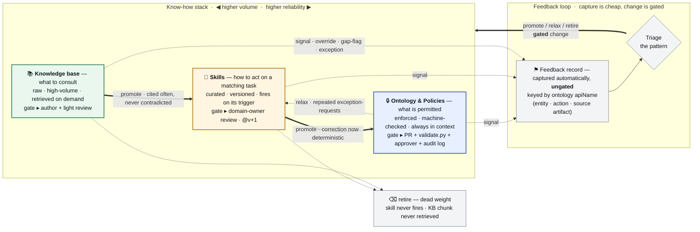

# knowledge

The **knowledge layer** for the [order-triage agent](../agent/README.md):
a **file-based ontology**, the **skills** (curated procedures) and **KB** that bind into it,
and the **bindings** that point into it. Authored as YAML/markdown, validated against JSON
Schema contracts, and compiled to JSON artifacts the agent consumes. There is no graph
database — the repository is the source of truth and `git` is the audit log. Edit the
source, run the build, commit the compiled artifacts, tag a version. This repo sits at the
**front of the pipeline**: it is the source of truth that every other piece of the demo
ultimately consumes.

## How it fits

One of **five components** in the [bedrock-demo](../README.md) mono-repo — see
[The five components](../README.md#the-five-components) for the full map and hand-offs.
The upstream source of truth: it compiles the work-stream specs into the ontology + skills + KB that the [order-triage agent](../agent/README.md) bakes in-tree and consumes.

## Repository structure

```text
ontology/                 the ontology (author here, split by layer; layers merge into one document)
  _meta.yaml              provenance: versions, owner, status
  datasources.yaml        connections + source-of-truth registry
  object-types.yaml       entities: keys, properties, aliases, source bindings
  link-types.yaml         relationships: cardinality, direction
  action-types.yaml       state mutations (MVP credit/order-triage; rest pending specs)
skills/                   curated procedures, bound to the ontology by apiName
  *.skill.md              YAML frontmatter (bindings) + markdown procedure body — the agent fetches these
  examples/*.skill.yaml   metadata-only ontology examples (validated, but not fetched by the agent)
kb/                       knowledge base registry, bound by apiName
  index.yaml              docs + chunks, each declaring what it `concerns`
  *.md                    the documents themselves
schema/
  ontology.schema.json    the ontology contract (Draft 2020-12)
  bindings.schema.json    the skill / KB manifest contract
build/
  validate.py             merge → validate → compile the ontology
  bindings.py             resolve skill/KB refs → reverse index
  lineage_report.py       source-of-truth + maturity rollup
  render_ontology.py      interactive HTML graph + a Mermaid/table overview for inspection
  ontology.compiled.json  the compiled ontology (committed)
  bindings.json           resolved bindings + reverse index (committed)
docs/
  adr/                    architecture decision records (currently 0001 — privilege/classification)
  architecture/           the architecture primer + the association model
../.github/workflows/     CI (knowledge-validate.yml): validate, resolve bindings, drift gates, render visual, upload; a knowledge change rebuilds the agent image via agent-build.yml's path filter
requirements.txt          the two runtime deps (pyyaml, jsonschema)
CLAUDE.md                 machine/agent operating instructions for this repo
```

## Setup & usage

**Prerequisites**

- Python 3.13 (CI runs on 3.13) and `pip`.
- The two runtime deps in `requirements.txt` (`pyyaml`, `jsonschema`) — no other tooling, no
  test framework, no linter; `validate.py` and `bindings.py` *are* the checks.
- A working knowledge of the three-layer model below before you edit source — what belongs in
  the ontology vs. a skill vs. the KB. See [Architecture & visualizations](#architecture--visualizations).

**Happy path**

```bash
pip install -r requirements.txt
python build/validate.py          # validate + compile the ontology  -> build/ontology.compiled.json
python build/bindings.py          # resolve skill/KB bindings + reverse index -> build/bindings.json
python build/lineage_report.py    # source-of-truth / maturity rollup -> build/lineage.{md,csv}
python build/render_ontology.py   # interactive graph -> build/ontology.html (open in a browser) + summary.md
```

`ontology.compiled.json` and `bindings.json` are **committed artifacts** — regenerate and
commit them alongside any source change, or CI's drift gate fails. The exact command sequence,
exit-code/CI semantics, and the drift-gate gotcha live in [`CLAUDE.md`](CLAUDE.md).

The agent copies the top-level `skills/*.skill.md` from the in-tree `../knowledge` folder at
its own build time (no GitHub fetch, no token); that consuming-side wiring lives in the
[agent](../agent/README.md), not here — see [Key journeys](#key-journeys).

## Architecture & visualizations

Three layers, ranked by reliability, sit on top of one another: the **ontology** declares
*what is permitted* (enforced, machine-checked, always in context), **skills** capture *how to
act* on a matching task (curated, versioned, present when their trigger fires), and the **KB**
holds *what to consult* (raw, high-volume, retrieved on demand). Skills and KB bind **into** the
ontology by `apiName`; nothing in the ontology points back. The build merges the ontology
layers, validates them, compiles an enriched artifact, and resolves every binding into a reverse
index — failing on any dangling reference. The full treatment is in the
[architecture primer](docs/architecture/architecture-primer.md).

### What's modelled

- **42 object types** across three work-streams — **A** bean sourcing & procurement,
  **B** planning, blend & inventory, **C** sales, contracting & fulfilment.
- **61 relationships** — associations and dependencies with cardinality and direction.
- **18 datasources + 2 connections** forming the source-of-truth registry.
- **3 MVP actions** (credit / order-triage), with validation rules; the broader A/B/C
  action catalog still comes from the work-stream specs.
- **Skills and KB** that bind into the ontology — see [associations](docs/architecture/associations.md).

### How association works (skills + KB ↔ ontology)

References point **into** the ontology by `apiName`; nothing in the ontology points
back. A skill declares `appliesTo` (its structural trigger — the entities, links, and
actions it governs), plus `invokes` and `reads`. A KB doc declares what it `concerns`,
at the chunk level where possible. `build/bindings.py` validates the manifests, resolves
every reference (a dangling one fails the build), expands link references to their
endpoint objects, and emits `build/bindings.json` — the **reverse index** from each
`apiName` to the skills and KB that touch it. Optional `aliases` on entities power KB
auto-tagging and natural-language query expansion. Full detail in
[associations](docs/architecture/associations.md).

### Governance: how know-how moves through the layers

Most operating know-how is soft — *"do X for Y, except when Z"* — and a single rule
rarely lives in one place. The discipline (see the
[architecture primer](docs/architecture/architecture-primer.md)) is to split each fragment
across three layers ranked by **reliability**, and push it **as high up the stack as it
honestly goes**:

- **Knowledge base** — *what to consult*: raw, high-volume material, retrieved on demand.
- **Skills** — *how to act* on a matching task: curated, versioned, present whenever
  their trigger fires.
- **Ontology & Policies** — *what is permitted*: enforced, machine-checked, always in
  context. The audit-grade layer that cannot be silently skipped.

A feedback loop keeps the layers current. Every override, gap-flag, and exception-request
is **captured automatically and ungated** (recording one changes nothing), keyed by
ontology `apiName`. Triage turns accumulated evidence into a **gated** change whose gate
scales with blast radius — promoting know-how up the stack as it hardens, relaxing a
too-rigid rule back down, and retiring dead weight. The non-negotiable: **capture is
cheap, change is gated, and nothing silently rewrites its own enforced rules.**



_Solid = promotion (hardening) · dashed = relax / retire / signal. Full treatment — the
three placement questions, a worked credit-policy example, and the feedback-record
schema — in the [architecture primer](docs/architecture/architecture-primer.md)._

### See the whole model

CI renders the live model on every run: the Mermaid graph + tables land in the **job summary**
(visible on the Actions run page, no download), and `build/ontology.html` — an interactive,
zoomable, filterable graph — is uploaded in the **ontology-build** artifact. Locally,
`python build/render_ontology.py` writes the same `build/ontology.html`; open it in a browser
to explore the whole ontology at once.

## Key journeys

**1 · Author or edit source → ship a release.** Edit the YAML/markdown in `ontology/`,
`skills/`, or `kb/`. Run `python build/validate.py` (merge → schema → referential-integrity →
compile) and `python build/bindings.py` (resolve every binding → reverse index). Commit the
regenerated `build/ontology.compiled.json` and `build/bindings.json` alongside your source so
the drift gate passes. On merge, `knowledge-validate.yml` re-validates and the change rebuilds
the [agent](../agent/README.md) image via `agent-build.yml`'s path filter.

**2 · A skill or KB binds an entity → blast-radius + drift gate.** A skill's frontmatter (or a
KB doc in `kb/index.yaml`) declares what it touches by `apiName`. `bindings.py` resolves every
reference and builds the **reverse index** from each `apiName` to the skills/KB/actions that
touch it — so renaming or removing an entity surfaces exactly what breaks, and a dangling
reference **fails the build**. This is the cross-layer drift gate.

**3 · Classify an object confidential → authority derives to the user.** When an object's
`classification` is `confidential`/`restricted` (or an action mutates enterprise state), the
compile's `enrich_authority()` stamps the action's `authority` as `user`. The ontology declares
only *what* is privileged, never *how* it is enforced; the consuming agent reads that single
field and routes credentials — impersonating the user on the privileged path. The model and its
rationale are in [ADR 0001](docs/adr/0001-ontology-privilege-classification.md).

## Further reading

- [`docs/adr/0001-ontology-privilege-classification.md`](docs/adr/0001-ontology-privilege-classification.md) — the privilege/classification → authority decision (why the ontology declares *what* is privileged, never *how*).
- [`docs/architecture/architecture-primer.md`](docs/architecture/architecture-primer.md) — the three-layer placement discipline, the three placement questions, a worked credit-policy example, and the feedback-record schema.
- [`docs/architecture/associations.md`](docs/architecture/associations.md) — the full binding model (how skills + KB associate into the ontology).
- [`CLAUDE.md`](CLAUDE.md) — the machine/agent operating instructions: exact build commands, the committed-artifact drift gate, conventions, and the consuming-side fetch.
