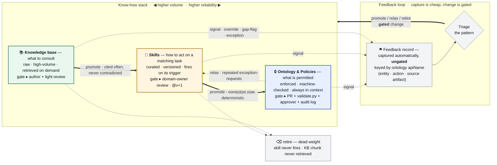

# knowledge

The **knowledge layer** for the [order-triage agent](../agent/README.md): a file-based
ontology, the skills (curated procedures) and knowledge base that bind into it, and the
bindings that point into it. Source is authored as YAML and markdown, validated against
schema contracts, and compiled into the JSON artifacts the agent consumes. There is no graph
database — the repository is the source of truth and `git` is the audit log. You edit the
source, run the build, commit the compiled artifacts, and tag a version. This folder sits at
the front of the pipeline: the source of truth that every other piece of the demo ultimately
consumes.

## How it fits

One of the **six top-level folders** in the [bedrock-demo](../README.md) mono-repo (the five
pipeline components plus the shared lib) — see [The components](../README.md#the-components)
for the full map and hand-offs. This is the upstream source of truth: it compiles the
work-stream specs into the ontology, skills, and KB that the
[order-triage agent](../agent/README.md) bakes in-tree and consumes.

## What's modelled

- **42 object types** across three work-streams — **A** bean sourcing & procurement,
  **B** planning, blend & inventory, **C** sales, contracting & fulfilment.
- **61 relationships** — associations and dependencies with cardinality and direction.
- **18 datasources + 2 connections** forming the source-of-truth registry.
- **3 MVP actions** (credit / order-triage), with validation rules; the broader A/B/C
  action catalog still comes from the work-stream specs.

## Getting started

```bash
pip install -r requirements.txt
python build/validate.py          # validate + compile the ontology  -> build/ontology.compiled.json
python build/bindings.py          # resolve skill/KB bindings + reverse index -> build/bindings.json
python build/render_ontology.py   # interactive graph -> build/ontology.html (open in a browser)
```

The two compiled artifacts are **committed**: regenerate and commit them alongside any source
change, or CI's drift gate fails. The exact command sequence, the exit-code/CI semantics, and
the drift-gate gotcha live in the operating brief, [`CLAUDE.md`](CLAUDE.md).

## Architecture

Three layers, ranked by reliability, sit on top of one another. The **ontology** declares
*what is permitted* — enforced, machine-checked, always in context. **Skills** capture *how to
act* on a matching task — curated, versioned, present when their trigger fires. The
**knowledge base** holds *what to consult* — raw, high-volume, retrieved on demand. Skills and
KB bind **into** the ontology by name; nothing in the ontology points back. The build merges
the ontology layers, validates them, compiles an enriched artifact, and resolves every binding
into a reverse index — failing on any dangling reference. The binding model is in
[associations](docs/architecture/associations.md); the full three-layer treatment is in the
[architecture primer](docs/architecture/architecture-primer.md).

Most operating know-how is soft — *"do X for Y, except when Z"* — and a single rule rarely
lives in one place. The discipline is to split each fragment across the three layers and push
it **as high up the stack as it honestly goes**. A feedback loop keeps the layers current:
every override, gap-flag, and exception-request is captured automatically and ungated, then
triage turns accumulated evidence into a **gated** change whose gate scales with blast radius —
promoting know-how up the stack as it hardens, relaxing a too-rigid rule back down, and
retiring dead weight. The non-negotiable: capture is cheap, change is gated, and nothing
silently rewrites its own enforced rules.



_Solid = promotion (hardening) · dashed = relax / retire / signal. The full treatment — the
three placement questions, a worked credit-policy example, and the feedback-record schema —
is in the [architecture primer](docs/architecture/architecture-primer.md)._

**See the whole model.** CI renders the live model on every run (the graph and tables land in
the Actions job summary, no download needed). Locally, the build writes `build/ontology.html` —
an interactive, zoomable, filterable graph — open it in a browser to explore the whole ontology
at once.

## Key journeys

**1 · Author or edit source → ship a release.** Edit the YAML/markdown source, run the validate
and bindings build steps, and commit the regenerated compiled artifacts alongside your source so
the drift gate passes. On merge, CI re-validates and the change rebuilds the
[agent](../agent/README.md) image via its path filter.

**2 · A skill or KB binds an entity → blast-radius + drift gate.** A skill or KB doc declares
what it touches by name. The build resolves every reference and builds the reverse index from
each name to the skills, KB, and actions that touch it — so renaming or removing an entity
surfaces exactly what breaks, and a dangling reference fails the build. This is the cross-layer
drift gate.

**3 · Classify an object confidential → authority derives to the user.** When an object is
classified confidential or restricted (or an action mutates enterprise state), the compile
stamps the action's authority as `user`. The ontology declares only *what* is privileged, never
*how* it is enforced; the consuming agent reads that single field and routes credentials,
impersonating the user on the privileged path. The model and its rationale are in
[ADR 0001](docs/adr/0001-ontology-privilege-classification.md).

## Further reading

- [`CLAUDE.md`](CLAUDE.md) — the operating brief: exact build commands, the committed-artifact
  drift gate, conventions, and the consuming-side fetch.
- [`docs/architecture/architecture-primer.md`](docs/architecture/architecture-primer.md) — the
  three-layer placement discipline, the three placement questions, a worked credit-policy
  example, and the feedback-record schema.
- [`docs/architecture/associations.md`](docs/architecture/associations.md) — the full binding
  model (how skills + KB associate into the ontology).
- [`docs/adr/0001-ontology-privilege-classification.md`](docs/adr/0001-ontology-privilege-classification.md)
  — the privilege/classification → authority decision (why the ontology declares *what* is
  privileged, never *how*).
