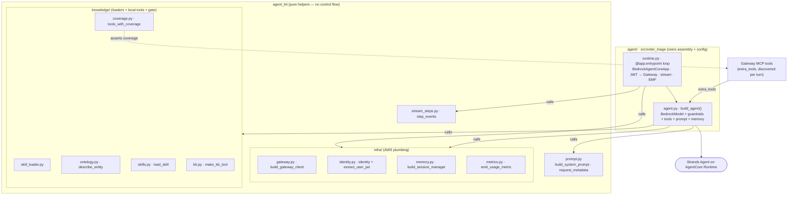

# agent_kit

The **agent-agnostic Strands + AgentCore helper toolkit**. `agent_kit` is a flat set of
composable helpers every agent on **Amazon Bedrock AgentCore Runtime** can reuse —
system-prompt and `requestMetadata` builders, per-request user identity, the Gateway MCP
client, the AgentCore Memory session manager, the per-turn token-usage EMF emitter, the
skill/ontology/KB loaders, the action-coverage gate, and the stream-step classifier. The
library has **zero control flow and makes zero configuration decisions**: the **consuming
agent owns assembly** — it writes its own `build_agent()` (constructing the `BedrockModel`
with its own guardrail/model config) and its `@app.entrypoint` runtime loop, calling these
`kit.*` helpers. There is **no `build_app` / `AgentSpec` / `Config`** here. The toolkit imports
no per-agent package, so the same code backs every agent. It is installed into the agent image
([`../agent/Dockerfile`](../agent/Dockerfile) builds `./lib[deploy]`, then the agent on top).

## How it fits

The [bedrock-demo](../README.md) mono-repo has **six top-level folders** — the five pipeline
components (knowledge, agent, stubs, infra, app) plus this **shared lib (`agent_kit`)** the
agent builds on; see [The components](../README.md#the-components) for the full map. `agent_kit`
is **not a pipeline stage**: it is the agent-agnostic helper toolkit consumed by the
[agent](../agent/README.md) (and any future agent), installed into the agent container image.
The agent owns its assembly — it writes `build_agent()` and the entrypoint loop and calls the
`kit.*` helpers; the library provides the reusable building blocks.

## Public API

The package root (`import agent_kit`, conventionally aliased `kit`) re-exports a **flat set of
helpers** — no control objects, no factory:

- **`identity`** (the `agent_kit.infra.identity` module) — per-request user identity:
  `set_user_jwt` / `reset` / `current`, `actor_id(default="anonymous")`, `actor_oid()`,
  `ANONYMOUS_ACTOR`, and `extract_user_jwt(context, header_name="Authorization")` to pull the
  bearer off the AgentCore request context.
- **`build_gateway_client(gateway_url, jwt)`** — build the Gateway MCP client with the user
  JWT as the `Authorization: Bearer` token (lazy-imports `mcp` + `strands.tools.mcp`).
- **`build_session_manager(memory_id, session_id, actor_id, retrieval_namespaces, region="us-west-2")`**
  — the AgentCore Memory session manager (returns `None` when `session_id is None`;
  lazy-imports `bedrock_agentcore`).
- **`emit_usage_metric(agent, *, namespace, agent_id, model_id="", session_id=None, actor_id="", actor_oid="")`**
  — print the per-turn token-usage EMF document to stdout (never raises).
- **`make_kb_tool(name, description, knowledge_base_id, region="us-west-2")`** — build the
  KB-search `@tool` by name/description over an explicit Knowledge Base id.
- **`describe_entity`** — the ontology reverse-index lookup tool; **`OntologyLoader`** /
  **`ontology_loader`** back it.
- **`load_skill`** — fetch a skill's playbook body; **`SkillLoader`** / **`skill_loader`** read
  the catalog and required actions.
- **`tools_with_coverage(local_tools, action_implementations, extra_tools=None)`** /
  **`assert_action_coverage(tools, action_implementations)`** / **`SkillActionCoverageError`** —
  the action-coverage gate: assert every skill-invoked action maps to a registered tool.
- **`build_system_prompt(preamble="", loader=None)`** / **`request_metadata(agent_id, session_id=None, actor_id="", actor_oid="")`**
  — assemble the system prompt (skill doctrine + on-demand catalog) and the opaque,
  PII-scrubbed `requestMetadata` dict for a Converse call.
- **`step_events`** / **`tool_result_text`** — the pure stream-step classifier.

## Repository structure

```text
lib/
├── src/agent_kit/
│   ├── __init__.py          # the flat helper re-exports (no AgentSpec / build_app / build_agent)
│   ├── prompt.py            # build_system_prompt() + request_metadata() builders
│   ├── stream_steps.py      # pure classifier: Strands events -> typed timeline step events
│   ├── infra/               # AWS-facing plumbing
│   │   ├── gateway.py       # build_gateway_client(gateway_url, jwt) — Gateway MCP client
│   │   ├── identity.py      # per-request user identity (ContextVar) + extract_user_jwt
│   │   ├── memory.py        # build_session_manager(...) — AgentCore Memory session manager
│   │   └── metrics.py       # emit_usage_metric(...) — the per-turn token-usage EMF emitter
│   └── knowledge/           # fetched-content loaders + local tools + the coverage gate
│       ├── skill_loader.py  # SkillLoader: skills_catalog() + required_actions() over SKILLS_DIR
│       ├── ontology.py      # OntologyLoader + describe_entity (reverse-index lookup tool)
│       ├── skills.py        # load_skill tool (returns a skill's procedure body)
│       ├── kb.py            # _kb_retrieve + make_kb_tool factory (Bedrock Knowledge Base)
│       └── coverage.py      # tools_with_coverage + assert_action_coverage (the coverage gate)
├── tests/                   # hermetic unit tests (loaders, identity, stream classifier, metadata)
├── pyproject.toml           # distribution agent-kit; core deps + deploy/dev extras
├── Makefile                 # setup · test · lint · clean (uv)
├── CLAUDE.md                # machine/agent operating instructions
└── README.md
```

### `infra/` vs `knowledge/`

The two sub-packages split along a clean line:

- **`infra/`** is the **AWS-facing plumbing** — the Gateway MCP client, the per-request user
  identity `ContextVar` (the OBO subject, used only as a memory partition key, never to
  authorize), the AgentCore Memory session manager, and the per-turn token-usage EMF emitter.
- **`knowledge/`** is the **fetched-content layer** — it reads the skills + ontology bindings
  copied into `SKILLS_DIR` / `ONTOLOGY_DIR` and exposes the **local tools** (KB search,
  `describe_entity`, `load_skill`) plus the **action-coverage gate** that asserts every
  skill-invoked action maps to a registered tool.

The **backends and the fetched knowledge are not in this package.** The Gateway-served backend
tools are passed to `tools_with_coverage(...)` as `extra_tools` by the agent at runtime
(discovered per MCP session, never hard-coded); the local tools are always present. The
skill/ontology/KB *content* is fetched into the agent image from the
[knowledge](../knowledge/README.md) folder — `agent_kit` ships the loaders, not the data.

## The import boundary

`import agent_kit` succeeds with **only the core deps** — `strands` (which pulls in `mcp`),
`boto3`, `pyyaml`. The deploy-only imports are **lazy**: `bedrock_agentcore` is imported inside
`build_session_manager`, and the `mcp` client is built inside `build_gateway_client` — never at
module top level. That keeps the **hermetic tests** runnable without the `deploy` extra and
without any network, model, or AWS access.

## Minimal consumer

The agent owns assembly — it writes its own `build_agent()` (model + guardrails + tools +
prompt) and the `@app.entrypoint` loop, calling `kit.*` helpers. A sketch:

```python
import os
import agent_kit as kit
from agent_kit import identity
from strands import Agent
from strands.models import BedrockModel

def build_agent(session_id, actor_id, actor_oid, extra_tools):
    # the AGENT owns the model + guardrail config
    model = BedrockModel(
        model_id=os.getenv("BEDROCK_MODEL_ID", "anthropic.claude-opus-4-8"),
        region_name="us-west-2",
        additional_args={"requestMetadata": kit.request_metadata(
            "order-triage", session_id, actor_id, actor_oid)},
        # guardrail_id / guardrail_version threaded in here when both are set
    )
    tools = kit.tools_with_coverage(
        [kit.make_kb_tool("search_policies", "…", os.getenv("KNOWLEDGE_BASE_ID", ""), "us-west-2"),
         kit.describe_entity, kit.load_skill],
        {"raiseException": "orders___flagOrder"},   # action -> Gateway tool
        extra_tools,                                  # the Gateway's MCP tools
    )
    return Agent(model=model, system_prompt=kit.build_system_prompt(), tools=tools,
                 agent_id="order-triage",
                 session_manager=kit.build_session_manager(
                     os.getenv("AGENTCORE_MEMORY_ID", ""), session_id, actor_id,
                     RETRIEVAL_NAMESPACES, "us-west-2"))

# the AGENT owns the entrypoint loop (BedrockAgentCoreApp), opening the Gateway MCP
# session, forwarding the user JWT via identity.set_user_jwt(kit.extract_user_jwt(context)),
# streaming with kit.step_events(...), and calling kit.emit_usage_metric(...) at the end.
```

The helpers do the reusable work; the **agent** decides the model, guardrails, namespaces, and
control flow. The local tools (KB search, `describe_entity`, `load_skill`) are always present;
the Gateway's MCP tools arrive as `extra_tools`, and `tools_with_coverage` asserts every
skill-invoked action resolves to a registered tool before the agent serves a request.

## How a runtime is assembled

The **agent** owns assembly and control flow; the library is the box of helpers it calls.



The agent calls `kit.*` to build the model, prompt, tools, memory, and metrics; the Gateway's
MCP tools are passed in per turn as `extra_tools`, and `tools_with_coverage` asserts every
skill-invoked action resolves to one of the registered tools before the agent serves a request.

## Setup & usage

**Prerequisites**

- [`uv`](https://docs.astral.sh/uv/) — manages the venv and dependencies.
- Python **3.12** (everything runs through `uv run`).

**Happy path**

```bash
make setup     # uv venv + dev deps (uv sync --extra dev)
make test      # hermetic unit tests — no network, no model, no AWS
make lint      # ruff (line-length 100; select E,F,I,UP,B; E501 ignored)
```

The tests are **hermetic** by design — loaders, identity, the stream classifier, and request
metadata, with no deploy extra required. `agent_kit` is installed into the consuming agent's
image (via `../agent/Dockerfile`), not run standalone; exercise the full runtime through the
deployed agent (e.g. the [order-triage-webapp](../app/README.md) OBO client).

CI (`../.github/workflows/lib-ci.yml`) runs ruff + the hermetic tests on every PR. Because the
agent image **bakes the lib**, a `lib/**` change also triggers the agent's
[`agent-ci.yml`](../agent/README.md) and rebuilds the image via `agent-build.yml`.

## Further reading

- [`CLAUDE.md`](./CLAUDE.md) — the machine/agent operating instructions: the public API, the
  `infra/` vs `knowledge/` split, the import-boundary invariant, and code conventions.
- [`../agent/README.md`](../agent/README.md) — the consuming agent, its request flow, and the
  observability/build wiring around the runtime this toolkit stands up.
