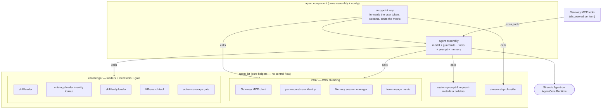

# agent_kit

The **agent-agnostic Strands + AgentCore helper toolkit**. `agent_kit` is a flat box of
composable helpers that any agent on **Amazon Bedrock AgentCore Runtime** can reuse to assemble
itself. It has **zero control flow and makes zero configuration decisions**: the consuming agent
owns assembly — it writes its own model-and-runtime wiring and calls these helpers for the
reusable parts. The toolkit imports no per-agent package, so the same code can back every agent.
It is installed into the agent container image rather than run on its own.

## How it fits

The [bedrock-demo](../README.md) mono-repo has six top-level folders — the five pipeline
components (knowledge, agent, stubs, infra, app) plus this **shared lib (`agent_kit`)** the agent
builds on; see [The components](../README.md#the-components) for the full map. `agent_kit` is
**not a pipeline stage**: it is the agent-agnostic helper toolkit consumed by the
[agent](../agent/README.md) (and any future agent), baked into the agent container image. The
agent owns its assembly and control flow; the library provides the reusable building blocks.

The helpers fall into a handful of conceptual categories: the **system-prompt and request-metadata
builders**, the **per-request user identity** (an on-behalf-of subject used only as a memory
partition key), the **Gateway MCP client**, the **AgentCore Memory session manager**, the
**per-turn token-usage metric emitter**, the **skill / ontology / KB loaders plus their local
tools**, the **action-coverage gate** (which asserts every skill-invoked action maps to a
registered tool), and the **stream-step classifier**. The exact function-by-function API is in
[`./CLAUDE.md`](./CLAUDE.md).

## Architecture

The **agent** owns assembly and control flow; the library is the box of helpers it calls. The
agent's own wiring builds the model, prompt, tools, memory, and metrics by calling `agent_kit`;
the Gateway's MCP tools are discovered per turn and passed into assembly as extra tools, where the
coverage gate asserts every skill-invoked action resolves to a registered tool before the agent
serves a request.



## How an agent uses it

The agent owns assembly — it writes its own `build_agent()` (model + guardrails + tools + prompt)
and the entrypoint loop, calling `kit.*` helpers. A sketch:

```python
import os
import agent_kit as kit
from agent_kit import identity
from strands import Agent
from strands.models import BedrockModel

def build_agent(session_id, actor_id, actor_oid, extra_tools):
    # the AGENT owns the model + guardrail config
    model = BedrockModel(
        model_id=os.getenv("BEDROCK_MODEL_ID", "anthropic.claude-opus-4-8"),
        region_name="us-west-2",
        additional_args={"requestMetadata": kit.request_metadata(
            "order-triage", session_id, actor_id, actor_oid)},
        # guardrail_id / guardrail_version threaded in here when both are set
    )
    tools = kit.tools_with_coverage(
        [kit.make_kb_tool("search_policies", "…", os.getenv("KNOWLEDGE_BASE_ID", ""), "us-west-2"),
         kit.describe_entity, kit.load_skill],
        {"raiseException": "orders___flagOrder"},   # action -> Gateway tool
        extra_tools,                                  # the Gateway's MCP tools
    )
    return Agent(model=model, system_prompt=kit.build_system_prompt(), tools=tools,
                 agent_id="order-triage",
                 session_manager=kit.build_session_manager(
                     os.getenv("AGENTCORE_MEMORY_ID", ""), session_id, actor_id,
                     RETRIEVAL_NAMESPACES, "us-west-2"))

# the AGENT owns the entrypoint loop (BedrockAgentCoreApp), opening the Gateway MCP
# session, forwarding the user JWT via identity.set_user_jwt(kit.extract_user_jwt(context)),
# streaming with kit.step_events(...), and calling kit.emit_usage_metric(...) at the end.
```

The helpers do the reusable work; the **agent** decides the model, guardrails, namespaces, and
control flow. The two sub-packages split along a clean line: **`infra/`** is the AWS-facing
plumbing (Gateway client, per-request identity, Memory session manager, token-usage metric), and
**`knowledge/`** holds the loaders that read the fetched skills + ontology content, the local
tools (KB search, `describe_entity`, `load_skill`), and the coverage gate. The backends and the
fetched knowledge *content* are not in this package — the Gateway's tools arrive per turn as extra
tools, and the skill / ontology / KB content is baked in from the
[knowledge](../knowledge/README.md) folder.

## Getting started

**Prerequisites:** [`uv`](https://docs.astral.sh/uv/) (manages the venv and dependencies) and
Python **3.12** (everything runs through `uv run`).

```bash
make setup     # uv venv + dev deps
make test      # hermetic unit tests — no network, no model, no AWS
make lint      # ruff
```

The tests are **hermetic** by design — loaders, identity, the stream classifier, and request
metadata, with no deploy extra and no network, model, or AWS access required. `agent_kit` is
installed into the consuming agent's image, not run standalone; exercise the full runtime through
the deployed agent (e.g. the [order-triage-webapp](../app/README.md) OBO client). For the full
command and gotcha detail, see [`./CLAUDE.md`](./CLAUDE.md).

## Further reading

- [`./CLAUDE.md`](./CLAUDE.md) — the operating brief: the function-by-function public API, the
  `infra/` vs `knowledge/` split, the import-boundary invariant, and code conventions.
- [`../agent/README.md`](../agent/README.md) — the consuming agent, its request flow, and the
  observability/build wiring around the runtime this toolkit stands up.
