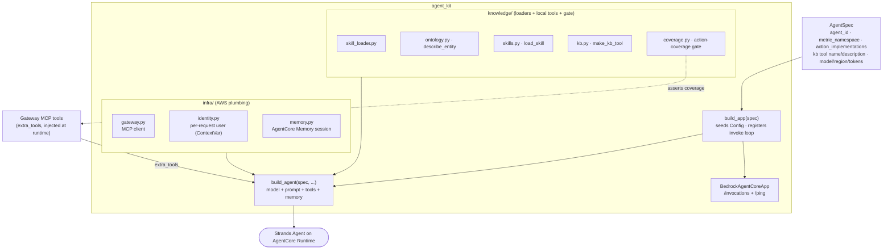

# agent_kit

The **agent-agnostic Strands + AgentCore runtime toolkit**. `agent_kit` holds the plumbing
every agent on **Amazon Bedrock AgentCore Runtime** shares — system-prompt and tool-surface
assembly, the `BedrockModel`, AgentCore Memory, per-request user identity, the Gateway MCP
client, the skill/ontology/KB loaders, the action-coverage gate, and the stream-step
classifier. A consuming agent stays **thin**: it constructs one `AgentSpec` — its id, metric
namespace, action implementations, KB tool name/description, and model/region/token defaults —
and calls `build_app(SPEC)` to stand up a deployable runtime. The toolkit itself imports no
per-agent package, so the same code backs every agent. It is installed into the agent image
([`../agent/Dockerfile`](../agent/Dockerfile) builds `./lib[deploy]`, then the agent on top).

## How it fits

The [bedrock-demo](../README.md) mono-repo has **six top-level folders** — the five pipeline
components (knowledge, agent, stubs, infra, app) plus this **shared lib (`agent_kit`)** the
agent builds on; see [The components](../README.md#the-components) for the full map. `agent_kit`
is **not a pipeline stage**: it is the agent-agnostic runtime toolkit consumed by the
[agent](../agent/README.md) (and any future agent), installed into the agent container image.
The agent supplies an `AgentSpec` and calls `build_app(SPEC)`; all the runtime and knowledge
plumbing lives here.

## Public API

Everything a consumer needs is re-exported from the package root (`import agent_kit`):

- **`AgentSpec`** (`spec.py`) — the frozen per-agent contract, and the only surface a consuming
  agent constructs: `agent_id`, `metric_namespace`, `action_implementations` (each ontology
  action a skill can invoke → the Gateway tool that serves it), `kb_tool_name` /
  `kb_tool_description`, an optional `system_prompt_preamble`, the memory `retrieval_namespaces`,
  and `model_id` / `region` / `max_tokens` defaults.
- **`build_agent(spec, session_id=None, actor_id=None, actor_oid="", extra_tools=None)`**
  (`agent.py`) — assembles the system prompt, tool surface, `BedrockModel`, and AgentCore
  Memory session manager into a Strands `Agent`. The Gateway's MCP tools arrive as
  `extra_tools`.
- **`build_app(spec)`** (`app.py`) — the AgentCore Runtime entrypoint factory: seeds config
  from the spec, lazy-imports `BedrockAgentCoreApp`, registers the streaming `/invocations`
  invoke loop (forwards the inbound user JWT to the Gateway, emits the per-turn token-usage EMF
  metric), and returns the app.
- Also exported: **`make_kb_tool`** (build the KB-search `@tool` by name/description),
  **`describe_entity`** (ontology reverse-index lookup tool), **`load_skill`** (fetch a skill's
  playbook body), **`step_events`** (the stream-step classifier), **`get_config`** / **`Config`**
  (env-driven runtime config).

## Repository structure

```text
lib/
├── src/agent_kit/
│   ├── __init__.py          # the public API re-exports (AgentSpec, build_agent, build_app, …)
│   ├── spec.py              # AgentSpec — the frozen per-agent contract
│   ├── config.py            # env-driven Config.from_env() (lru_cached get_config) + configure()
│   ├── agent.py             # build_agent() + system-prompt and requestMetadata assembly
│   ├── app.py               # build_app() — the AgentCore Runtime entrypoint factory
│   ├── stream_steps.py      # pure classifier: Strands events -> typed timeline step events
│   ├── infra/               # AWS-facing plumbing
│   │   ├── gateway.py       # Gateway MCP client (user JWT as bearer)
│   │   ├── identity.py      # per-request user identity (ContextVar; OBO subject)
│   │   └── memory.py        # AgentCore Memory session manager
│   └── knowledge/           # fetched-content loaders + local tools + the coverage gate
│       ├── skill_loader.py  # SkillLoader: skills_catalog() + get_skill() over SKILLS_DIR
│       ├── ontology.py      # OntologyLoader + describe_entity (reverse-index lookup tool)
│       ├── skills.py        # load_skill tool (returns a skill's procedure body)
│       ├── kb.py            # KB retrieve + make_kb_tool factory (Bedrock Knowledge Base)
│       └── coverage.py      # tool registry (get_tools) + the action-coverage startup gate
├── tests/                   # hermetic unit tests (loaders, identity, stream classifier, metadata)
├── pyproject.toml           # distribution agent-kit; core deps + deploy/dev extras
├── Makefile                 # setup · test · lint · clean (uv)
├── CLAUDE.md                # machine/agent operating instructions
└── README.md
```

### `infra/` vs `knowledge/`

The two sub-packages split along a clean line:

- **`infra/`** is the **AWS-facing plumbing** — the Gateway MCP client, the per-request user
  identity `ContextVar` (the OBO subject, used only as a memory partition key, never to
  authorize), and the AgentCore Memory session manager.
- **`knowledge/`** is the **fetched-content layer** — it reads the skills + ontology bindings
  copied into `SKILLS_DIR` / `ONTOLOGY_DIR` and exposes the **local tools** (KB search,
  `describe_entity`, `load_skill`) plus the **action-coverage gate** that asserts every
  skill-invoked action maps to a registered tool.

The **backends and the fetched knowledge are not in this package.** The Gateway-served backend
tools are passed into `build_agent` as `extra_tools` at runtime (discovered per MCP session,
never hard-coded); the local tools are always present. The skill/ontology/KB *content* is
fetched into the agent image from the [knowledge](../knowledge/README.md) folder — `agent_kit`
ships the loaders, not the data.

## The import boundary

`import agent_kit` succeeds with **only the core deps** — `strands` (which pulls in `mcp`),
`boto3`, `pyyaml`. The deploy-only imports are **lazy**: `bedrock_agentcore` is imported inside
`build_app`, and the `mcp` client is built inside the Gateway client — never at module top
level. That keeps the **hermetic tests** runnable without the `deploy` extra and without any
network, model, or AWS access.

## Minimal consumer

A new agent is a spec plus one line. The whole per-agent surface:

```python
from agent_kit import AgentSpec, build_app

SPEC = AgentSpec(
    agent_id="order-triage",
    metric_namespace="OrderTriage/Agent",
    # each ontology action a skill can invoke -> the Gateway tool that serves it
    action_implementations={"raiseException": "orders___flagOrder"},
    kb_tool_name="search_policies",
    kb_tool_description="Search the order/credit/dispute policy knowledge base for relevant rules.",
)

app = build_app(SPEC)   # the AgentCore Runtime entrypoint (/invocations + /ping)
```

`agent_kit` does the rest: builds one Strands agent per turn, forwards the inbound user JWT as
the Gateway bearer, injects the Gateway's MCP tools as `extra_tools`, and streams the answer
back as NDJSON plus typed `__step__` timeline events.

## How a runtime is assembled



The local tools (KB search, `describe_entity`, `load_skill`) are always present; the Gateway's
MCP tools are injected per turn as `extra_tools`, and the coverage gate asserts every
skill-invoked action resolves to one of the registered tools before the agent serves a request.

## Setup & usage

**Prerequisites**

- [`uv`](https://docs.astral.sh/uv/) — manages the venv and dependencies.
- Python **3.12** (everything runs through `uv run`).

**Happy path**

```bash
make setup     # uv venv + dev deps (uv sync --extra dev)
make test      # hermetic unit tests — no network, no model, no AWS
make lint      # ruff (line-length 100; select E,F,I,UP,B; E501 ignored)
```

The tests are **hermetic** by design — loaders, identity, the stream classifier, and request
metadata, with no deploy extra required. `agent_kit` is installed into the consuming agent's
image (via `../agent/Dockerfile`), not run standalone; exercise the full runtime through the
deployed agent (e.g. the [order-triage-webapp](../app/README.md) OBO client).

CI (`../.github/workflows/lib-ci.yml`) runs ruff + the hermetic tests on every PR. Because the
agent image **bakes the lib**, a `lib/**` change also triggers the agent's
[`agent-ci.yml`](../agent/README.md) and rebuilds the image via `agent-build.yml`.

## Further reading

- [`CLAUDE.md`](./CLAUDE.md) — the machine/agent operating instructions: the public API, the
  `infra/` vs `knowledge/` split, the import-boundary invariant, and code conventions.
- [`../agent/README.md`](../agent/README.md) — the consuming agent, its request flow, and the
  observability/build wiring around the runtime this toolkit stands up.
