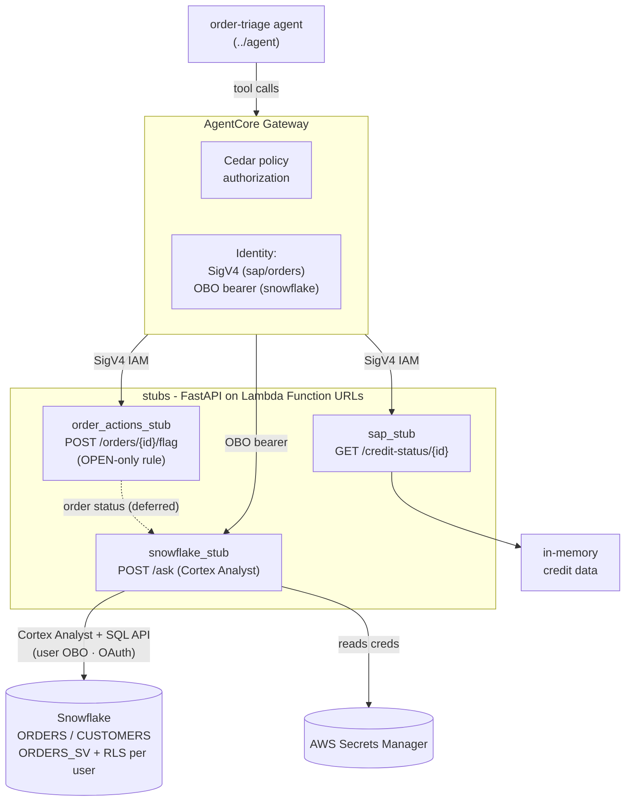

# stubs

Three dummy back-office services used as **AgentCore Gateway targets** for the
[order-triage agent](../agent/README.md). Each is a FastAPI app
that deploys as an arm64 Lambda Function URL, and together they stand in for the SAP,
order-actions, and Snowflake systems the agent needs to triage an order. This repo owns the
service code plus its OpenAPI specs and Lambda build, and publishes those artifacts to S3
where `../infra` wires them up as the live Gateway's tool targets.

| Service | Endpoint(s) | Gateway target | Purpose |
|---|---|---|---|
| `sap_stub` | `GET /credit-status/{id}` | `sap` | SAP credit status (on-hold, available credit) — deterministic in-memory data |
| `order_actions_stub` | `POST /orders/{id}/flag` | `orders` | flag an OPEN order for review |
| `snowflake_stub` | `POST /ask` (agent) | `snowflake` | NL analytics over the `ORDERS_SV` semantic view (Cortex Analyst) |

## How it fits

One of the **six top-level folders** in the [bedrock-demo](../README.md) mono-repo (the five
pipeline components plus the shared lib) — see [The components](../README.md#the-components)
for the full map and hand-offs.
The tool tier: three back-office stub services (SAP, order-actions, Snowflake) that produce
Lambda zips and OpenAPI specs for `../infra` to deploy, and that the `../agent` invokes as its
Gateway targets at runtime.

The three service packages live one per folder — `sap_stub/`, `order_actions_stub/`, and
`snowflake_stub/` — each a thin FastAPI app with its own OpenAPI spec and Lambda entrypoint.

## Getting started

The Makefile drives everything: `make setup` then `make test` for the hermetic test suite,
`make sap` / `make order-actions` / `make snowflake` to run a stub locally, and `make lambdas`
to build the arm64 Lambda zips. For the full command list, prerequisites (the Snowflake stub
needs AWS credentials and a secret name), and the inbound-auth gotchas, see
[CLAUDE.md](CLAUDE.md).

## Architecture

The three services are thin FastAPI apps that the AgentCore Gateway reaches as tool targets.
The Gateway authorizes each call against its Cedar policy, then invokes the matching Lambda
Function URL — SigV4-signed for `sap`/`orders`, or with a per-user Entra OBO bearer for
`snowflake`. `snowflake_stub` answers NL questions via Cortex Analyst over the `ORDERS_SV`
semantic view (`order_actions_stub`'s status-read dependency is a deferred edge). The same
services are built into Lambda zips and published, alongside their OpenAPI specs, for `../infra`
to deploy — see [docs/build-and-deploy.md](docs/build-and-deploy.md) for that cascade.

## Key journeys

1. **Agent flags an order.** The agent calls the `orders` tool → the Gateway authorizes it
   against its Cedar policy and SigV4-signs the call to `order_actions_stub`. Before flagging,
   the stub checks the order's status over an internal HTTP call to `snowflake_stub`
   and applies its OPEN-only rule — only an OPEN order can be flagged.

2. **Per-user order read.** The agent calls the `snowflake` tool with a forwarded Entra
   **OBO** bearer → `snowflake_stub` presents that token to the Snowflake SQL REST API as
   token-type `OAUTH`, so the read runs under that user's own RBAC rather than a shared
   service role.

3. **Build → publish → deploy.** `build_lambdas.sh` builds the three arm64 zips; on merge to
   `main` (or via `workflow_dispatch`) the release workflow uploads the zips plus each service's
   OpenAPI spec to the artifacts S3 bucket and cascades a dispatch to `../infra`, which references
   the zips by S3 key (Lambda code) and reads the specs as Gateway targets. The full cascade is in
   [docs/build-and-deploy.md](docs/build-and-deploy.md).

## Further reading

- **[CLAUDE.md](CLAUDE.md)** — operating brief, including the full inbound-auth model (SigV4 vs.
  OBO vs. `X-API-Key`) and the deploy/publish flow.
- **[docs/build-and-deploy.md](docs/build-and-deploy.md)** — the build→publish→deploy cascade
  and its diagram.
- **CD runbook** — [`../infra/docs/playbooks/cd-setup.md`](../infra/docs/playbooks/cd-setup.md)
  for the full publish/cascade/gated-apply pipeline.
- **ADRs** — this component owns none. Cross-cutting decisions live in the owning components'
  `docs/adr/` (`../infra`, `../knowledge`).
