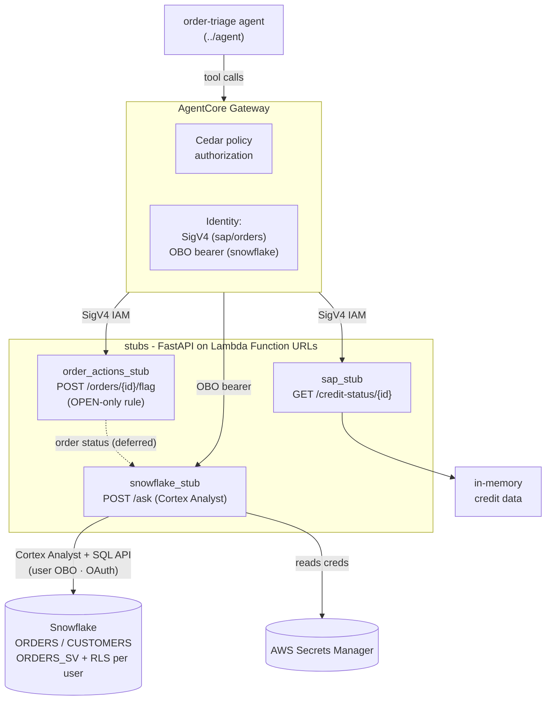
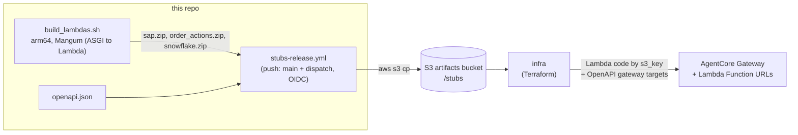

# stubs

Three dummy back-office services used as **AgentCore Gateway targets** for the
[order-triage agent](../agent/README.md). Each is a FastAPI app
that deploys as an arm64 Lambda Function URL, and together they stand in for the SAP,
order-actions, and Snowflake systems the agent needs to triage an order. This repo owns the
service code plus its OpenAPI specs and Lambda build, and publishes those artifacts to S3
where `../infra` wires them up as the live Gateway's tool targets.

| Service | Endpoint(s) | Gateway target | Purpose |
|---|---|---|---|
| `sap_stub` | `GET /credit-status/{id}` | `sap` | SAP credit status (on-hold, available credit) — deterministic in-memory data |
| `order_actions_stub` | `POST /orders/{id}/flag` | `orders` | flag an OPEN order for review |
| `snowflake_stub` | `POST /ask` (agent) | `snowflake` | NL analytics over the `ORDERS_SV` semantic view (Cortex Analyst) |

## How it fits

One of the **six top-level folders** in the [bedrock-demo](../README.md) mono-repo (the five
pipeline components plus the shared lib) — see [The components](../README.md#the-components)
for the full map and hand-offs.
The tool tier: three back-office stub services (SAP, order-actions, Snowflake) that produce
Lambda zips and OpenAPI specs for `../infra` to deploy, and that the `../agent` invokes as its
Gateway targets at runtime.

## Repository structure

```text
.
├── sap_stub/                  # SAP credit-status stub (Gateway target `sap`)
│   ├── app.py                 # FastAPI routes + business logic
│   ├── lambda_handler.py      # Mangum(app) — Lambda deploy entrypoint
│   └── openapi.json           # spec consumed by ../infra as a Gateway target
├── order_actions_stub/        # order-flagging stub (Gateway target `orders`)
│   ├── app.py                 # FastAPI routes + OPEN-only flag rule
│   ├── lambda_handler.py      # Mangum(app)
│   └── openapi.json
├── snowflake_stub/            # NL analytics stub (Gateway target `snowflake`)
│   ├── app.py                 # FastAPI route: POST /ask (OBO-only)
│   ├── snowflake_client.py    # Cortex Analyst (NL→SQL over ORDERS_SV) client
│   ├── lambda_handler.py      # Mangum(app)
│   └── openapi.json
├── tests/                     # hermetic tests (FastAPI TestClient — no network/AWS)
│   ├── test_stubs.py          # sap / order_actions / snowflake route behavior
│   └── test_snowflake_obo.py  # snowflake_stub OBO vs. service auth paths
├── build_lambdas.sh           # builds the three arm64 Lambda zips into ./build
├── Makefile                   # setup / test / lint / run-local / lambdas targets
├── pyproject.toml             # deps + ruff/pytest config (Python 3.12, uv)
├── (CI at repo root: ../.github/workflows/stubs-ci.yml — lint + test on PR;
│    ../.github/workflows/stubs-release.yml — build zips, publish to S3, cascade to deploy.yml)
├── README.md
└── CLAUDE.md                  # machine/agent operating instructions (auth model, deploy)
```

## Setup & usage

**Prerequisites**

- Python 3.12 and [uv](https://docs.astral.sh/uv/) (deps + virtualenv).
- For running `snowflake_stub` locally: AWS credentials and a `SNOWFLAKE_SECRET_NAME`
  pointing at the Snowflake config secret in AWS Secrets Manager. `sap_stub` and
  `order_actions_stub` need neither.
- No Docker required — local runs use uvicorn and `build_lambdas.sh` produces the arm64 zips without it.

**Happy path**

```bash
make setup                      # uv sync --extra dev
make test                       # FastAPI TestClient — no running server needed
make sap                        # run SAP stub on :8088
make order-actions              # run order-actions stub on :8089
make snowflake                  # run Snowflake stub on :8090 (needs AWS creds + SNOWFLAKE_SECRET_NAME)
make lambdas                    # build all arm64 Lambda zips into ./build
```

`make lint` runs ruff. Run a single test with `uv run pytest tests/test_snowflake_obo.py -q`.

## Architecture & visualizations

The three services are thin FastAPI apps that the AgentCore Gateway reaches as tool targets.
The Gateway authorizes each call against its Cedar policy, then invokes the matching Lambda
Function URL — SigV4-signed for `sap`/`orders`, or with a per-user Entra OBO bearer for
`snowflake`. `snowflake_stub` answers NL questions via Cortex Analyst over the `ORDERS_SV`
semantic view (`order_actions_stub`'s status-read dependency is a deferred edge). The same services are built
into Lambda zips and published, alongside their OpenAPI specs, for `../infra` to
deploy.

### Runtime



### Build & deploy



## Key journeys

1. **Agent flags an order.** The agent calls the `orders` tool → the Gateway authorizes it
   against its Cedar policy and SigV4-signs the call to `order_actions_stub`. Before flagging,
   the stub checks the order's status over an internal HTTP call to `snowflake_stub`
   (`X-API-Key`) and applies its OPEN-only rule — only an OPEN order can be flagged.

2. **Per-user order read.** The agent calls the `snowflake` tool with a forwarded Entra
   **OBO** bearer → `snowflake_stub` presents that token to the Snowflake SQL REST API as
   token-type `OAUTH`, so the read runs under that user's own RBAC rather than a shared
   service role.

3. **Build → publish → deploy.** `build_lambdas.sh` builds the three arm64 zips; on merge to
   `main` (or via `workflow_dispatch`) `../.github/workflows/stubs-release.yml` uploads the zips
   plus each service's `openapi.json` to the artifacts S3 bucket and cascades a `stubs-published`
   dispatch to `../infra`, which references the zips by `s3_key` (Lambda code) and reads the
   specs via `aws_s3_object` data sources (Gateway targets).

## Further reading

- **[CLAUDE.md](CLAUDE.md)** — machine/agent operating instructions, including the full
  inbound-auth model (SigV4 vs. OBO vs. `X-API-Key`) and the deploy/publish flow.
- **ADRs** — this component owns none. Cross-cutting decisions live in the owning components'
  `docs/adr/` (`../infra`, `../knowledge`).
- **CD runbook** — `../infra/docs/playbooks/cd-setup.md` for the full
  publish/cascade/gated-apply pipeline.
