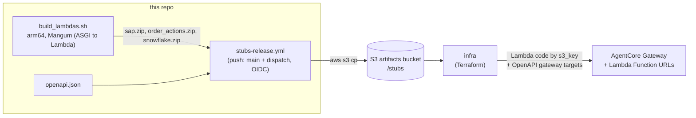

# stubs — build & deploy

How the three stub services become live Gateway targets: the build→publish→deploy cascade and its diagram.

## Build & deploy

## The cascade

`build_lambdas.sh` builds the three arm64 Lambda zips into `./build`. On merge to `main` (or
via `workflow_dispatch`), `../../.github/workflows/stubs-release.yml` uploads those zips plus
each service's `openapi.json` to the artifacts S3 bucket, then cascades a `stubs-published`
dispatch to `../../infra`. Terraform references the zips by `s3_key` (the Lambda code) and reads
the specs back via `aws_s3_object` data sources (the Gateway tool targets), so a published
artifact set is enough for `infra` to stand up or refresh the live Gateway and its Lambda
Function URLs.

For the full publish/cascade/gated-apply pipeline, see the CD runbook at
[`../../infra/docs/playbooks/cd-setup.md`](../../infra/docs/playbooks/cd-setup.md).
